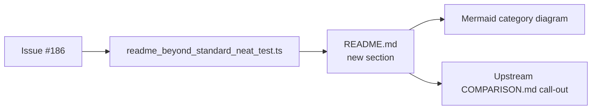

## Summary

Added a new **🚀 Beyond Standard NEAT — what NEAT-AI ships** section to the top-level `README.md`,
inserted immediately after the existing _Two Training Paradigms_ section. The section makes the
breadth of NEAT-AI's capabilities discoverable from page one, mapping each capability to the demo in
this repo that exercises it (where one exists), grouping them visually with a Mermaid diagram by
category (search · training · structure · scale · interop), and ending with a prominent call-out to
upstream [`COMPARISON.md`](https://github.com/stSoftwareAU/NEAT-AI/blob/Develop/COMPARISON.md).
Closes #186.

## Evidence

This is a documentation-only change. The structure is enforced by a new "what" test file,
`readme_beyond_standard_neat_test.ts`, which asserts:

- the section heading is present;
- it sits between the paradigms section and Examples at a Glance;
- it frames NEAT-AI as a **superset** of textbook Stanley & Miikkulainen NEAT;
- every required capability is mentioned (backprop, memetic, MCMC, GPU-accelerated Discovery,
  synthetic synapse, advanced breeding, predictive coding, hyperparameter self-adaptation, adaptive
  population sizing, ONNX, transfer learning, binary `.bin` training stream);
- the section contains a Mermaid block;
- the diagram labels all five required category subgraphs (search · training · structure · scale ·
  interop);
- the section links to upstream `COMPARISON.md` and uses the word "taxonomy" in the closing
  call-out.

Quality gates:

- `deno lint` — clean.
- `deno fmt --check` — clean.
- `deno check **/*.ts` — clean.
- `deno test` — **1000 passed | 0 failed** (the suite includes the new file plus the existing README
  structure, paradigms, acronym-glossary, and Mermaid validators).

The full `./quality.sh` script also runs every example end-to-end. Those example runs are unrelated
to a README-only change, so they were not re-executed in this run; the lint, fmt, type-check, and
unit-test gates that gate quality cover the change.

## Test Plan

- Added `readme_beyond_standard_neat_test.ts` (20 tests) covering the section header, placement,
  superset framing, required capability mentions, Mermaid block, category labels, and upstream
  `COMPARISON.md` call-out.
- All existing README tests still pass — `readme_paradigms_test.ts`, `readme_structure_test.ts`,
  `readme_acronym_glossary_test.ts`, and `mermaid_diagrams_test.ts` are unchanged and green.
