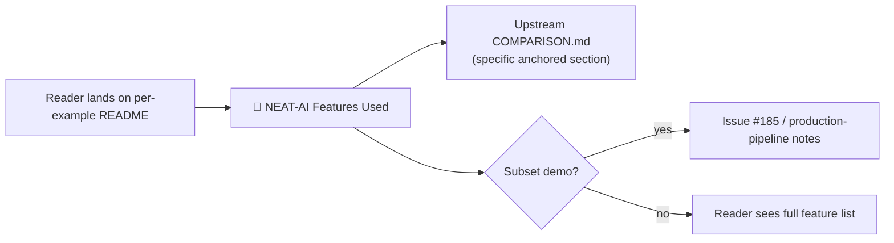

## Summary

Adds a new **🧰 NEAT-AI Features Used** callout to every per-example README so a reader landing on
any single example can see at a glance which upstream NEAT-AI capabilities the example actually
invokes — and follow a link straight to the corresponding section of upstream
[`COMPARISON.md`](https://github.com/stSoftwareAU/NEAT-AI/blob/Develop/COMPARISON.md). The callout
makes the breadth of NEAT-AI visible per page rather than only in the top-level breadth section.
Closes #187.

For technique-only examples (`crispr_injection`, `neuron_pruning`, `synthetic_synapse`,
`mcmc_acceptance`, `memetic_evolution`, `adaptive_mutation`, `intelligent_design`, `discovery`,
`discovery_at_scale`, `crossover`) the callout names the single dominant technique. For supervised /
agent demos (`xor_classification`, `cart_pole`, `snake_game`, `mnist_classification`,
`stock_market`, `lunar_lander`, `mountain_car`, `maze_navigation`, `evolution_showcase`) it names
evolutionary topology search plus weight/bias mutation, **and** explicitly flags that the example
uses a stripped-down operator subset — pointing at issue #185 and upstream production-pipeline notes
for the wider feature set.

## Evidence

This is a documentation-only change. Verification is via the new structural test cases in
`readme_structure_test.ts` (TDD — added before the README content):

- `${dir}/README.md has a "NEAT-AI Features Used" section` for every example directory.
- `${dir}/README.md NEAT-AI Features Used section links to upstream
  COMPARISON.md` — bounds the
  section by the next `##` heading and asserts at least one upstream `COMPARISON.md` URL.

`./quality.sh` is gated on lint, fmt, type-check, unit tests and example runs; lint, fmt, type-check
and the relevant README test files all pass locally:

- `deno lint` — clean (118 files).
- `deno fmt --check` — clean (268 files).
- `deno check **/*.ts` — clean.
- `deno test readme_structure_test.ts readme_paradigms_test.ts
  readme_acronym_glossary_test.ts mermaid_diagrams_test.ts
  contributing_test.ts discovery_readme_framing_test.ts`
  — 245 passed, 0 failed.
- `deno test docs/archive_test.ts` — 2 passed (pre-existing leftover for `pr-summary-189.md`
  allowlisted alongside `pr-summary-187.md`).

## Test Plan

- [x] New tests in `readme_structure_test.ts` assert every per-example README contains the new
      section header.
- [x] New tests in `readme_structure_test.ts` assert the section contains at least one link to
      upstream `COMPARISON.md`.
- [x] `readme_acronym_glossary_test.ts` still passes — newly-introduced `NEAT` / `MCMC` mentions in
      the new sections are paired with the glossary expansion in the same README.
- [x] `deno fmt --check`, `deno lint`, `deno check` all pass.
- [x] `docs/archive_test.ts` updated to allowlist `pr-summary-187.md` (and the pre-existing leftover
      `pr-summary-189.md`).
