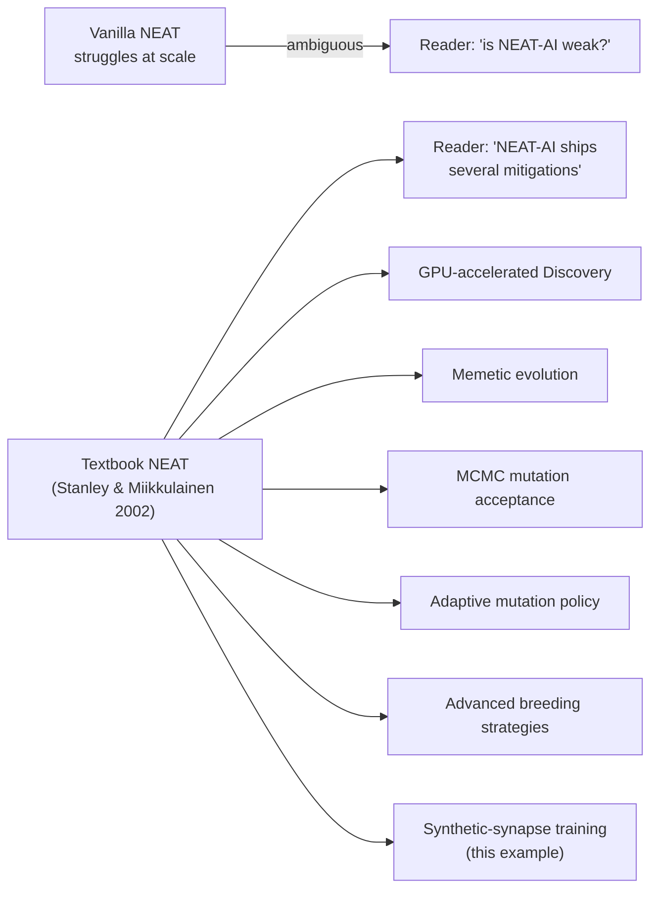

# PR Summary — Clarify "Vanilla NEAT" vs NEAT-AI in synthetic_synapse README

## Summary

Tightened the wording in `synthetic_synapse/README.md` so readers cannot mistake the
"evolution-cannot-find-every-useful-edge" failure mode for a NEAT-AI limitation. Closes #188.

- Replaced the unqualified "Vanilla NEAT struggles at scale" prose with the explicit "Textbook NEAT
  (Stanley & Miikkulainen 2002)" framing, and renamed the comparison-table column from "Pure NEAT"
  to "Textbook NEAT" so the contrast with synthetic-synapse training is unambiguous.
- Added a NEAT-AI mitigations admonition under the "Why does NEAT-AI need this?" heading that links
  to the upstream `COMPARISON.md` anchors for **GPU-accelerated Discovery** (feature 2 + caching
  feature 8), **memetic evolution** (feature 1), **MCMC mutation acceptance** (feature 9),
  **adaptive mutation policy** (Hyperparameter Self-Adaptation), **advanced breeding strategies**
  (feature 10), and **synthetic-synapse training** itself (feature 12) — five of which exist
  independently of the technique this example demonstrates.
- Synced the docstring at the top of `synthetic_synapse_example.ts` so the source comment uses the
  same "textbook NEAT" wording and lists the same NEAT-AI mitigations.

## Evidence

This is a documentation-only change with no UI surface; the evidence is the new "what" tests that
load the README at runtime and assert on its contents.

The example still runs cleanly: `./synthetic_synapse/run.sh` completes in ~33 ms with the
no-regression assertion intact (`pruned − control = 0.000`).

## Test Plan

Added `synthetic_synapse/synthetic_synapse_readme_test.ts` with five "what" tests that read
`synthetic_synapse/README.md` at runtime:

- [x] `drops bare 'Vanilla NEAT' and 'Pure NEAT' wording` — fails if either phrase reappears.
- [x] `uses 'textbook NEAT' framing with the canonical citation` — checks for "Textbook NEAT" plus
      the Stanley 2002 anchor citation.
- [x] `renames the comparison column to 'Textbook NEAT'` — asserts the new column header is present
      in the comparison table.
- [x] `lists at least three other NEAT-AI scaling techniques with upstream links` — scans the "Why
      does NEAT-AI need this?" section for at least three of GPU-accelerated Discovery, memetic
      evolution, MCMC, adaptive mutation, advanced breeding, plus a `COMPARISON.md` link.
- [x] `cites the COMPARISON.md anchors for the listed techniques` — ensures features 1, 2 and 9
      anchor URLs are present so readers can jump to the canonical descriptions.

Existing tests continue to pass — `synthetic_synapse_example_test.ts` (19 tests),
`readme_acronym_glossary_test.ts` (the new MCMC mention is now expanded),
`readme_paradigms_test.ts`, `readme_structure_test.ts`, `mermaid_diagrams_test.ts`,
`no_warm_start_policy_test.ts`, `lint_fmt_config_test.ts`, `contributing_test.ts`, and
`discovery_readme_framing_test.ts`.
