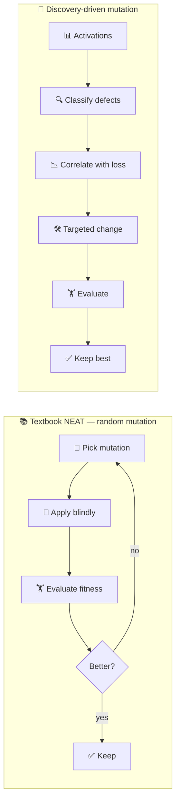

# PR Summary — Issue #189

## Summary

Reframes both Discovery READMEs (`discovery/README.md` and `discovery_at_scale/README.md`) around
the reporter's wording: **science-driven structural mutation, not random search**. Each page now
opens with a top-level paragraph contrasting textbook NEAT's blind random add-node / add-conn
mutations with NEAT-AI-Discovery's error-driven analysis (saturated · dead · dormant · bimodal ·
bottleneck → targeted rewire / replace / prune / split), cites upstream
[`COMPARISON.md`](https://github.com/stSoftwareAU/NEAT-AI/blob/Develop/COMPARISON.md) features 2
(error-driven mutation) and 8 (discovery caching), and includes a Mermaid block making the contrast
visual. The defect-category table on `discovery_at_scale/README.md` gains a new "Discovery
intervention" column annotating each defect class with the structural change Discovery would
propose. A new `discovery_readme_framing_test.ts` enforces the framing on both pages.

Closes #189.

## Evidence

This is a documentation-only change — no UI, CLI, or runtime behaviour is modified — so the evidence
is the new test suite plus a Mermaid diagram showing the framing both pages now adopt.

Verification:

- `deno fmt --check` — clean (267 files).
- `deno lint` — clean (118 files).
- `deno check discovery_readme_framing_test.ts` — clean.
- `deno test --no-check --allow-read --allow-write --allow-env --allow-net --allow-ffi` — **922
  passed**, 0 failed (full unit-test run).

## Test Plan

Added `discovery_readme_framing_test.ts` at the repo root. It loads both README files and asserts:

- The intro paragraph (between H1 and the first H2) contains "error-driven", "structural mutation",
  "not random", and the verbatim phrase "science-driven structural mutation".
- The intro names textbook NEAT's random mutation and the activation categories (saturated, dead,
  dormant, bottleneck).
- Both pages link to the upstream `COMPARISON.md` URL and cite "Feature 2" and "Feature 8".
- Each page contains at least one Mermaid block whose body mentions both `random` and
  `discovery-driven`.
- The Defect Categories section on `discovery_at_scale/README.md` describes the rewire / replace /
  prune interventions.

All 11 new tests pass; the existing 911 tests remain green.
