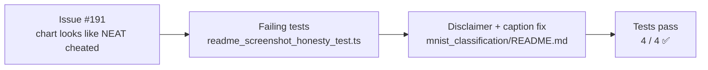

# PR Summary — Issue #191

## Summary

The MNIST README's headline narrative talks about a long-form NEAT-from-noise evolution (hours of
wall-clock, up to 50 000 generations, growing topology) but the chart embedded immediately below it
came from the **MLP/SGD baseline** — fixed `196 → 64 → 10` topology, crosses 95 % in ~10 epochs,
flat neuron and synapse counts. To a fresh reader that looks like a NEAT run that "cheated" by
guessing the right topology, exactly as the reporter pointed out. Updates the README so the chart
caption identifies the MLP baseline, agrees with the SVG's own `<title>`, and an inline disclaimer
spells out that the chart is **not** from the NEAT-from-noise run and the constant neuron/synapse
counts are by design (the MLP topology is hand-prescribed). Closes #191.

## Evidence

This is a documentation-only change. Verified by four new "what" tests in
`mnist_classification/readme_screenshot_honesty_test.ts` that read the README and the embedded SVG
and assert:

1. The chart caption identifies the screenshot as the MLP baseline run.
2. The chart caption includes the SVG's own `<title>` verbatim.
3. The README contains an explicit paragraph naming `evolution.svg`, identifying it as the MLP
   baseline, and stating it is not the NEAT evolution.
4. The README explains that the MLP baseline's neuron/synapse counts are constant by design (fixed
   topology), not a NEAT cheat.

## Test Plan

- [x] Added `mnist_classification/readme_screenshot_honesty_test.ts` (four tests, all initially red,
      all green after the README change).
- [x] `deno fmt --check` passes (277 files).
- [x] `deno lint` passes (122 files).
- [x] `deno check **/*.ts` passes.
- [x] Pre-existing test failures (`pr-summary-186.md` allowlist gap, network-permission-gated
      example tests) are out of scope — they exist on `Develop` before this change.
