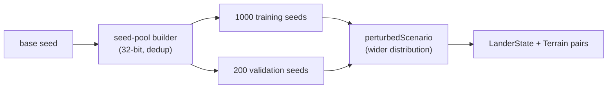

## Summary

Widens the lunar-lander start distribution and adds a deterministic scenario sampler that emits
**disjoint training and validation seed pools**, so a champion that memorises a single trajectory
cannot pass validation. Closes #195.

- `lunar_lander/physics.ts`
  - New `WIDE_RANGES` constant documenting the per-component half-ranges at `magnitude=1`.
  - New `LanderScenario` type and `perturbedScenario(random, magnitude?)` sampler returning
    `{ state, terrain }` with `padX` varied.
  - `perturbedInitialState` is widened to the same per-component ranges (`x±25 m`, `y±20 m`,
    `vx±3 m/s`, `vy±2 m/s`, `angle±0.25 rad`, `fuel±20`); previously narrow ranges (`±5 m`,
    `±0.5 m/s`, `±0.05 rad`, fuel fixed) let a controller win by memorising a single trajectory.
- `lunar_lander/scenarios.ts` (new)
  - `generateScenarioPools(baseSeed, training=1000, validation=200, magnitude=1)` derives two
    disjoint 32-bit seed pools and realises each pool into `{ seed, state, terrain }` via
    `perturbedScenario`.
  - Deterministic for the same `(baseSeed, counts, magnitude)` tuple.
- `lunar_lander/scenarios_test.ts` (new) and updated `lunar_lander/physics_test.ts` cover
  deterministic seeds, disjoint pools, every scenario starting in `flying`, and the distribution
  actually spanning the wider range.
- `lunar_lander/README.md` documents the wider distribution and the train/validate pool split with a
  Mermaid diagram.

## Evidence

This is a backend module — there is no web interface to screenshot. Verification is via unit tests:

```
deno test --allow-read --allow-write --allow-env \
  lunar_lander/physics_test.ts lunar_lander/scenarios_test.ts
ok | 36 passed | 0 failed
```

Plus `deno fmt --check`, `deno lint`, `deno check` and `markdownlint-cli2 lunar_lander/README.md` —
all clean.



## Test Plan

New / updated tests in `lunar_lander/scenarios_test.ts` and `lunar_lander/physics_test.ts`:

- `generateScenarioPools produces the requested counts`
- `generateScenarioPools default counts are 1000 / 200`
- `generateScenarioPools is deterministic for the same base seed`
- `generateScenarioPools differs between distinct base seeds`
- `generateScenarioPools yields disjoint training and validation seed pools`
- `every generated scenario starts in a flying state`
- `scenario distribution actually spans the wider range`
- `each scenario's seed reproduces its state and terrain`
- `scenarios stay inside world bounds`
- `generateScenarioPools rejects invalid arguments`
- `zero-count pools are allowed and disjoint by definition`
- `perturbedInitialState centres on initialState within the widened ranges` (existing test updated
  to assert against `WIDE_RANGES`; the legacy narrow ranges no longer apply — change is documented
  in the test body).
- `perturbedScenario varies padX within WIDE_RANGES.padX`
- `perturbedScenario is deterministic for the same seed`
