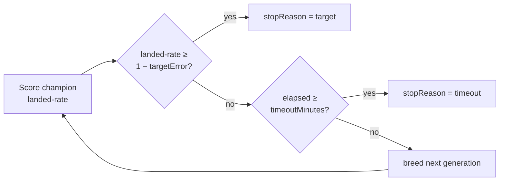

# lunar_lander: NEAT-AI standard `targetError` + `timeoutMinutes` stop conditions

## Summary

Replaces the lunar-lander evolver's `maxGenerations` hard cap and `SOLVED_LANDED_RATE = 0.6`
threshold with the two standard fields from NEAT-AI's `NeatOptions`: `targetError` (default `0.01`,
i.e. landed-rate ≥ 99%) and `timeoutMinutes` (default `2`). Whichever condition fires first wins.
`EvolveResult` now reports `wallclockMs` and `stopReason: "target" | "timeout"` so callers can
distinguish the two outcomes, and the CLI accepts `--target-error=N` / `--timeout-minutes=N`
overrides. Closes #196.

## Evidence

This is a backend / CLI-only change — there is no UI to screenshot. Verified via:

- `deno test lunar_lander/lunar_lander_test.ts` — all 32 tests pass, including two new tests that
  exercise both stop reasons (`stops on timeout when targetError is unreachable`,
  `stops on target
  when targetError is generous`).
- `deno lint lunar_lander/`, `deno fmt --check lunar_lander/`, `deno check **/*.ts` — clean.
- Local CLI smoke test:
  `deno run … lunar_lander/lunar_lander.ts --timeout-minutes=0.05
  --target-error=-1` reported
  `stop=timeout, wallclock=3.3s` with the new banner line announcing the configured stop conditions.

## Test Plan

- Added `evolveLanderController stops on timeout when targetError is unreachable` — sets
  `targetError = -1` (landed-rate ≥ 2 is impossible) and `timeoutMinutes = 0.005` (~300 ms); asserts
  `stopReason === "timeout"`, `solved === false`, `wallclockMs` finite, `generations` finite and >
  0, and that `wallclockMs` is consistent with the observed elapsed time.
- Added `evolveLanderController stops on target when targetError is generous` — sets
  `targetError = 1` (landed-rate ≥ 0 trips at gen 0) with a generous `timeoutMinutes = 1`; asserts
  `stopReason === "target"`, `solved === true`, finite `wallclockMs` and `generations > 0`.
- Updated existing tests to drop `maxGenerations` and `SOLVED_LANDED_RATE` in favour of the new
  option shape. The `noise on average` test now uses `1 - DEFAULT_EVOLVE_OPTIONS.targetError` (i.e.
  the new 99% threshold) as the upper bound for gen-1 landed rate. The
  `champion improves
  over generations` and snapshot/neurons tests use a `snapshotConfig` to
  deterministically pin the loop to a fixed number of generations after target trips immediately,
  instead of relying on the removed generation cap.
- README updated: the `Soft-Landing Threshold and Hard Generation Cap` section becomes
  `NEAT-AI
  Standard Stop Conditions` and documents the two new fields + CLI overrides.
