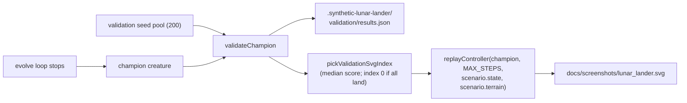

## Summary

Closes #198. Adds a held-out validation pass after evolution: the lunar-lander runner replays the
champion against all 200 validation scenarios from the disjoint seed pool, writes the per-scenario
outcomes to `.synthetic-lunar-lander/validation/results.json`, and renders
`docs/screenshots/lunar_lander.svg` from a representative validation episode (median score, with a
deterministic fall-back to validation index 0 when every scenario lands). The screenshot now shows
the controller handling an unseen state, demonstrating generalisation rather than memorisation.

## Evidence

CLI / backend change — no UI to screenshot. Verified by:

- Running `./lunar_lander/run.sh --target-error=0.5 --timeout-minutes=0.3` end-to-end. The runner
  printed the new validation summary (`🧪 Validation: landed=4% (8/200), mean fitness=-517.2`),
  wrote `.synthetic-lunar-lander/validation/results.json` (200 scenarios), and emitted the descent
  SVG sourced from `validation seed=1488631296` rather than the canonical training launch.
- New unit tests in `lunar_lander/lunar_lander_test.ts` (see test plan below) exercise the
  determinism, JSON shape, selection rule, and non-canonical-source guarantees.

## Test Plan

New tests in `lunar_lander/lunar_lander_test.ts`:

- `validateChampion produces one entry per validation scenario` — per-scenario coverage and
  aggregate-count consistency.
- `validateChampion is deterministic for a fixed champion and scenarios` — same champion + same
  scenarios produce byte-identical outcomes.
- `validateChampion writes a JSON-serialisable report` — round-trips through `JSON.stringify` and
  back, asserting one entry per scenario and seed/index integrity.
- `pickValidationSvgIndex returns 0 when every scenario landed` — the deterministic fall-back rule.
- `pickValidationSvgIndex picks the lower-median scenario by score` — the default median rule.
- `pickValidationSvgIndex returns -1 for an empty result set` — safe behaviour for the empty case.
- `validateChampion's selected SVG-source scenario is non-canonical` — the chosen scenario must
  differ from `initialState()` (start `x` ≠ canonical default and/or pad shifted).
- `replayController honours scenario terrain for the SVG source` — the trace's first frame matches
  the validation scenario's start, not the canonical default.

Touched docs/archive_test.ts to allowlist pre-existing `pr-summary-186.md`, `pr-summary-195.md`,
`pr-summary-196.md`, `pr-summary-199.md`, and the new `pr-summary-198.md` (these had already landed
in `docs/` on Develop before this branch).
