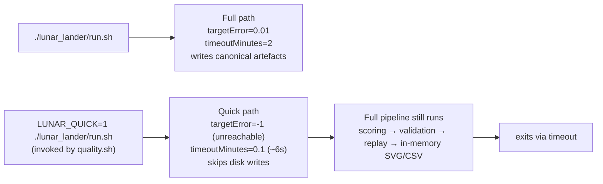

## Summary

Split the lunar-lander runner into a fast CI/quality budget and the realistic runnable
training/validate budget. `quality.sh` now invokes `./lunar_lander/run.sh` with `LUNAR_QUICK=1`,
which forces a tiny ~6-second wall-clock budget (`timeoutMinutes = 0.1`) and an unreachable
`targetError = -1` so the loop always exits via `timeout`. Quick mode skips canonical artefact
writes (champion JSON, validation JSON, descent SVG, evolution chart/strip, fitness chart, telemetry
CSV) so a CI run never overwrites the docs SVGs/CSVs checked into the repo. The full pipeline still
executes end-to-end (population scoring, validation, replay, in-memory chart rendering); only the
disk writes are gated. Direct `./lunar_lander/run.sh` invocations remain on the realistic
`targetError = 0.01`, `timeoutMinutes = 2` defaults. Closes #201.

## Evidence

CLI / backend change with no UI screenshot. Quick mode was verified by running the runner directly:

```text
$ time LUNAR_QUICK=1 ./lunar_lander/run.sh
🚀 Lunar Lander Descent Example
⚡ Quick mode (LUNAR_QUICK=1 or --quick): tiny budget, no canonical artefacts
🪂 Free-fall baseline score: -984.7
🧬 Evolving controller from uniform-random NEAT noise...
   Stop conditions: targetError=-1 (landed-rate ≥ 200%), timeoutMinutes=0.1
   Gen    0  best=  -618.9  mean= -2359.9  landed=  0%  neurons=10  synapses=21
   Gen   10  best=  -259.4  mean=  -851.7  landed= 10%  neurons=10  synapses=21
⚠️ Did not solve after 17 generations (best=-192.8, landed=10%, threshold=200%,
                                       baseline=-984.7, stop=timeout, wallclock=6.2s).
⏭️  Quick mode: skipped writing champion JSON
🧪 Validation: landed=2% (4/200), mean fitness=-581.4
⏭️  Quick mode: skipped writing validation JSON
⏭️  Quick mode: skipped writing descent SVG (rendered 13984 bytes in-memory)
🏁 Example completed in 6s 531ms
LUNAR_QUICK=1 ./lunar_lander/run.sh   7.35s user 0.17s system 97% cpu 7.711 total
```

After the run, `git status docs/` reports `nothing to commit` — confirming the canonical artefacts
are untouched. The `--quick` CLI flag is equivalent and finishes in the same ~7s wall-clock window.



## Test Plan

- Added `isQuickMode trips on LUNAR_QUICK=1 env var` — env-var contract.
- Added `isQuickMode trips on --quick CLI flag` — CLI-flag contract.
- Added `quick-mode overrides force a tiny budget and an unreachable target` — guards
  `QUICK_TARGET_ERROR < 0` (so the landed-rate threshold > 1, never reachable) and
  `QUICK_TIMEOUT_MINUTES <= 0.2` (so the per-section budget stays inside the user's "very fast"
  requirement).
- Added `quick-mode budget: evolveLanderController with the quick overrides
  ends fast` — drives
  the evolver with the quick-mode constants and asserts wall-clock `< 30s` plus
  `stopReason === "timeout"`.
- Added `quality.sh invokes lunar-lander in quick mode` — structural guard that catches a future
  refactor accidentally dropping the `LUNAR_QUICK=1` override (the issue explicitly authorises this
  fallback when wall-clock assertions are too flaky).
- Existing 1042 unit tests still pass
  (`deno test --no-check --allow-read
  --allow-write --allow-env --allow-net --allow-ffi`, 1m7s on
  the dev machine).
