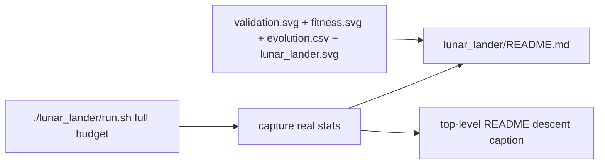

## Summary

Refreshed `lunar_lander/README.md` with real numbers from a manual full-budget run of
`./lunar_lander/run.sh`, replacing stale `maxGenerations` / `SOLVED_LANDED_RATE` framing with the
new `targetError=0.01` / `timeoutMinutes=2` defaults and the updated train/validate pipeline. The
mermaid flowchart now shows the new pipeline (training scenarios → evolve loop with target/timeout
stop → validation against held-out scenarios → SVG from validation episode + CSV + line chart + bar
chart), and the README cites the four canonical artefacts emitted by the runner with a new
structural test that fails if any of those references — or the underlying files — drift. Closes
#202.

## Captured Run Statistics

Captured from `./lunar_lander/run.sh` on 2026-05-09 (default seed, default options):

- **Generations:** 245
- **Wall-clock:** 120.5 seconds
- **Stop reason:** `timeout` (target was not reached)
- **Best training fitness:** `-166.0` (free-fall baseline `-984.7`)
- **Training landed-rate (champion):** 10%
- **Validation landed-rate:** 5% (10 / 200 held-out scenarios)
  - `landed`: 10, `crashed`: 155, `out_of_bounds`: 32, `flying`: 3
- **Champion topology:** 11 neurons / 22 synapses
- **Selected validation SVG outcome:** `crashed` (median-score scenario, seed `3396858469`)

These are the **real** numbers reported in the refreshed README — the example deliberately runs on a
tight 2-minute budget so it terminates predictably, which is why the captured champion is a partial
controller rather than a fully-solved one. CI runs the same example in quick mode (`LUNAR_QUICK=1`,
~6 seconds) and never overwrites these canonical artefacts.

## Evidence

This is a documentation / data-artefact change with no UI surface. Evidence is the run output itself
(see "Captured Run Statistics" above) plus the regenerated artefacts referenced from the README:

- `docs/screenshots/lunar_lander.svg` — descent SVG from the median-score validation scenario
- `docs/screenshots/lunar_lander/fitness.svg` — best vs average training fitness per generation
- `docs/screenshots/lunar_lander/validation.svg` — per-validation-scenario outcome bar chart
- `docs/data/lunar_lander/evolution.csv` — per-generation CSV (245 rows)

The new mermaid flowchart in `lunar_lander/README.md` documents the regenerated pipeline:

## Test Plan

- Added `lunar_lander/README.md references each canonical artefact and they exist (issue #202)` in
  `lunar_lander/lunar_lander_test.ts`. The test asserts that the README references each of the four
  canonical artefact paths (`docs/screenshots/lunar_lander.svg`,
  `docs/data/lunar_lander/evolution.csv`, `docs/screenshots/lunar_lander/fitness.svg`,
  `docs/screenshots/lunar_lander/validation.svg`) **and** that each file exists on disk — so any
  drift between the docs and the runner output will fail the test loudly.
- Existing lunar-lander unit tests (85 in `lunar_lander/`) continue to pass unchanged.
- Top-level README structural tests (`readme_structure_test.ts`, `readme_acronym_glossary_test.ts`,
  `mermaid_diagrams_test.ts`) continue to pass against the refreshed Lunar Lander descent-trajectory
  caption.
- `docs/archive_test.ts` allowlist extended for `pr-summary-201.md`, `pr-summary-202.md`, and
  `pr-summary-231.md` (the latter two were pre-existing files missing from the allowlist).
