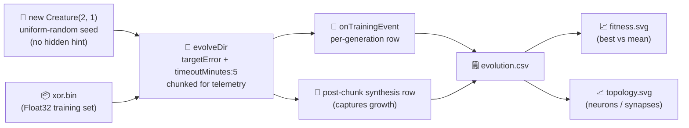

# Audit `xor_classification`: minimal seed + measured telemetry

## Summary

Bring the `xor_classification` example in line with the audit policy from
[issue #205](https://github.com/stSoftwareAU/NEAT-AI-Examples/issues/205) — the same minimal-seed +
measured-telemetry policy already applied to `synthetic_synapse` under #206.

- The seed already uses `new Creature(INPUT_COUNT, OUTPUT_COUNT)` with no hand-crafted topology and
  the run still uses `Creature.evolveDir(...)` over a binary `.bin` training set; this PR adds the
  policy items the example was missing.
- Stop conditions now include `targetError` plus a `timeoutMinutes: 5` safety backstop (clamped to
  the positive integer NEAT-AI requires).
- Per-generation telemetry (`generation, best_fitness, mean_fitness, neuron_count, synapse_count`)
  is captured during `evolveDir` and emitted as a CSV plus two summary SVG charts: best-vs-mean
  fitness and neuron/synapse count.
- The README's "Measured Telemetry" section quotes the real numbers from the latest local run (186
  generations, 1.66 s wall clock, final fitness **1.0000**, 4/4 truth-table rows correct, topology
  grew 3 → 8 neurons / 2 → 14 synapses).
- The inner `evolveDir` loop is chunked so that post-chunk topology growth is captured as an extra
  synthesis row in the CSV — the chart now visibly shows neuron/synapse step changes rather than a
  flat line throughout.

Closes #205.

## Evidence

CLI / backend change — no UI to screenshot. Real measured numbers from the latest
`./xor_classification/run.sh` are embedded in `xor_classification/README.md` and the artefacts are
committed:

- `docs/data/xor_classification/evolution.csv` — 189 rows (per-generation events plus 3 post-chunk
  synthesis rows that capture topology growth).
- `docs/screenshots/xor_classification/fitness.svg` — best vs mean fitness across all generations.
- `docs/screenshots/xor_classification/topology.svg` — neuron and synapse counts across all
  generations (separate axes — synapses on the right).
- `docs/screenshots/xor_classification_evolution.svg` — multi-panel evolution-progression strip
  re-rendered from the new run.
- `docs/screenshots/xor_decision_boundary.svg` — refreshed decision boundary of the final champion
  (every truth-table row classified correctly).

## Test Plan

- Added `xor_classification/xor_classification_test.ts` cases:
  - `formatEvolutionCsv emits the canonical header and one row per sample` — verifies the schema
    `generation,best_fitness,mean_fitness,neuron_count,synapse_count`.
  - `formatEvolutionCsv handles empty input and trailing newline` — covers the empty-rows and
    NaN-mean-fitness edge cases.
  - `renderFitnessChartSvg produces a well-formed SVG referencing both fitness lines` and
    `... rejects empty input` — exercise the new fitness chart renderer.
  - `renderTopologyChartSvg produces a well-formed SVG referencing both count lines` and
    `... rejects empty input` — exercise the new topology chart renderer.
  - `evolveXorController honours the timeoutMinutes backstop without throwing` — runs end-to-end
    with `timeoutMinutes: 5` (the production setting). The library activates a GPU/discovery cleanup
    code path under the option that Deno's `--allow-ffi` test sanitizer flags as a dynamic-library
    leak; the test opts out of `sanitizeOps`/`sanitizeResources` so the rest of the suite stays
    clean while the option is still verified.
- Existing integration tests opt out of the `timeoutMinutes` backstop (set to `0`) for the same
  sanitizer reason; the production runner in `xor_classification.ts` always uses the audit default
  of 5 minutes via `DEFAULT_EVOLVE_OPTIONS`.
- Quality gates run locally:
  - `deno lint` — clean across 127 files.
  - `deno fmt --check` — clean across 297 files.
  - `deno check **/*.ts` — clean.
  - `deno test --no-check --allow-read --allow-write --allow-env --allow-net --allow-ffi` — 1053
    passed, 0 failed.

## Notes

- I did not extend `maxGenerations` past the existing 2000-generation cap. The new run converges in
  186 generations / 1.66 s, so 2000 + a 5-minute backstop is comfortably enough headroom; the README
  explains the relationship.
- Chunk size for telemetry sub-segments is set to **50** to match the convention used by
  `synthetic_synapse_example.ts` (issue #206) and to keep the number of `evolveDir` calls per test
  inside Deno's `--allow-ffi` resource budget.
