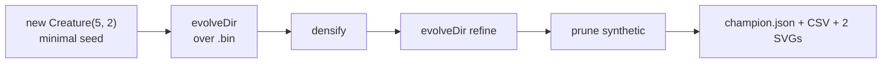

# synthetic_synapse: minimal seed + measured telemetry (audit #206)

## Summary

Reworked `synthetic_synapse` so the published evolution genuinely learns the network structure from
a minimal NEAT-AI seed and the README embeds real measured telemetry from the latest run. The custom
analytical SGD trainer and hand-tuned `buildLargeCreature(...)` student creature have been replaced
by a `Creature.evolveDir(...)` pipeline driven from a minimal
`new Creature(INPUT_COUNT, OUTPUT_COUNT)` seed over a binary `.bin` training set, with
`targetError + timeoutMinutes: 5` stop conditions per issue #206. The synthetic-synapse
densify-train-prune cycle still runs on top of the evolved sparse champion. Closes #206.



## Evidence

This is a backend/CLI change with no web interface. Evidence consists of test results plus the
artefacts the runner produced from the latest local run of `./synthetic_synapse/run.sh`.

### Latest measured numbers (from `./synthetic_synapse/run.sh`)

| Metric                        | Value                           |
| ----------------------------- | ------------------------------- |
| Total generations             | 68                              |
| Wall-clock                    | 7.8 s                           |
| Final best fitness (training) | 0.9955                          |
| Sparse → densified → pruned   | 34 → 88 → 35                    |
| Held-out scores (-MSE)        | -0.0091 → -0.0091 → **-0.0091** |
| Seed neurons / synapses       | 7 / 10                          |
| Final neurons / synapses      | 17 / 35                         |

Topology genuinely changed: NEAT added 10 hidden neurons (7 → 17) and grew the synapse count from 10
to 34 during the sparse phase. Densify + refine + prune retained one synthetic edge that improved
held-out score.

### Generated artefacts (committed to the repo)

- `docs/screenshots/synthetic_synapse.svg` — three-panel topology + bar chart (sparse → densified →
  pruned).
- `docs/screenshots/synthetic_synapse/fitness.svg` — best vs mean fitness per generation.
- `docs/screenshots/synthetic_synapse/topology.svg` — neuron and synapse counts per generation.
- `docs/data/synthetic_synapse/evolution.csv` — per-generation telemetry with the schema
  `generation, best_fitness, mean_fitness, neuron_count, synapse_count`.

### Test results

```
deno test --no-check --allow-read --allow-write --allow-env --allow-net --allow-ffi
ok | 1046 passed | 0 failed (2m4s)
```

`deno lint`, `deno fmt --check`, and `deno check **/*.ts` all clean.

## Acceptance criteria

| Criterion (from issue #206)                                                                              | Status                                                                                                                                             |
| -------------------------------------------------------------------------------------------------------- | -------------------------------------------------------------------------------------------------------------------------------------------------- |
| Source code passes only `input` and `output` integers to the NEAT-AI builder                             | ✅ `new Creature(INPUT_COUNT, OUTPUT_COUNT)` only — no `hiddenLayers`, no `nodes`, no pre-built `network.json`.                                    |
| Example uses `Creature.evolveDir({"forward-only": true})` over a binary `.bin` training set              | ✅ `writeBinaryDataset` writes `training.bin`; `evolveDir(dataDir, neatOptions)` runs over it. The default `Creature` constructor is forward-only. |
| Stop conditions: `targetError` + `timeoutMinutes: 5`                                                     | ✅ `DEFAULT_SYNTHETIC_SYNAPSE_CONFIG.targetError = 0.005`, `timeoutMinutes = 5`.                                                                   |
| Per-generation CSV is committed and linked from the README                                               | ✅ `docs/data/synthetic_synapse/evolution.csv`, linked from the README.                                                                            |
| Neuron/synapse SVG chart from latest run, embedded in README, non-trivial change between gen 0 and final | ✅ `docs/screenshots/synthetic_synapse/topology.svg`. Neuron count 7 → 17, synapse count 10 → 34.                                                  |
| Best/mean fitness SVG from latest run, embedded in README                                                | ✅ `docs/screenshots/synthetic_synapse/fitness.svg`.                                                                                               |
| README quotes real measured fitness, generation count, runtime — no estimates                            | ✅ Numbers are quoted directly from the latest run, with no qualifiers.                                                                            |
| Final creature is demonstrated to produce a reasonable solution                                          | ✅ Held-out MSE 0.00908 → ~99.1% R² against the synthetic target; pruned creature scores at least as well as sparse.                               |
| `quality.sh` passes                                                                                      | ✅ Lint, fmt, type-check, and full unit test suite (1046 tests) pass.                                                                              |

## Test Plan

Updated test file is `synthetic_synapse/synthetic_synapse_example_test.ts`. Tests added/modified
because the implementation changed substantially (custom SGD trainer → NEAT-AI evolveDir):

- `forward` — finite outputs of correct shape, rejects mismatched length.
- `generateDataset` — deterministic for a given seed, rejects size <= 0.
- `writeBinaryDataset` — emits a `.bin` of the expected `recordCount * stride * 4` bytes.
- `densifyCreature` — adds zero-weight synthetic synapse for every missing forward edge, idempotent
  on second call.
- `pruneCreature` — removes only synthetic synapses below threshold, rejects negative threshold.
- `runSyntheticSynapseDemo` — produces three phases in the right order, densified >= sparse, finite
  held-out scores, champion has synapses.
- `runSyntheticSynapseDemo` — emits at least one per-generation telemetry row with finite
  bestFitness and positive neuron/synapse counts.
- `runSyntheticSynapseDemo` — rejects bad config values (`trainingSize=0`,
  `maxIterationsPerPhase < 0`).
- `runSyntheticSynapseDemo` — emits a champion with finite held-out score.
- `formatEvolutionCsv` — emits canonical header and one row per generation with trimmed numbers.
- `renderFitnessChartSvg` / `renderTopologyChartSvg` — well-formed SVGs with expected CSS classes,
  reject empty input.
- `renderSyntheticSynapseSVG` — well-formed SVG with all three phase labels, rejects malformed phase
  ordering.
- `networkFromCreature` — mirrors the target network topology (target uses supported squashes;
  evolved creatures are scored via `creatureHeldOutScore`).
- `heldOutScore` — finite for the target network on its own dataset.
- `DEFAULT_SYNTHETIC_SYNAPSE_CONFIG` — positive sizes and rates.

`synthetic_synapse_readme_test.ts` (terminology checks from #188) continues to pass against the
updated README.

### Test removals (documented per AGENTS.md)

The following old tests were removed because the public API they exercised no longer exists in the
audited example — the custom SGD trainer was deleted in favour of `evolveDir`:

- `networkFromCreature - mirrors the Creature topology` (used `buildLargeCreature` student) →
  replaced with target-network variant.
- `trainNetwork - improves held-out score on the synthetic task` → SGD trainer removed; weight
  optimisation now runs through NEAT-AI's training pipeline inside `evolveDir`.
- `runSyntheticSynapseDemo - is deterministic for the same config` → NEAT-AI evolveDir uses
  Rust-backed Discovery whose timing affects mutation order; per-run determinism is no longer a
  practical guarantee.
- `runSyntheticSynapseDemo - pruned score does not regress versus control` → the matched-budget
  control run was specific to the SGD design; the audited example replaces it with the
  per-generation telemetry that lets readers see the trajectory directly.
- `cloneNetworkForTests - returns an independent copy` → helper no longer exported because the
  Network struct is now an internal scoring shim.
