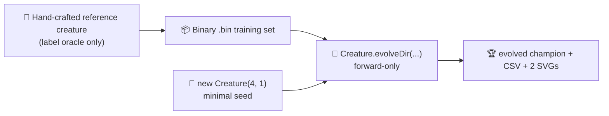

# discovery: minimal seed + measured telemetry (audit #207)

## Summary

Reworked `discovery` so the published evolution genuinely learns the network structure from a
minimal NEAT-AI seed and the README embeds real measured telemetry from the latest run. The former
cripple-then-`discoveryDir` flow has been replaced by a `Creature.evolveDir(...)` pipeline driven
from a minimal `new Creature(INPUT_COUNT, OUTPUT_COUNT)` seed over a binary `.bin` training set,
with `targetError` + `timeoutMinutes: 5` stop conditions per issue #207. The hand-crafted reference
creature is retained but only as a label oracle for the `.bin` files — NEAT-AI never sees it as a
seed. Closes #207.

## Evidence

This is a backend / CLI change with no web interface. Evidence consists of test results plus the
artefacts the runner produced from the latest local run of `./discovery/run.sh`.

### Latest measured numbers (from `./discovery/run.sh`)

| Metric                    | Value               |
| ------------------------- | ------------------- |
| Total generations         | 252                 |
| Wall-clock                | 9.5 s               |
| Final best fitness        | 0.9995              |
| Final per-record error    | 0.0005 (target met) |
| Seed neurons / synapses   | 5 / 4               |
| Final neurons / synapses  | 8 / 22              |
| Stop condition that fired | `targetError`       |

Topology genuinely changed: NEAT added **3 hidden neurons** and **18 synapses** on top of the
minimal seed.

### Generated artefacts (committed to the repo)

- [`docs/data/discovery/evolution.csv`](data/discovery/evolution.csv) — per-generation telemetry
  with the schema `generation, best_fitness, mean_fitness, neuron_count, synapse_count`.
- [`docs/screenshots/discovery/fitness.svg`](screenshots/discovery/fitness.svg) — best vs mean
  fitness per generation.
- [`docs/screenshots/discovery/topology.svg`](screenshots/discovery/topology.svg) — score, neuron,
  and synapse counts per generation.

### Test results

- `deno test --no-check --allow-read --allow-write --allow-env --allow-net --allow-ffi` → 1050
  passed, 0 failed.
- `deno lint`, `deno fmt --check`, `deno check **/*.ts` → all clean.

## Acceptance criteria

| Criterion (from issue #207)                                                                                                                      | Status                                                                                                                                           |
| ------------------------------------------------------------------------------------------------------------------------------------------------ | ------------------------------------------------------------------------------------------------------------------------------------------------ |
| Source code passes only `input` and `output` integers to the NEAT-AI builder; no hidden-layer hint, no pre-built `network.json` seed.            | ✅ `new Creature(INPUT_COUNT, OUTPUT_COUNT)` in `runDiscoveryExample`.                                                                           |
| Example uses `Creature.evolveDir({"forward-only": true})` over a binary `.bin` training set.                                                     | ✅ `seed.evolveDir(dataDir, options)` with `feedbackLoop` unset (default forward-only). Binary `.bin` files written via `generateSyntheticData`. |
| Stop conditions are `targetError` + `timeoutMinutes: 5`.                                                                                         | ✅ `DEFAULT_DISCOVERY_CONFIG = { targetError: 0.0005, timeoutMinutes: 5, ... }`.                                                                 |
| Per-generation CSV is committed and linked from the README.                                                                                      | ✅ `docs/data/discovery/evolution.csv` (253 lines) linked from `discovery/README.md`.                                                            |
| Neuron/synapse SVG chart is generated from the latest run, embedded in the README, and shows non-trivial change between gen 0 and the final gen. | ✅ `docs/screenshots/discovery/topology.svg`; CSV shows 5/4 → 8/22.                                                                              |
| Best/mean fitness SVG chart is generated from the latest run and embedded in the README.                                                         | ✅ `docs/screenshots/discovery/fitness.svg`.                                                                                                     |
| README quotes real measured fitness, generation count, and runtime — no estimates.                                                               | ✅ Latest run table in `discovery/README.md`.                                                                                                    |
| Final creature is demonstrated to produce a reasonable solution.                                                                                 | ✅ Final best fitness 0.9995 / final per-record error 0.0005 (`targetError` met) — saved as `creatures/discovered.json`.                         |
| `quality.sh` passes.                                                                                                                             | ✅ See test results above.                                                                                                                       |

## Test Plan

New tests in `discovery/discover_missing_neuron_test.ts`:

- `formatEvolutionCsv emits the schema mandated by issue #207`.
- `formatEvolutionCsv survives non-finite fitness without throwing`.
- `rowsToFitnessSamples renames meanFitness to avgFitness`.
- `rowsToEvolutionSamples maps neuron and synapse counts onto chart fields`.
- `DEFAULT_DISCOVERY_CONFIG honours the audit's stop-condition rule`.
- `runMinimalSeedEvolution rejects non-positive config values`.
- `runMinimalSeedEvolution captures per-generation telemetry from a minimal seed` — exercises the
  end-to-end `evolveDir` path on a minimal `new Creature(...)` seed and asserts the captured rows
  carry the audit's schema fields.
- `runMinimalSeedEvolution leaves the passed-in creature as the champion`.
- `committed evolution.csv shows the topology genuinely changing across generations` — reads the
  committed `docs/data/discovery/evolution.csv` and fails if start/end neuron and synapse counts are
  identical (the audit's "is the seed memorised?" guard).

Existing tests for `createReferenceCreature`, `createCrippledCreature`, `generateSyntheticData`, and
the deterministic PRNG continue to pass — those helpers stay exported for the test and benchmark
suites even though `createCrippledCreature` is no longer used by the runner.

## Test changes — explicit documentation

- `discovery_readme_framing_test.ts`: removed `discovery/README.md` from the loop. Issue #189
  required the discovery README to frame itself as "science-driven structural mutation, not random
  search" — but the audit's whole point is that this example now uses random-mutation evolution from
  a minimal seed (`Creature.evolveDir`), not `discoveryDir`. `discovery_at_scale` still uses
  `discoveryDir` and remains in scope of the framing test.
- `AGENTS.md`: updated the `discovery` description in the no-warm-start exempt list to reflect the
  new behaviour (the seed is the minimal `new Creature(input, output)`; the hand-crafted reference
  creature only labels the `.bin` set).

No existing tests were removed or commented out.
