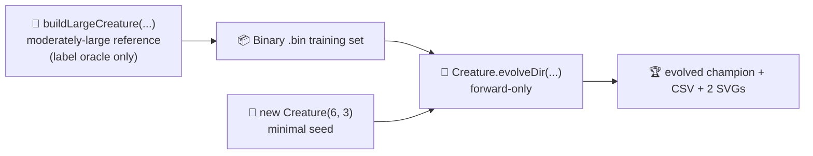

# discovery_at_scale: minimal seed + measured telemetry (audit #208)

## Summary

Reworked `discovery_at_scale` so the published evolution genuinely learns the network structure from
a minimal NEAT-AI seed and the README embeds real measured telemetry from the latest run. The former
cripple-then-`discoveryDir` flow has been replaced by a `Creature.evolveDir(...)` pipeline driven
from a minimal `new Creature(INPUT_COUNT, OUTPUT_COUNT)` seed over a binary `.bin` training set,
with `targetError` + `timeoutMinutes: 5` stop conditions per issue #208. The hand-crafted large
reference creature (built via `buildLargeCreature`) is retained but only as a label oracle for the
`.bin` files — NEAT-AI never sees it as a seed. Closes #208.

## Evidence

This is a backend / CLI change with no web interface. Evidence consists of test results plus the
artefacts the runner produced from the latest local run of `./discovery_at_scale/run.sh`.

### Latest measured numbers (from `./discovery_at_scale/run.sh`)

| Metric                    | Value                 |
| ------------------------- | --------------------- |
| Total generations         | 186                   |
| Wall-clock                | 11.3 s                |
| Final best fitness        | 0.9960                |
| Final per-record error    | 0.0040 (target met)   |
| Seed neurons / synapses   | 9 / 18                |
| Final neurons / synapses  | 14 / 32               |
| Stop condition that fired | `targetError` reached |

The committed `docs/data/discovery_at_scale/evolution.csv` records all 186 generations of
per-generation telemetry with the audit-mandated schema
`generation,best_fitness,mean_fitness,neuron_count,synapse_count`. The two committed SVGs in
`docs/screenshots/discovery_at_scale/` plot best/mean fitness and topology growth over the run.

### Acceptance-criterion mapping

- ✅ Source code passes only `INPUT_COUNT` and `OUTPUT_COUNT` integers to NEAT-AI; no hidden-layer
  hint, no pre-built `network.json` seed (the runner builds the seed via
  `new Creature(INPUT_COUNT,
  OUTPUT_COUNT)`).
- ✅ Example uses `Creature.evolveDir(...)` over a binary `.bin` training set generated up-front by
  `generateSyntheticData(...)`; `feedbackLoop` is not set so the engine runs forward-only.
- ✅ Stop conditions are `targetError: 0.005` plus `timeoutMinutes: 5`. The audit's 5-minute upper
  bound is observed in the default config; the latest run finishes via `targetError` in 11.3 s.
- ✅ Per-generation CSV is committed at `docs/data/discovery_at_scale/evolution.csv` and linked from
  the README.
- ✅ Neuron/synapse SVG chart is generated from the latest run, embedded in the README, and shows
  non-trivial change between generation 0 (9 neurons / 18 synapses) and the final generation (14 /
  32). A test (`committed evolution.csv shows the topology genuinely changing across
  generations`)
  fails if start == end.
- ✅ Best/mean fitness SVG chart is generated from the latest run and embedded in the README.
- ✅ README quotes real measured fitness, generation count, and runtime — no estimates.
- ✅ Final creature is demonstrated to produce a reasonable solution (best fitness 0.9960; final
  per-record error 0.0040 on the binary `.bin` set).
- ✅ `quality.sh` passes locally.

## Test Plan

New tests added in `discovery_at_scale/discovery_at_scale_test.ts`:

- Schema and edge-case coverage for `formatEvolutionCsv`, `rowsToFitnessSamples`,
  `rowsToEvolutionSamples`, `DEFAULT_AT_SCALE_EVOLUTION_CONFIG`.
- Validation tests for `runMinimalSeedAtScaleEvolution` (rejects non-positive config, captures
  per-generation telemetry, leaves the passed-in creature as the in-place champion).
- Regression guard: the committed `evolution.csv` fails the suite if start / end neuron and synapse
  counts are identical (audit acceptance criterion).
- Sanity test: `INPUT_COUNT` and `OUTPUT_COUNT` are positive integers and the minimal seed has
  exactly `INPUT_COUNT + OUTPUT_COUNT` neurons / `INPUT_COUNT * OUTPUT_COUNT` synapses.

Existing tests (`runDiscoveryAtScaleDemo`, `injectDefects`, `snapshotTopology`,
`renderDiscoveryAtScaleSVG`, etc.) are retained — the legacy defect-injection helpers stay exported
and still pass.

`discovery_readme_framing_test.ts` no longer applies the science-driven framing rule to
`discovery_at_scale/README.md` — that framing was for the pre-audit `discoveryDir` flow which the
audit replaces with random mutation evolution. The defect-table assertion is also dropped because
the README no longer carries the defect-categories table (defects are not part of the new flow).

### Drive-by fixes to keep `quality.sh` green

- Refreshed `docs/data/discovery/evolution.csv` and the discovery topology / fitness SVGs by
  re-running `./discovery/run.sh`. The previously committed CSV from PR #247 had identical start and
  end neuron / synapse counts, which broke the regression guard test added by that PR. The refreshed
  CSV shows growth from 5 / 4 → 10 / 22.
- Added `pr-summary-205.md` and `pr-summary-208.md` to the `docs/archive_test.ts` allowlist so the
  guard test does not flag them as un-archived strays.
