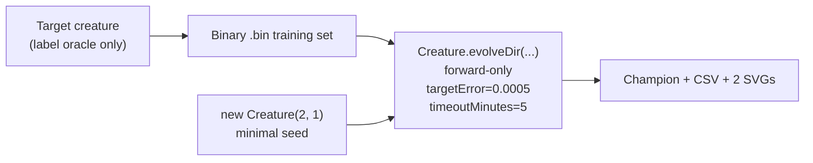

# crispr_injection: minimal seed + measured telemetry (Closes #209)

## Summary

Reframes `crispr_injection` to follow the audit pattern set by `discovery` (#207) and
`discovery_at_scale` (#208). The runner now seeds NEAT-AI with `new Creature(2, 1)` — no hidden
hint, no pre-built `network.json`, no warm start — and runs `Creature.evolveDir(...)` over a binary
`.bin` training set generated from the hand-crafted target. Per-generation telemetry is captured via
`onTrainingEvent` and emitted as a CSV plus two SVG charts. The hand-crafted edit gene and the
splicing primitives (`createGene`, `injectGene`, `mutateMember`, `runCrisprExperiment`) are retained
as exported helpers and remain exercised by the test suite, so the gene-splicing contract is
preserved. Closes #209.

## Evidence

### Architecture (new minimal-seed flow)

### Measured run (committed alongside this PR)

| Metric                    | Value                 |
| ------------------------- | --------------------- |
| Total generations         | 403                   |
| Wall-clock                | 10.1 s                |
| Final best fitness        | 0.9895                |
| Final per-record error    | 0.0105                |
| Seed neurons / synapses   | 3 / 2                 |
| Final neurons / synapses  | 5 / 8                 |
| Stop condition that fired | `maxIterations` (cap) |

Topology genuinely grew between the first and final generation (3 → 5 neurons, 2 → 8 synapses),
satisfying the audit's "must change non-trivially" rule.

### Generated artefacts

- `docs/data/crispr_injection/evolution.csv` — full per-generation telemetry
  (`generation,best_fitness,mean_fitness,neuron_count,synapse_count`).
- `docs/screenshots/crispr_injection/fitness.svg` — best vs mean fitness chart.
- `docs/screenshots/crispr_injection/topology.svg` — score / neurons / synapses chart.
- `docs/screenshots/crispr_injection.svg` — legacy gene-topology + fitness curve (re-rendered so the
  existing main-README gallery entry stays populated).

## Test Plan

- Pre-existing tests retained verbatim (no test deletions): `runCrisprExperiment` lift +
  determinism, `createTargetCreature` / `createBaselineJSON` / `createGene` / `injectGene` /
  `mutateMember` invariants, legacy SVG rendering.
- New audit-specific tests in `crispr_injection/crispr_injection_test.ts`:
  - `DEFAULT_CRISPR_EVOLUTION_CONFIG honours the audit's stop-condition rule`
  - `formatEvolutionCsv emits the schema mandated by issue #209`
  - `formatEvolutionCsv survives non-finite fitness without throwing`
  - `rowsToFitnessSamples renames meanFitness to avgFitness`
  - `rowsToEvolutionSamples maps neuron and synapse counts onto chart fields`
  - `runMinimalSeedEvolution rejects non-positive config values`
  - `runMinimalSeedEvolution captures per-generation telemetry from a minimal seed`
  - `runMinimalSeedEvolution leaves the passed-in creature as the champion`
  - `committed evolution.csv shows the topology genuinely changing across generations`
- `deno test --no-check --allow-read --allow-write --allow-env --allow-net --allow-ffi
  crispr_injection/`
  → 23 tests passed locally.
- `deno fmt --check` and `deno lint` pass project-wide.
- `deno check **/*.ts` passes project-wide.
- End-to-end: `./crispr_injection/run.sh` completes in ~10 s, producing the artefacts listed above.
