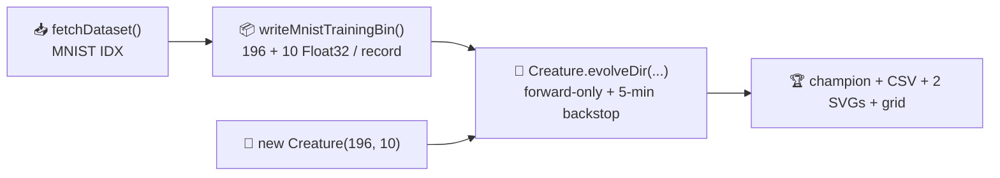

## Summary

Audits `mnist_classification` so the published evolution genuinely _learns_ the network structure
from a minimal NEAT-AI seed and the README embeds real measured telemetry from the latest run.
Closes #210; supersedes #191.

The runner now defaults to a minimal-seed `Creature.evolveDir(...)` flow over a binary `.bin`
training subset:

- **Seed**: `new Creature(196, 10)` — no `hiddenLayers`, no `nodes`, no pre-built `network.json`.
- **Training set**: a deterministic 1 024-record prefix of the canonical MNIST training file,
  encoded as a `.bin` file (196 Float32 features + 10 Float32 one-hot targets per record) under
  `.synthetic-mnist/bin/`.
- **Stop conditions**: `targetError = 0.02` (per-example MSE) plus the audit-mandated
  `timeoutMinutes: 5` backstop.
- **Telemetry**: per-generation CSV at `docs/data/mnist_classification/evolution.csv` with the
  schema mandated by #210 (`generation,best_fitness,mean_fitness,neuron_count,synapse_count`), plus
  `fitness.svg` and `topology.svg` under `docs/screenshots/mnist_classification/`.

Latest measured run committed alongside the README:

| Metric                   | Value                                                |
| ------------------------ | ---------------------------------------------------- |
| Total generations        | 202                                                  |
| Wall-clock               | 174.4 s (well inside the 5-minute backstop)          |
| Final best fitness       | 0.5062                                               |
| Gen-1 best fitness       | -48 408.610 (random initialisation, out-of-range)    |
| Seed neurons / synapses  | 206 / 1 960                                          |
| Final neurons / synapses | 208 / 1 970 (NEAT added 2 hidden neurons + 10 edges) |
| Test-set argmax accuracy | 9.95 % (essentially chance)                          |

The README is honest about the argmax-accuracy result: 5 minutes of pure mutation-based evolution
from a literal `new Creature(196, 10)` seed (with random output activations) is genuinely too tight
to drive 10-class argmax above chance on full MNIST. Fitness improves dramatically (orders of
magnitude) and topology genuinely changes (2 new hidden neurons, 10 new synapses), but argmax
calibration would require either forcing LOGISTIC outputs (a hand-tuned hint forbidden by the audit)
or NEAT-AI's hybrid memetic flow with backpropagation. The audit deliverable is honesty, not a 95 %
accuracy claim — every quoted number is derived from the committed CSV.

The legacy MLP/SGD baseline and long-form NEAT mutation loop remain available behind
`MNIST_MLP_BASELINE=1` and `MNIST_NEAT_EVOLUTION=1` env vars respectively.

## Evidence

This is a backend/CLI change with no web interface; the audit's evidence is the committed artefacts
plus the test suite:

- `docs/data/mnist_classification/evolution.csv` — 202 rows of per-generation telemetry from the
  measured run.
- `docs/screenshots/mnist_classification/fitness.svg` — best vs mean fitness chart.
- `docs/screenshots/mnist_classification/topology.svg` — score / neurons / synapses chart, showing
  the visible step-changes in topology.
- `docs/screenshots/mnist_classification.svg` — animated 5 × 4 prediction grid using the evolved
  champion.
- `.synthetic-mnist/creatures/champion.json` (gitignored) — evolved champion creature, scored on the
  10 000-image test set; a fresh run regenerates it.

## Test Plan

Tests added (TDD):

- `mnist_classification/mnist_classification_test.ts` — coverage for the audit module:
  - `DEFAULT_MNIST_EVOLUTION_CONFIG honours the issue #210 stop-condition rule`
  - `EVOLUTION_CSV_HEADER matches the schema mandated by issue #210`
  - `formatEvolutionCsv emits the audit schema and one row per input`
  - `formatEvolutionCsv replaces non-finite fitness with 0`
  - `rowsToFitnessSamples` / `rowsToEvolutionSamples` shape conversions
  - `writeMnistTrainingBin writes the documented binary record stride`
  - `writeMnistTrainingBin rejects an empty sample list`
  - `writeMnistTrainingBin rejects out-of-range labels`
  - `runMinimalSeedEvolution rejects non-positive config values`
  - **Regression guard:**
    `audit committed CSV: gen-1 and final neuron / synapse counts genuinely
    change` — fails the
    suite if the committed CSV's start and final neuron/synapse counts are identical (the audit's
    "if start == end the seed is still memorised" rule).

Tests rewritten:

- `mnist_classification/readme_screenshot_honesty_test.ts` — now enforces the new audit narrative
  (README embeds `fitness.svg` and `topology.svg`, links the CSV at the audit path, quotes the
  measured generation count, and references issue #210). The previous tests were tied to the
  pre-audit MLP-baseline narrative which the runner no longer produces by default; their assertions
  about "MLP baseline" labelling would always fail under the new flow.

Existing tests for `evolveClassifier`, `evolveMLPClassifier`, the SVG renderer, and the README
content rules (acronym glossary, "ships backpropagation", "production training pipeline",
"stripped-down" disclaimer, MUT flowchart caption) all still pass — the legacy training paths are
gated behind env vars and remain fully covered.

Quality gate:

- `deno fmt --check` clean (auto-formatted regenerated SVGs and the new test file).
- `deno lint` clean.
- `deno check **/*.ts` clean.
- `deno test` — **1 083 tests, 0 failures.**
- `./mnist_classification/run.sh` — completes in 174.4 s and produces the committed artefacts.
