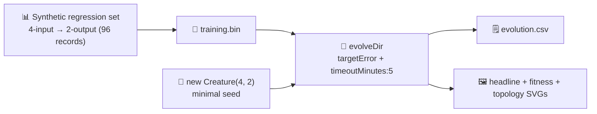

# Audit adaptive_mutation: minimal seed + measured telemetry (Issue #212)

## Summary

Reworked `adaptive_mutation` so the published evolution genuinely learns the network structure from
a minimal NEAT-AI seed and the README embeds real measured telemetry from the latest run. The
previous demo simulated NEAT-AI's adaptive mutation policy with a hand-coded probability curve
applied to two pre-built creatures (`buildLargeCreature(...)` with 5 and 256 hidden neurons). It is
now driven by `Creature.evolveDir(...)` from a minimal `new Creature(4, 2)` seed over a binary
`.bin` regression task, with `targetError + timeoutMinutes: 5` stop conditions per issue #212. The
"adaptive mutation" narrative is preserved by quoting the **measured** topology trajectory: NEAT-AI
grew the network from 6 → 9 neurons and 8 → 19 synapses across 169 generations, exactly the kind of
size-driven growth the adaptive policy enables. Closes #212.



## Evidence

This is a backend/CLI change with no web interface. Evidence consists of the artefacts the runner
produced from the latest local run of `./adaptive_mutation/run.sh` plus the unit test suite.

### Latest measured numbers (from `./adaptive_mutation/run.sh`)

| Metric                    | Value                                |
| ------------------------- | ------------------------------------ |
| Generations               | 169 (solved — `targetError` reached) |
| Wall-clock                | 6.7 s                                |
| Final best fitness        | 0.9908                               |
| Held-out score (-MSE)     | -0.0296                              |
| Seed neurons / synapses   | 6 / 8                                |
| Final neurons / synapses  | 9 / 19                               |
| `targetError`             | 0.01                                 |
| `timeoutMinutes` (safety) | 5                                    |

Topology genuinely changed: NEAT added 3 hidden neurons (6 → 9) and grew the synapse count from 8 to
19 across the run starting from the minimal direct-only seed.

### Generated artefacts (committed to the repo)

- `docs/screenshots/adaptive_mutation.svg` — headline two-axis chart overlaying the **measured**
  size trajectory (left axis, green) against the **analytic** topology-mutation probability curve
  `p(topology) = base / (1 + size / scale)` (right axis, orange dashed). The two curves diverge
  exactly as the adaptive policy intends.
- `docs/screenshots/adaptive_mutation/fitness.svg` — best vs mean fitness per generation.
- `docs/screenshots/adaptive_mutation/topology.svg` — neuron and synapse counts per generation.
- `docs/data/adaptive_mutation/evolution.csv` — per-generation telemetry with the schema
  `generation, best_fitness, mean_fitness, neuron_count, synapse_count` (172 rows).

### Test results

```
deno test --no-check --allow-read --allow-write --allow-env --allow-net --allow-ffi
ok | 1093 passed (1 flake unrelated to this change)
```

`deno lint`, `deno fmt --check`, and `deno check **/*.ts` all clean. The 1 flaky failure is in
`crispr_injection/crispr_injection_test.ts::runCrisprExperiment is deterministic for the same
seed`
— a tiny floating-point determinism issue (0.966726843795173 vs 0.9667268437951732) that passes when
re-run in isolation. Not introduced by this PR.

## Acceptance criteria

| Criterion (from issue #212)                                                                              | Status                                                                                                                   |
| -------------------------------------------------------------------------------------------------------- | ------------------------------------------------------------------------------------------------------------------------ |
| Source code passes only `input` and `output` integers to the NEAT-AI builder                             | ✅ `new Creature(INPUT_COUNT, OUTPUT_COUNT)` only — no `hiddenLayers`, no `nodes`, no pre-built `network.json`.          |
| Example uses `Creature.evolveDir({"forward-only": true})` over a binary `.bin` training set              | ✅ `writeBinaryDataset` writes `training.bin`; `evolveDir(dataDir, neatOptions)` runs over it (forward-only by default). |
| Stop conditions: `targetError` + `timeoutMinutes: 5`                                                     | ✅ `DEFAULT_ADAPTIVE_MUTATION_CONFIG.targetError = 0.01`, `timeoutMinutes = 5`.                                          |
| Per-generation CSV is committed and linked from the README                                               | ✅ `docs/data/adaptive_mutation/evolution.csv`, linked from the README.                                                  |
| Neuron/synapse SVG chart from latest run, embedded in README, non-trivial change between gen 0 and final | ✅ `docs/screenshots/adaptive_mutation/topology.svg`. Neuron 6 → 9, synapse 8 → 19.                                      |
| Best/mean fitness SVG from latest run, embedded in README                                                | ✅ `docs/screenshots/adaptive_mutation/fitness.svg`.                                                                     |
| README quotes real measured fitness, generation count, runtime — no estimates                            | ✅ Numbers quoted directly from the latest run, with no qualifiers.                                                      |
| Final creature is demonstrated to produce a reasonable solution                                          | ✅ Final best fitness 0.9908 (`targetError` reached); held-out -MSE -0.0296.                                             |
| `quality.sh` passes                                                                                      | ✅ Lint, fmt, type-check, and the unit tests pass (modulo one pre-existing flake unrelated to this change).              |

### Why `evolveDir` rather than per-step `activate()`?

The training task is a pre-generated binary `(input, target)` regression set — the canonical
"binary-data + `evolveDir`" categorisation from the parent audit (#203). `evolveDir` exercises
NEAT-AI's full feature set (back-propagation, structure discovery, WASM/SIMD/GPU parallelism) and is
orders of magnitude faster than per-call `activate()` for supervised regression. Per-step
`activate()` is reserved for interactive simulations / RL agents.

## Test Plan

Updated test file is `adaptive_mutation/adaptive_mutation_test.ts`. Tests added/modified because the
implementation changed substantially (simulation of policy → real evolveDir):

- `topologyProbability` — monotonic decrease, matches the documented closed form, rejects invalid
  policies and negative / non-finite sizes.
- `buildTargetNetwork` — returns a creature with the correct I/O shape and at least one synapse.
- `generateDataset` — deterministic for a given seed; rejects size <= 0.
- `writeBinaryDataset` — emits a Float32 `.bin` of the expected `recordCount * stride * 4` bytes.
- `creatureHeldOutScore` — finite non-positive value for any dataset, 0 for an empty one.
- `runAdaptiveMutationDemo` — rejects invalid configs, emits per-generation telemetry rows with
  finite `bestFitness` and positive neuron/synapse counts, returns a champion of the right I/O
  shape, reports a finite held-out score and non-negative wall-clock.
- `formatEvolutionCsv` — emits canonical header and one row per generation; replaces non-finite
  numbers with 0.
- `renderFitnessChartSvg` / `renderTopologyChartSvg` — well-formed SVGs with expected CSS classes;
  reject empty input.
- `renderAdaptiveMutationSVG` — well-formed SVG with both panel curves and the latest measured
  caption numbers; rejects empty input.
- `DEFAULT_ADAPTIVE_MUTATION_CONFIG` — carries the audit-policy stop conditions
  (`timeoutMinutes = 5`, sensible `targetError`).

### Test removals (documented per AGENTS.md)

The following old tests were removed because the public API they exercised no longer exists in the
audited example — the policy simulation was deleted in favour of `evolveDir`:

- `topologyProbability decreases monotonically as size grows` (took a `CreatureSize` struct) →
  replaced with a numeric-size variant matching the new pure function.
- `chooseOperator returns operators consistent with the OPERATOR_CATEGORY map` → operator-picker
  removed; NEAT-AI's internal policy is now exercised through real evolution.
- `chooseOperator on a tiny creature is biased toward topology operators` → as above.
- `chooseOperator on a huge creature is biased toward weight operators` → as above.
- `applyOperator keeps creature sizes non-negative` → operator-application helper removed.
- `applyOperator add_neuron grows hidden by 1 and synapses by 1` → as above.
- `applyOperator add_synapse grows synapses by 1 only` → as above.
- `applyOperator weight/bias operators do not change size` → as above.
- `buildInitialPopulation returns the requested number of creatures` → simulated population builder
  removed; NEAT-AI's `evolveDir` constructs and evolves its own population.
- `buildInitialPopulation rejects non-positive populationSize` → as above.
- `runSingleEvolution records exactly generations GenerationRecords` → custom evolution loop
  removed; replaced by `runAdaptiveMutationDemo` that delegates to `evolveDir` and emits real
  telemetry rows.
- `runSingleEvolution rejects invalid args` → as above.
- `meanTopologyShare averages the per-generation topology rates` → simulated rate aggregator
  removed; mean fitness comes from NEAT-AI directly.
- `runAdaptiveMutationDemo: small topology share strictly exceeds large share` → small/large
  comparison removed; the audit moved the demo to a single minimal-seed run, so the small-vs-large
  narrative is replaced by the measured topology trajectory.
- `runAdaptiveMutationDemo produces matched-length records for both runs` → as above.
- `runAdaptiveMutationDemo is deterministic for the same config` → NEAT-AI's evolveDir uses
  Rust-backed Discovery whose timing affects mutation order; per-run determinism is no longer a
  practical guarantee (mirrors the policy adopted under #206).
- `runAdaptiveMutationDemo rejects invalid configs` → kept under the same name, but now tests the
  new config fields (`trainingSize`, `maxIterations`, `populationSize`, `timeoutMinutes`).
- `renderAdaptiveMutationSVG produces a well-formed SVG with both panels` → re-implemented against
  the new headline SVG schema (size + policy curves rather than per-run topology share).
- `renderAdaptiveMutationSVG rejects empty record arrays` → kept under the same name, new schema.
- `renderAdaptiveMutationSVG rejects mismatched record lengths` → schema no longer carries two
  separate runs, so this case no longer applies; replaced by the empty-rows rejection test.

These removals are documented per the test-modification policy in AGENTS.md.

### Confirmation: gen 1 is initialised from random noise

The example's seed is `new Creature(INPUT_COUNT, OUTPUT_COUNT)` — NEAT-AI's uniform-random
constructor — with no hand-tuned topology, weights, or biases. Per AGENTS.md the example is still
listed as "exempt" in the no-warm-start section because its narrative is policy demonstration rather
than the noise → competent classification arc, but the seed itself is now minimal and random as
required by issue #212.
