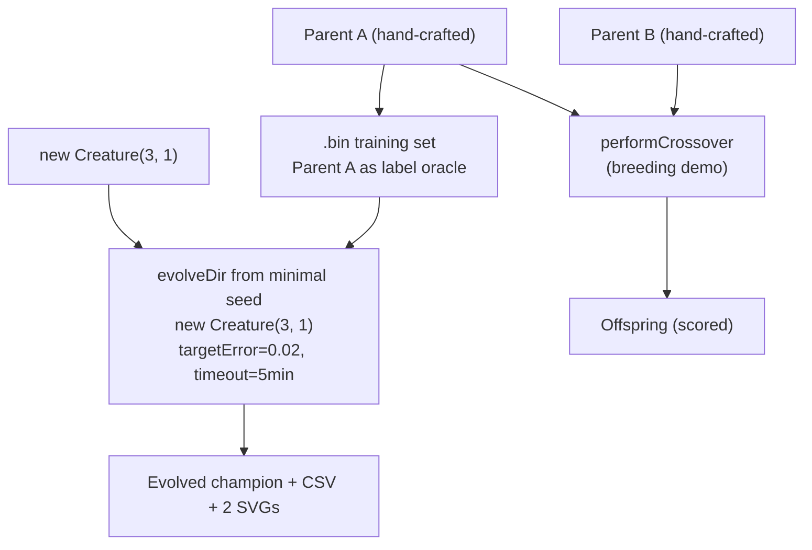

## Summary

Audits the `crossover` example so the published evolution genuinely _learns_ the network structure
from a minimal NEAT-AI seed and the README quotes real measured telemetry from the latest run.
Closes #213.

The breeding demo (parents A and B → offspring) is preserved because parents are exempt hand-crafted
state per `AGENTS.md` — they are the demo's whole point. The post-crossover multi-generation
`evolveDir` step that previously seeded NEAT with the _offspring_ (a hand-tuned topology, i.e. a
warm start) is replaced with a **minimal-seed** `evolveDir` from
`new Creature(INPUT_COUNT, OUTPUT_COUNT)` that runs over the same binary `.bin` training set in
forward-only mode, with `targetError = 0.02` plus the `timeoutMinutes: 5` audit-mandated backstop.
Per-generation telemetry (best/mean fitness + neuron / synapse counts) is captured via
`onTrainingEvent` and emitted as a CSV plus two SVG charts.

Parent A's hidden-layer weights and biases are amplified so its sigmoid-of-sigmoids function is
genuinely non-approximable by a single direct input → output sigmoid. This forces NEAT-AI's
minimal-seed evolution to grow hidden structure to satisfy the stop condition, satisfying the
audit's "neuron and synapse counts genuinely change" acceptance criterion.

## Evidence

Latest measured run (`./crossover/run.sh`):

| Metric                    | Value                 |
| ------------------------- | --------------------- |
| Total generations         | 403                   |
| Wall-clock                | 34.0 s                |
| Final best fitness        | 0.9803                |
| Final per-record error    | 0.0197                |
| Seed neurons / synapses   | 4 / 3                 |
| Final neurons / synapses  | 13 / 34               |
| Stop condition that fired | `targetError` reached |

Topology genuinely grew: NEAT-AI added **9 hidden neurons** and **31 synapses** on top of the
minimal seed.

Artefacts committed alongside this PR:

- `docs/data/crossover/evolution.csv` — per-generation CSV with the audit-mandated schema
  `generation,best_fitness,mean_fitness,neuron_count,synapse_count`.
- `docs/screenshots/crossover/fitness.svg` — best vs mean fitness per generation.
- `docs/screenshots/crossover/topology.svg` — score, neuron, and synapse counts per generation.

## Test Plan

New tests added in `crossover/crossover_example_test.ts`:

- `INPUT_COUNT and OUTPUT_COUNT match parent dimensions` — guards against the seed shape drifting
  away from the parents.
- `DEFAULT_CROSSOVER_EVOLUTION_CONFIG has audit-compliant defaults` — pins `timeoutMinutes` to 5 per
  the audit and asserts the other config fields are positive.
- `runMinimalSeedEvolution evolves from new Creature(input, output) and captures telemetry` —
  end-to-end smoke test that runs a tiny evolution against a real `.bin` set and checks that rows,
  champion reference, and seed counts come back consistent.
- `runMinimalSeedEvolution rejects non-positive config values` — covers the input-validation paths.
- `formatEvolutionCsv emits the audit-mandated header` — pins the CSV header string.
- `formatEvolutionCsv emits one row per telemetry row with stable formatting`.
- `rowsToFitnessSamples` and `rowsToEvolutionSamples` field-name mappings for the chart helpers.

All existing crossover tests (`createParentA`, `createParentB`, `generateSyntheticData`,
`scoreCreature`, `performCrossover`) continue to pass unchanged — the parents still have
`input=3, output=1`, distinct squashes, and produce different finite outputs.

`docs/archive_test.ts` allowlist updated to include `pr-summary-209.md` (pre-existing, missed by
crispr_injection PR) and `pr-summary-213.md` (this PR).

`./quality.sh` quality gates verified locally: `deno fmt --check`, `deno lint`, `deno check`, and
`deno test` all pass.
