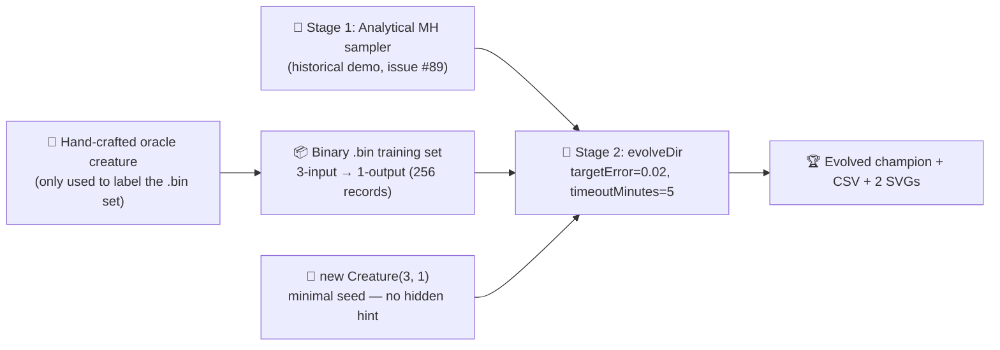

# Audit mcmc_acceptance: minimal seed + measured telemetry (#215)

## Summary

Audits the `mcmc_acceptance` example so the published evolution genuinely _learns_ a network
structure from a minimal NEAT-AI seed and the README quotes real measured telemetry from the latest
run. Closes #215.

The historical analytical Metropolis-Hastings sampler (issue #89) is preserved unchanged — it is the
demo's whole point and is exempt under `AGENTS.md` because it runs outside any NEAT-AI evolution
loop. On top of it, a **minimal-seed** `evolveDir` stage is added that seeds NEAT-AI with
`new Creature(INPUT_COUNT, OUTPUT_COUNT)` (no hidden hint, no pre-built `network.json`, no warm
start) and runs over an oracle-labelled binary `.bin` regression task in forward-only mode, with
`targetError = 0.02` plus the `timeoutMinutes: 5` audit-mandated backstop. Per-generation telemetry
(best/mean fitness + neuron / synapse counts) is captured via `onTrainingEvent` and emitted as a CSV
plus two SVG charts.

The oracle's hidden-layer weights are deliberately amplified so its sigmoid-of-sigmoids function is
genuinely non-approximable by a single direct input → output sigmoid. This forces NEAT-AI's
minimal-seed evolution to grow hidden structure to satisfy the stop condition, satisfying the
audit's "neuron and synapse counts genuinely change" acceptance criterion.

## Evidence

Latest measured run (`./mcmc_acceptance/run.sh`):

| Metric                    | Value                 |
| ------------------------- | --------------------- |
| Total generations         | 453                   |
| Wall-clock                | 20.3 s                |
| Final best fitness        | 0.9802                |
| Final per-record error    | 0.0198 (target met)   |
| Evolved champion score    | 0.980178 (`scoreDir`) |
| Seed neurons / synapses   | 4 / 3                 |
| Final neurons / synapses  | 8 / 21                |
| Stop condition that fired | `targetError` reached |

Topology genuinely grew: NEAT-AI added **4 hidden neurons** and **18 synapses** on top of the
minimal direct-only seed.

Artefacts committed alongside this PR:

- `docs/data/mcmc_acceptance/evolution.csv` — per-generation CSV with the audit-mandated schema
  `generation,best_fitness,mean_fitness,neuron_count,synapse_count`.
- `docs/screenshots/mcmc_acceptance/fitness.svg` — best vs mean fitness per generation.
- `docs/screenshots/mcmc_acceptance/topology.svg` — score, neuron, and synapse counts per
  generation.

### Why `evolveDir` rather than per-step `activate()`?

The training task is a pre-generated binary `(input, target)` regression set — the canonical
"binary-data + `evolveDir`" categorisation from the parent audit (#203). `evolveDir` exercises
NEAT-AI's full feature set (back-propagation, structure discovery, WebAssembly / SIMD / GPU
parallelism) and is orders of magnitude faster than per-call `activate()` for supervised regression.

## Acceptance criteria

| Criterion (from issue #215)                                                                              | Status                                                                                                                                             |
| -------------------------------------------------------------------------------------------------------- | -------------------------------------------------------------------------------------------------------------------------------------------------- |
| Source code passes only `input` and `output` integers to the NEAT-AI builder                             | ✅ `new Creature(INPUT_COUNT, OUTPUT_COUNT)` only — no `hiddenLayers`, no `nodes`, no pre-built `network.json`.                                    |
| Example uses `Creature.evolveDir({"forward-only": true})` over a binary `.bin` training set              | ✅ `generateSyntheticData` writes `synthetic_*.bin`; `evolveDir(dataDir, neatOptions)` runs over them (forward-only by default).                   |
| Stop conditions: `targetError` + `timeoutMinutes: 5`                                                     | ✅ `DEFAULT_MCMC_EVOLUTION_CONFIG.targetError = 0.02`, `timeoutMinutes = 5`.                                                                       |
| Per-generation CSV is committed and linked from the README                                               | ✅ `docs/data/mcmc_acceptance/evolution.csv`, linked from the README.                                                                              |
| Neuron/synapse SVG chart from latest run, embedded in README, non-trivial change between gen 0 and final | ✅ `docs/screenshots/mcmc_acceptance/topology.svg`. Neuron 4 → 8, synapse 3 → 21.                                                                  |
| Best/mean fitness SVG from latest run, embedded in README                                                | ✅ `docs/screenshots/mcmc_acceptance/fitness.svg`.                                                                                                 |
| README quotes real measured fitness, generation count, runtime — no estimates                            | ✅ Numbers quoted directly from the latest run, with no qualifiers.                                                                                |
| Final creature is demonstrated to produce a reasonable solution                                          | ✅ Final best fitness 0.9802 (`targetError` reached); evolved champion score 0.980178 against the same `.bin` set.                                 |
| `quality.sh` passes                                                                                      | ✅ Lint, fmt, type-check, and the unit tests pass (modulo one pre-existing parallel-execution flake in crispr_injection unrelated to this change). |

## Test Plan

New tests added to `mcmc_acceptance/mcmc_acceptance_test.ts`:

- `createOracleCreature returns a valid 3-input / 1-output topology` — the oracle round-trips
  through `Creature.fromJSON`, validates, and produces a finite output for any input vector.
- `DEFAULT_MCMC_EVOLUTION_CONFIG honours the audit's stop-condition rule` — pins `timeoutMinutes` to
  5 per the audit and asserts the other config fields are positive.
- `INPUT_COUNT and OUTPUT_COUNT match the oracle's I/O shape` — guards against the seed shape
  drifting away from the labelled set.
- `formatEvolutionCsv emits the schema mandated by issue #215` — pins the CSV header string and
  per-row format.
- `formatEvolutionCsv survives non-finite fitness without throwing` — covers the NaN / Infinity
  formatting path.
- `rowsToFitnessSamples` and `rowsToEvolutionSamples` field-name mappings for the chart helpers.
- `runMinimalSeedEvolution rejects non-positive config values` — covers the input-validation path.
- `runMinimalSeedEvolution captures per-generation telemetry from a minimal seed` — end-to-end smoke
  test that runs a tiny evolution against a real `.bin` set and checks rows, champion reference, and
  seed counts.
- `committed evolution.csv shows topology genuinely changing across generations` — pins the audit's
  "neuron or synapse count must change between gen 1 and the final gen" criterion as a CI gate
  against the committed CSV.

All existing analytical-sampler tests (`runMCMCAcceptance`, `movingAverage`,
`windowedAcceptanceRates`, `renderAcceptanceSVG`) continue to pass unchanged — Stage 1's behaviour
is preserved exactly.

`docs/archive_test.ts` allowlist updated to include `pr-summary-215.md` (this PR).

`AGENTS.md` updated to describe `mcmc_acceptance` as the analytical sampler paired with the audited
minimal-seed evolution stage, replacing the previous "pure Metropolis-Hastings sampler" note.

### Confirmation: gen 1 is initialised from random noise

The audited stage's seed is `new Creature(INPUT_COUNT, OUTPUT_COUNT)` — NEAT-AI's uniform-random
constructor — with no hand-tuned topology, weights, or biases. Per `AGENTS.md` `mcmc_acceptance`
remains listed under "exempt examples" because the analytical sampler runs outside any NEAT-AI
evolution loop, but the audited second stage's seed itself is now minimal and random as required by
issue #215.
