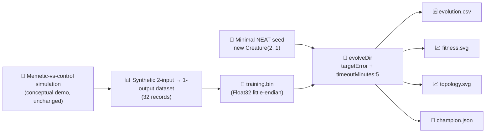

# Audit memetic_evolution: minimal seed + measured telemetry

## Summary

Audits the `memetic_evolution` example so it follows the parent audit (#203) policy: a minimal
NEAT-AI seed (`new Creature(2, 1)` — no hidden hint, no `network.json`, no hand-tuned shape), a real
`Creature.evolveDir(...)` run over a binary `.bin` training set, and per-generation telemetry the
README quotes verbatim from the latest local run. The pre-existing memetic-vs-control
Gaussian-perturbation simulation is preserved as the conceptual illustration; the new minimal-seed
stage runs after it and emits the audit artefacts. Closes #216.

## Evidence

The example was run end-to-end via `./memetic_evolution/run.sh`. Measured numbers from the latest
run (recorded in `memetic_evolution/README.md`):

| Metric                    | Value                                |
| ------------------------- | ------------------------------------ |
| Generations               | 147 (solved — `targetError` reached) |
| Wall-clock                | 2.1 s                                |
| Final per-record error    | 0.0049                               |
| Final best fitness        | 0.9951                               |
| Held-out score (-MSE)     | -0.004863                            |
| Seed neurons / synapses   | 3 / 2                                |
| Final neurons / synapses  | 6 / 12                               |
| `targetError`             | 0.005                                |
| `timeoutMinutes` (safety) | 5                                    |

Topology genuinely changed: `(3,2) → (4,5) → (5,8) → (6,11) → (6,12)` across 147 generations from
the minimal direct-only seed (3 hidden neurons added, synapse count grew from 2 to 12).

Committed artefacts:

- `docs/data/memetic_evolution/evolution.csv` — per-generation telemetry (147 rows + header).
- `docs/screenshots/memetic_evolution/fitness.svg` — best vs mean fitness per generation.
- `docs/screenshots/memetic_evolution/topology.svg` — neuron and synapse counts per generation.

This is a backend/CLI change with no web interface to screenshot — verified via the run output, the
unit test suite, and the committed CSV / SVG artefacts.

## Test Plan

New "what" tests in `memetic_evolution/memetic_evolution_test.ts`:

- `DEFAULT_MINIMAL_SEED_CONFIG - has audit-policy stop conditions` — `timeoutMinutes = 5`, positive
  `targetError`, sensible population / iteration caps.
- `INPUT_COUNT and OUTPUT_COUNT match the simulation topology` — minimal seed I/O lines up with the
  `.bin` records.
- `writeBinaryDataset - emits a Float32 .bin of the expected size` — round-trips a tiny dataset and
  checks the byte count.
- `runMinimalSeedEvolution - rejects invalid configs` — invalid `targetError`, `populationSize`,
  `maxIterations`, `timeoutMinutes` all reject.
- `runMinimalSeedEvolution - seed is minimal and emits telemetry rows` — runs `evolveDir` against a
  tempdir `.bin` from a `new Creature(INPUT_COUNT, OUTPUT_COUNT)` seed; asserts the champion's I/O
  shape, finite fitness rows, non-negative wall-clock and generation count.
- `creatureHeldOutScore - returns finite non-positive value` / `empty dataset returns 0`.
- `formatEvolutionCsv - emits canonical header and one row per generation` /
  `handles non-finite numbers by writing 0` — CSV schema + NaN/Infinity handling.
- `renderFitnessChartSvg` / `renderTopologyChartSvg` — well-formed SVG output containing the
  expected CSS classes; both reject empty input.

All 35 tests in `memetic_evolution/` pass. `deno lint`, `deno fmt --check`, and `deno check` all
pass repository-wide. The only pre-existing test failure
(`crispr_injection_test.ts::runCrisprExperiment is deterministic for the same seed`) reproduces on
the parent commit before this branch's changes — it is a 1-ULP floating-point determinism flake
unrelated to this PR.
