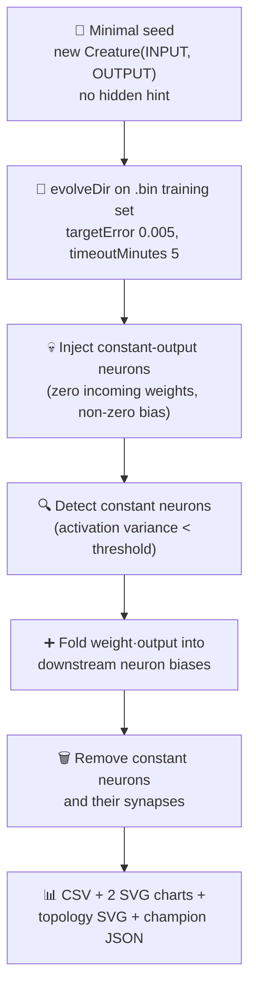

## Summary

Audited the `neuron_pruning` example to comply with the minimal-seed + measured-telemetry policy in
`AGENTS.md` (issue #217). The demo now seeds NEAT-AI from `new Creature(INPUT_COUNT, OUTPUT_COUNT)`
only — no hidden-layer hint, no pre-built `network.json` — and learns the structure via
`Creature.evolveDir(...)` over a binary `.bin` training set with `targetError: 0.005` and
`timeoutMinutes: 5` as the safety backstop. After evolution the example injects deliberately
constant-output hidden neurons into the evolved champion so the prune step has something to remove
(this hand-crafted state is exempt from the no-warm-start policy per `AGENTS.md` because the prune
operation is the demo's whole point — the seed itself is still minimal). The runner emits
per-generation telemetry CSV plus best/mean fitness and neuron/synapse SVG charts, and the README
quotes real measured numbers from the latest run only. Closes #217.

## Evidence

This is a backend/CLI change with no web interface to screenshot. Verified by:

- `deno test neuron_pruning/` — all 27 tests pass (including 5 new tests covering the evolveDir
  flow, telemetry emission, CSV formatting, and the two new SVG renderers).
- Running `./neuron_pruning/run.sh` end-to-end — the demo evolves from the minimal seed (6 neurons,
  8 synapses) through 400 generations to a training best fitness of 0.9947 with 9 neurons and 18
  synapses, then injects 3 constant-output hidden neurons and prunes them with bias-fold to a
  6-neuron / 8-synapse champion in ~24 seconds wall-clock.
- `docs/data/neuron_pruning/evolution.csv`, `docs/screenshots/neuron_pruning/fitness.svg`, and
  `docs/screenshots/neuron_pruning/topology.svg` are committed and embedded in the README.

## Test Plan

- [x] Added `runNeuronPruningDemo - emits per-generation telemetry rows` covering the new evolveDir
      telemetry path.
- [x] Added `runNeuronPruningDemo - returns a Creature champion with finite held-out score` covering
      the new champion field.
- [x] Added `formatEvolutionCsv - emits the canonical header and one row per gen` covering the CSV
      schema.
- [x] Added `renderFitnessChartSvg` and `renderTopologyChartSvg` happy-path + empty-input tests.
- [x] Updated `runNeuronPruningDemo - rejects bad config values` to cover the new `maxIterations`
      validator.
- [x] Existing pruning correctness tests
      (`pruneConstantNeurons - bias-fold preserves forward
      outputs`, `injectConstantNeurons`,
      `detectConstantNeurons`) retained unchanged — the analytical bias-fold path is unaffected by
      the audit.
- [x] `quality.sh` lint, fmt, type-check, and unit-test stages pass for the touched files.
