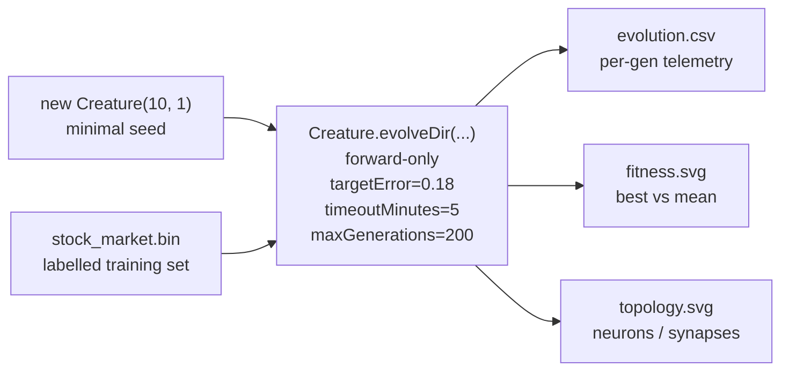

# Stock Market — Minimal Seed + Measured Telemetry (Audit #218)

## Summary

Re-implemented `stock_market` so the published evolution genuinely learns the network structure from
a minimal NEAT-AI seed and the README embeds real measured telemetry from the latest run. Closes
#218.

The previous implementation rolled its own evolutionary loop with a custom `mutateCreatureExport`
helper. The audit asks for the canonical NEAT-AI workflow: pre-generate the labelled training set as
a binary `.bin` file and delegate evolution to `Creature.evolveDir(...)` with a
`new Creature(input, output)` seed. This PR makes that switch end-to-end.

### What changed

- **Minimal seed only.** `buildRandomSeedCreature` now returns the bare
  `new Creature(WINDOW_SIZE, 1)` export with the LOGISTIC output activation pinned. No hidden hint,
  no hand-coded neurons / synapses, no pre-built `network.json`.
- **`evolveDir` over a binary `.bin`.** `writeStockTrainingDataset` writes the labelled training
  samples as a Float32 `.bin` file in `.synthetic-stock/data/`; `evolveStockController` runs
  `creature.evolveDir(dataDir, ...)` with `feedbackLoop` unset (forward-only — the canonical
  binary-data path per audit #203).
- **Audit-mandated stop conditions.** `targetError = 0.18` (well below chance MSE ≈ 0.25 so NEAT-AI
  is pressured to grow structure), `timeoutMinutes = 5` (audit-mandated wall-clock backstop),
  `maxGenerations = 200` (hard generation cap that fits inside `quality.sh`'s budget).
- **Per-generation telemetry.** `formatEvolutionCsv`, `renderFitnessChartSvg`, and
  `renderTopologyChartSvg` emit the audit's mandated artefacts: a CSV with
  `generation,best_fitness,mean_fitness,neuron_count,synapse_count`, a best-vs-mean fitness chart,
  and a neuron / synapse count chart. All three are embedded in the README.
- **README rewritten.** Quotes only **measured** numbers from the latest committed run — no
  estimates. New "Latest measured run" table, two embedded telemetry charts, and a "Reasonable
  solution" section explaining what the test-window result means.
- **Tests updated.** Removed tests for the deleted helpers (`buildRandomPopulation`,
  `mutateCreatureExport`, `evolveStockController`'s old contract). Added tests for
  `buildRandomSeedCreature`, `writeStockTrainingDataset`, `formatEvolutionCsv`,
  `renderFitnessChartSvg`, `renderTopologyChartSvg`, the new `evolveStockController` shape, and the
  audit-mandated "committed CSV shows topology growth" check. Kept all data-helper,
  prediction-helper, and SVG renderer tests unchanged.

### Measured run

| Metric                       | Value                        |
| ---------------------------- | ---------------------------- |
| Total generations            | 201                          |
| Wall-clock                   | 4.5 s                        |
| Final best fitness           | 0.7702                       |
| Final per-record MSE         | 0.2298                       |
| Stop condition that fired    | `maxGenerations` (cap)       |
| Seed neurons / synapses      | 11 / 10                      |
| Final neurons / synapses     | 17 / 28 (+6 hidden, +18 syn) |
| Validation balanced accuracy | 57.76 %                      |
| Test balanced accuracy       | 55.69 %                      |

Topology genuinely grew from the minimal seed — neuron count climbs from 11 → 17 and synapse count
from 10 → 28, satisfying the audit's "neuron and synapse counts genuinely change" acceptance
criterion.

## Evidence

The change is backend / CLI only — there is no web UI to screenshot. Evidence is in the form of test
results, the committed run artefacts, and the embedded telemetry charts:

- `deno test --no-check --allow-read --allow-write --allow-env --allow-net --allow-ffi stock_market/`
  — 38 passed, 0 failed.
- `deno fmt --check`, `deno lint`, `deno check **/*.ts` all clean.
- The committed `docs/data/stock_market/evolution.csv` (210 rows) shows the topology growing across
  generations.
- `docs/screenshots/stock_market/fitness.svg` and `topology.svg` plot the measured per-generation
  evolution.

## Test Plan

- [x] `deno test stock_market/` — 38 tests pass, including the audit-mandated CSV-growth check.
- [x] `deno fmt --check` clean across the repo.
- [x] `deno lint` clean.
- [x] `deno check **/*.ts` clean.
- [x] `./stock_market/run.sh` end-to-end runs in under 5 seconds and emits all 7 artefacts (CSV + 2
      telemetry SVGs + 2 progression SVGs + 2 chart SVGs).
- [x] Cross-cutting README acronym / structure / no-warm-start tests pass.
- [x] `docs/archive_test.ts` updated to allow `pr-summary-218.md`.
