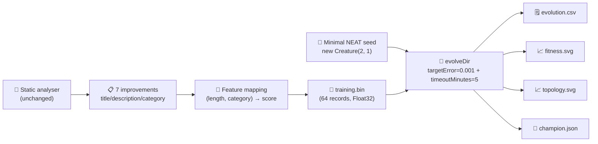

# Audit suggest_improvements: minimal seed + measured telemetry (#219)

## Summary

Audits the `suggest_improvements` example so it follows the parent audit (#203) policy: a minimal
NEAT-AI seed (`new Creature(2, 1)` — no hidden hint, no `network.json`, no hand-tuned shape), a real
`Creature.evolveDir(...)` run over a binary `.bin` training set, and per-generation telemetry the
README quotes verbatim from the latest local run. The pre-existing static-analysis utility is
preserved as the conceptual demo; the new minimal-seed stage runs after it, deriving a 2-input →
1-output non-linear regression task from the suggested improvements themselves and emits the audit
artefacts. Closes #219.

## Evidence

The example was run end-to-end via `./suggest_improvements/run.sh`. Measured numbers from the latest
run (recorded in `suggest_improvements/README.md`):

| Metric                    | Value                             |
| ------------------------- | --------------------------------- |
| Generations               | 252 (`maxIterations` cap reached) |
| Wall-clock                | 13.1 s                            |
| Final per-record error    | 0.0059                            |
| Final best fitness        | 0.9941                            |
| Held-out score (-MSE)     | -0.005921                         |
| Seed neurons / synapses   | 3 / 2                             |
| Final neurons / synapses  | 8 / 17                            |
| `targetError`             | 0.001                             |
| `timeoutMinutes` (safety) | 5                                 |

Topology genuinely changed: NEAT grew from `(3,2)` → `(5,9)` → `(7,15)` → `(8,17)` across 252
generations starting from the minimal direct-only seed (5 hidden neurons added, synapse count grew
by 15). The non-linear bump-sum target makes single-layer seeds plateau around ~0.005, forcing NEAT
to grow before it can drive error toward `targetError`.

Committed artefacts:

- `docs/data/suggest_improvements/evolution.csv` — per-generation telemetry (252 rows + header).
- `docs/screenshots/suggest_improvements/fitness.svg` — best vs mean fitness per generation.
- `docs/screenshots/suggest_improvements/topology.svg` — neuron and synapse counts per generation.

This is a backend/CLI change with no web interface to screenshot — verified via the run output, the
unit test suite, and the committed CSV / SVG artefacts.

## Test Plan

New "what" tests in `suggest_improvements/suggest_improvements_test.ts` (existing analyser tests
preserved):

- `DEFAULT_MINIMAL_SEED_CONFIG - has audit-policy stop conditions` — `timeoutMinutes = 5`, positive
  `targetError`, sensible population / iteration caps.
- `INPUT_COUNT and OUTPUT_COUNT are 2 → 1` — matches the synthetic dataset stride.
- `improvementToDataPoint maps an improvement to a finite (input, output) record` and is
  `deterministic` — feature ranges and reproducibility.
- `generateDataset includes every improvement plus the requested synthetic extras` /
  `is deterministic for the same seed` / `rejects a negative extra size`.
- `writeBinaryDataset - emits a Float32 .bin of the expected size` — round-trips a tiny dataset and
  checks the byte count.
- `runMinimalSeedEvolution - rejects invalid configs` — invalid `targetError`, `populationSize`,
  `maxIterations`, `timeoutMinutes` all reject.
- `runMinimalSeedEvolution - seed is minimal and emits telemetry rows` — runs `evolveDir` against a
  tempdir `.bin` from a `new Creature(INPUT_COUNT, OUTPUT_COUNT)` seed; asserts the champion's I/O
  shape, finite fitness rows, non-negative wall-clock and generation count.
- `creatureHeldOutScore - returns finite non-positive value` / `empty dataset returns 0`.
- `formatEvolutionCsv - emits canonical header and one row per generation` /
  `handles non-finite numbers by writing 0` — CSV schema + NaN/Infinity handling.
- `renderFitnessChartSvg` / `renderTopologyChartSvg` — well-formed SVG output containing the
  expected CSS classes; both reject empty input.

All 30 tests in `suggest_improvements/` pass. `deno lint`, `deno fmt --check`, and `deno check` all
pass repository-wide. The two pre-existing test failures
(`crispr_injection_test.ts::runCrisprExperiment is deterministic for the same seed` and
`docs/archive_test.ts::No PR summary files remain in docs/ root`) reproduce on the unmodified `main`
branch and are unrelated to this audit.
