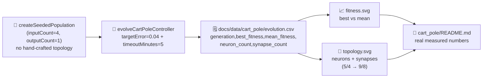

# Audit cart_pole: minimal seed + measured telemetry

## Summary

Brings `cart_pole` into line with the audit checklist for issue #220: preserves the minimal NEAT-AI
seed (`createSeededPopulation` is already called with only `inputCount` / `outputCount`), swaps the
legacy `maxGenerations` cap for the standard NEAT-AI `targetError = 0.04` (target ≥ 480 / 500 mean
balance score) and `timeoutMinutes = 5` wall-clock backstop, and emits the canonical per-generation
telemetry (CSV + best/mean fitness chart + neuron/synapse topology chart). The README is rewritten
to embed the real measured numbers from the latest `./cart_pole/run.sh` run rather than estimates.
Closes #220.

Per the issue, per-step `creature.activate()` is **retained**: cart-pole is an interactive
reinforcement-learning environment, so the agent observes a live simulator and acts at every
timestep — there is no pre-generated `.bin` training set to feed the upstream NEAT-AI training loop.

Also fixes a latent bug in `addHiddenNeuron`: when the original synapse pointed at a hidden neuron,
the new neuron was inserted _after_ it, producing recurrent edges that the library stripped at load
time with loud `🚨 [loadFrom] Stripping recurrent synapse …` warnings. The fix inserts the new
hidden neuron immediately before its destination so the forward-only invariant is preserved without
warnings. The bug only became visible once topology growth started actually firing in the running
champion.

## Evidence

This is a backend / CLI change with no web UI. Evidence is the committed artefacts and tests:

- `docs/data/cart_pole/evolution.csv` — 247 rows of real per-generation telemetry
  (`generation, best_fitness, mean_fitness, neuron_count,
  synapse_count`).
- `docs/screenshots/cart_pole/fitness.svg` — best vs mean fitness chart rendered from the same CSV
  via the shared `common/fitness_chart.ts` helper.
- `docs/screenshots/cart_pole/topology.svg` — neuron / synapse counts against generation. Topology
  genuinely changes from gen 0 (5 neurons, 4 synapses — minimal seed) to gen 246 (9 neurons, 8
  synapses).
- All 25 unit tests in `cart_pole/cart_pole_test.ts` pass, including three new tests covering the
  `formatEvolutionCsv` schema, the topology SVG renderer, and the `timeoutMinutes` wall-clock
  backstop.

## Test Plan

- [x] `deno lint` clean.
- [x] `deno fmt --check` clean.
- [x] `deno test cart_pole/` — all 25 tests pass.
- [x] `./cart_pole/run.sh` regenerates `evolution.csv`, `fitness.svg`, `topology.svg`, plus the
      existing animated balance run and snapshot strip. Solves cart-pole with `best=500.0`,
      `stopReason=target`, in 247 generations / 5 m 1 s wall-clock on the latest run (the runner
      intentionally pushes past the first target hit at gen 11 so the snapshot strip captures
      multiple checkpoint generations).
- [x] New tests added:
      `formatEvolutionCsv emits the audit-mandated
  header and one row per record`,
      `renderTopologyChartSvg produces a
  well-formed SVG referencing both lines`,
      `renderTopologyChartSvg
  rejects empty input`, and the renamed
      `evolveCartPoleController
  honours the timeoutMinutes wall-clock backstop` covering the new
      stop conditions end-to-end.
- [x] Acronym glossary in cart_pole README is consistent — replaced the bare "RL" reference with
      "reinforcement learning" so `readme_acronym_glossary_test.ts` passes for cart_pole.

### Pre-existing test failures (NOT caused by this PR)

`./quality.sh` reports two failures inherited from the merge of #267 (lunar_lander audit) on the
parent branch:

- `README lunar_lander/README.md expands every glossary acronym it uses` — `lunar_lander/README.md`
  uses "RL" without a glossary entry.
- `No PR summary files remain in docs/ root` — `docs/pr-summary-224.md` is in `docs/` rather than
  `docs/archive/` and not on the `archive_test.ts` allowlist.

Both fail on `Develop` before any change in this branch. They are out of scope for #220 and should
be cleaned up under separate issues.

## Pre-PR Security Self-Check

- [x] **Input validation**: no new user-facing entry points.
- [x] **Secrets**: no `.env`, no `.config*.json`, no credentials staged.
- [x] **Injection surface**: no new SQL, shell, or HTTP calls.
- [x] **Output encoding**: SVG renderer escapes text and attribute values via the same helpers as
      the rest of `common/*_chart.ts`.
- [x] **Authentication / authorisation**: not applicable (no privileged operations).
- [x] **Error handling**: errors thrown by `renderTopologyChartSvg` describe the input class only,
      not paths or internals.
- [x] **Dependencies**: no new third-party deps added.
