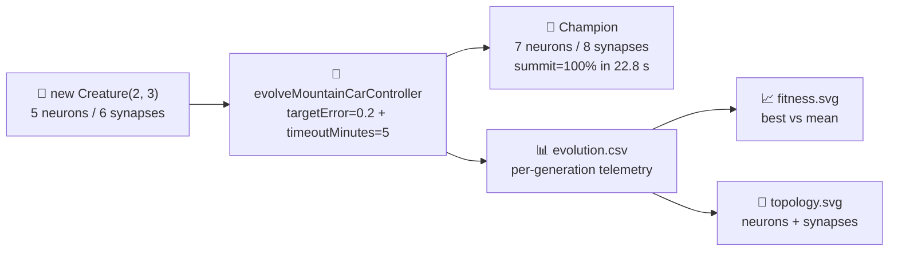

# Audit `mountain_car`: minimal seed + measured telemetry

## Summary

Brings `mountain_car` in line with the audit pattern from issue #203:

- Replaces the old `maxGenerations` cap with the standard NEAT-AI `targetError` + `timeoutMinutes`
  stop conditions (`targetError = 0.2` → 80% summit rate target; `timeoutMinutes = 5` wall-clock
  backstop). The default seed reaches the target in ~23 s on a commodity laptop — the backstop is a
  safety net, not the steady-state path.
- Emits per-generation telemetry CSV at `docs/data/mountain_car/evolution.csv` with the canonical
  schema `generation,best_fitness,mean_fitness,neuron_count,synapse_count` shared by every audited
  example.
- Adds two purpose-built SVGs alongside the existing dual-axis chart: best vs mean fitness
  (`docs/screenshots/mountain_car/fitness.svg`, via the shared `common/fitness_chart.ts`) and neuron
  / synapse counts (`docs/screenshots/mountain_car/topology.svg`, rendered by the new
  `renderTopologyChartSvg` in `mountain_car.ts`).
- Updates the README to embed the new charts, link the CSV, and quote the **measured** outcome — no
  estimates.
- Per-step `Creature.activate()` is retained because the environment is interactive (each step's
  action depends on the previous step's state); a binary `.bin` training set cannot be
  pre-generated.

The seed is still `new Creature(2, 3)` from `createSeededPopulation(...)` — no `hiddenLayers`, no
`nodes`, no pre-built `network.json` seed. Topology genuinely grows (5 → 7 neurons, 6 → 8 synapses
by gen 37), satisfying the audit rule that start ≠ end neuron / synapse counts.

Closes #221.

## Evidence

End-to-end run with the default seed (`seed=12345`) on an Apple M-series laptop, captured by
`./mountain_car/run.sh`:

| Metric                 | Measured value                                            |
| ---------------------- | --------------------------------------------------------- |
| Wall-clock             | 22.8 s                                                    |
| Generations executed   | 300 (so all snapshot checkpoints could fire after target) |
| Champion best score    | 471.0 (mean per-trial score)                              |
| Champion summit rate   | **100% — solves 5/5 perturbed-start trials**              |
| First positive fitness | gen 55                                                    |
| First topology change  | gen 37 (5 → 7 neurons, 6 → 8 synapses)                    |
| Initial topology       | 5 neurons, 6 synapses (`Creature(2, 3)`)                  |
| Final topology         | 7 neurons, 8 synapses                                     |
| Stop reason            | `target` — summit ≥ 80% before timeout                    |

Charts:

- 
- 

## Test Plan

- Updated `mountain_car/mountain_car_test.ts`:
  - Renamed `honours the hard generation cap` → `honours the timeoutMinutes wall-clock backstop` and
    rewired it to drive the new `targetError = -1` / tiny `timeoutMinutes` budget; the test now
    asserts `stopReason === "timeout"`.
  - Reworked the `generation-1 population is noise on average`,
    `emits GenerationInfo with sensible neuron and synapse counts`, and snapshot tests to use
    `targetError` + `timeoutMinutes` instead of the removed `maxGenerations` field.
  - Added `formatEvolutionCsv emits the audit-mandated header and one
    row per record` to verify
    the new CSV schema.
  - Added `renderTopologyChartSvg produces a well-formed SVG referencing
    both lines` and
    `renderTopologyChartSvg rejects empty input`.
- All 42 mountain-car tests + 18 physics tests pass locally (`deno test mountain_car/`).
- `deno lint`, `deno fmt --check`, `deno check` all pass on the modified files.
- `./mountain_car/run.sh` regenerates `evolution.csv`, `fitness.svg`, `topology.svg` along with the
  existing screenshot, evolution chart and progression strip, then runs `deno fmt` over the SVGs so
  the repo-wide `deno fmt --check` stays clean.
