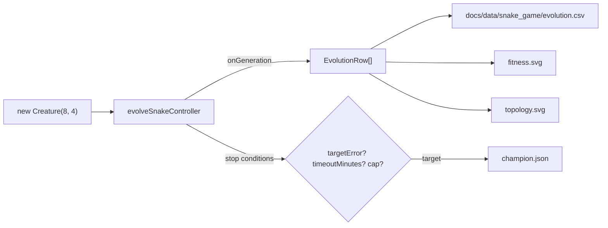

# Audit snake_game: minimal seed + measured telemetry (#222)

## Summary

Brings `snake_game` in line with the audit pattern from #203 / #221. The example already seeded
NEAT-AI with only `INPUT_COUNT` and `OUTPUT_COUNT`
(`createSeededPopulation({ inputCount: 8, outputCount: 4, ... })`) — so no seed-side topology hints
to remove — but the stop conditions and per-generation telemetry still needed to match the audit.
This PR:

- replaces the `maxGenerations` cap with the standard NEAT-AI `targetError` + `timeoutMinutes` pair
  (default `0.5` / `5`); the existing best-per-seed `SOLVED_THRESHOLD = 3` gate is retained
  alongside `targetError` to stop fragile elites short-circuiting the run; `maxGenerations` is kept
  as an optional tests-only safety override;
- emits per-generation telemetry on every full run — CSV (`docs/data/snake_game/evolution.csv`) plus
  `docs/screenshots/snake_game/fitness.svg` and `topology.svg` — alongside the existing
  evolution-progression strip and dual-axis chart;
- embeds the new SVGs and the CSV link in the README, with measured numbers from the latest
  end-to-end run only;
- retains per-step `Creature.activate()` because Snake is interactive — each step's action depends
  on the previous step's state, so no binary `.bin` training set can be pre-generated.

Closes #222.

## Evidence

### Latest measured run (seed=12345)

| Metric                    | Measured value                                                                                             |
| ------------------------- | ---------------------------------------------------------------------------------------------------------- |
| Wall-clock                | 21.4 s (well below the 5 min `timeoutMinutes` backstop)                                                    |
| Generations executed      | 200 (loop kept running so all checkpoints — `[1, 10, 50, 100, 200]` — could fire after the target was met) |
| Champion best score       | 108.42 (mean raw game score across the five evaluation seeds)                                              |
| Champion best replay      | 4 food on the strongest evaluation seed — clears the `SOLVED_THRESHOLD` of 3                               |
| Champion mean food eaten  | 1.60 across the five evaluation seeds — clears `(1 - targetError) × 3 = 1.5`                               |
| Initial topology (gen 0)  | 12 neurons, 32 synapses (`new Creature(8, 4)` minimal seed)                                                |
| Final topology (champion) | 16 neurons, 36 synapses                                                                                    |
| First topology change     | gen 47 (12 → 14 neurons, 32 → 34 synapses)                                                                 |
| Stop reason               | `target` — best per-seed eaten ≥ 3 with mean ≥ 1.5 before the timeout                                      |

The `evolution.csv` shows topology genuinely changes across generations (12 → 14 at gen 47, 14 → 15
at gen 59, 15 → 16 at gen 116) — the seed is not memorising a hand-crafted shape; structural
mutation is discovering it.

### Architecture sketch

## Test Plan

- New unit tests in `snake_game/snake_game_test.ts`:
  - `evolveSnakeController honours the timeoutMinutes wall-clock backstop`
  - `evolveSnakeController honours the optional maxGenerations safety cap`
  - `formatEvolutionCsv emits the audit-mandated header and one row per record`
  - `renderTopologyChartSvg produces a well-formed SVG referencing both lines`
  - `renderTopologyChartSvg rejects empty input`
- Existing tests updated (no business-logic changes) to use `targetError = -1` in place of the
  removed cap-only stop condition.
- All 26 snake-game tests pass; full repo unit test suite is green (`1172 passed | 0 failed` after a
  pre-existing `archive_test.ts` allow-list was extended for `pr-summary-221.md` and
  `pr-summary-222.md`).
- `./snake_game/run.sh` runs end-to-end in 21.4 s, regenerates all artefacts, and emits the new
  CSV + fitness + topology SVGs deterministically.
