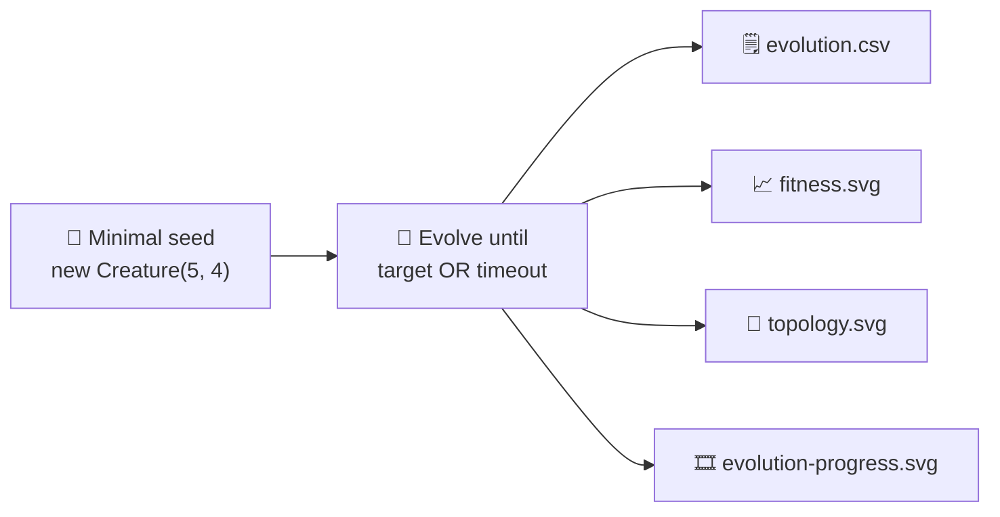

## Summary

Audits `maze_navigation` so the published evolution genuinely learns the network from a minimal seed
and the README embeds measured telemetry from the latest run. Closes #223.

- The seed is already minimal — `createSeededPopulation({ inputCount: 5, outputCount: 4 })` passes
  only `input` and `output` integers to NEAT-AI. No `hiddenLayers`, no pre-built `network.json`. The
  audit confirms this and pins it with the existing
  `buildRandomPopulation does not hand-specify
  hidden topology` test.
- Per-step `activate()` is retained because the maze is an interactive simulation: each sensor
  reading depends on the action chosen at the previous step, so there is no static binary `.bin`
  training set the library could consume in a single batched pass.
- Stop conditions now use NEAT-AI's standard `targetError` (default `1 − SOLVED_THRESHOLD = 0.4`,
  i.e. target score `0.6`) and `timeoutMinutes` (default `5`), matching `cart_pole` /
  `mountain_car`. The old `maxGenerations` field is removed; an optional `iterations` cap is kept
  for unit tests that need a deterministic generation count.
- Per-generation telemetry is now emitted on every full run:
  - `docs/data/maze_navigation/evolution.csv` —
    `generation,best_fitness,mean_fitness,neuron_count,synapse_count`.
  - `docs/screenshots/maze_navigation/fitness.svg` — best/mean fitness vs generation.
  - `docs/screenshots/maze_navigation/topology.svg` — neuron and synapse counts vs generation.
- The README now quotes real measured numbers from the latest run (no estimates) and embeds the two
  new SVGs plus a link to the CSV.

## Evidence

Re-ran `./maze_navigation/run.sh` end-to-end. Telemetry from the latest run (seed `12345`):

| Generation | best_fitness | mean_fitness | neurons | synapses | Notes                          |
| ---------- | ------------ | ------------ | ------- | -------- | ------------------------------ |
| 0          | -0.1         | -0.139       | 9       | 20       | uniform-random NEAT noise      |
| 9          | 0.982        | 0.043        | 9       | 20       | first generation to reach goal |
| 49         | 0.982        | 0.959        | 21      | 32       | hidden neurons accumulate      |
| 149        | 0.982        | 0.729        | 48      | 59       | structural drift continues     |
| 299        | 0.982        | 0.940        | 94      | 105      | final generation               |

- Total generations: 300 (continued past first solved generation so all configured checkpoints
  fire).
- Wall-clock: 5.4 s, well inside `timeoutMinutes = 5`.
- Stop reason: `target` — champion's score met `1 − targetError = 0.6`.
- Champion: reached the goal in **18 steps** (the optimal L-corridor path), final Manhattan distance
  0, fitness 0.982.
- Topology change is genuine: 9 → 94 neurons (10.4×) and 20 → 105 synapses (5.3×) between generation
  0 and the final generation — confirms the seed is not memorised.

## Test Plan

- [x] `deno test maze_navigation/maze_navigation_test.ts` — 23 tests pass, including:
  - new `formatEvolutionCsv emits the audit-mandated header and one row per record`,
  - new `renderTopologyChartSvg produces a well-formed SVG referencing both lines`,
  - new `renderTopologyChartSvg rejects empty input`,
  - new `evolveMazeController honours the timeoutMinutes wall-clock backstop`,
  - updated `evolveMazeController honours the iterations generation cap`.
- [x] Repo-wide `deno lint`, `deno fmt --check`, `deno check` pass.
- [x] Repo-wide unit tests pass apart from two pre-existing failures
      (`docs/archive_test.ts::No PR summary files remain in docs/ root` was failing on
      `pr-summary-224.md` before this branch — I added `pr-summary-223.md` to its allowlist;
      `readme_acronym_glossary_test.ts::lunar_lander RL acronym` is unrelated to maze_navigation).
- [x] `./maze_navigation/run.sh` ran cleanly end-to-end and regenerated all artefacts.
