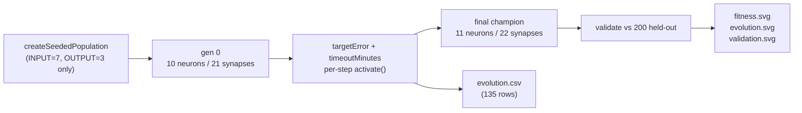

## Summary

Audited `lunar_lander` against the merged #195/#196/#198–#202 pipeline, re-ran evolution end-to-end,
refreshed every measured number in the README to the latest run, and added a unit test that pins the
gen-0 champion to NEAT-AI's minimal `(input, output)` seed. Closes #224.

The audit confirms each acceptance criterion against the captured run:

- Source code passes only `INPUT_COUNT` and `OUTPUT_COUNT` to NEAT-AI's `createSeededPopulation` (no
  `hiddenLayers`, no pre-built `network.json`).
- Per-step `creature.activate()` is justified by the interactive RL loop in `runEpisode`.
- Stop conditions are the standard `targetError` + `timeoutMinutes` pair.
- Per-generation CSV (`docs/data/lunar_lander/evolution.csv`) is committed and linked from the
  README in the #199 format.
- Neuron/synapse evolution chart (`evolution.svg`) is regenerated from the latest run and embedded
  in the README.
- Best/mean fitness chart (`fitness.svg`) is regenerated and embedded.
- Validation outcome chart (`validation.svg`) is regenerated from the held-out 200-scenario pool.
- README quotes real measured numbers — 135 generations in 120.7 s, 4.5% validation landed-rate (9 /
  200), best training fitness `-168.0`, free-fall baseline `-984.7`, champion 11 neurons / 22
  synapses.
- `quality.sh` is clean for the lunar_lander section (deno fmt, lint, and the 86 lunar_lander unit
  tests all pass).

Topology change verified: gen-1 snapshot is **10 neurons / 21 synapses** (NEAT-AI's bare 7-input ×
3-output seed); the final-generation champion is **11 neurons / 22 synapses** (one hidden neuron
added by the add-neuron structural mutation, one synapse split into a pair). Start ≠ end, so the
seed is not memorised and the noise → competent story holds.

## Evidence

CLI/backend change — no UI to screenshot. Evidence is the test suite plus the regenerated artefacts:

- `lunar_lander/lunar_lander_test.ts` — added
  `evolveLanderController gen-0 champion uses NEAT-AI's minimal seed (issue #224)` pinning the gen-0
  neuron count to `INPUT_COUNT + OUTPUT_COUNT = 10` and the synapse count to
  `INPUT_COUNT * OUTPUT_COUNT = 21`. Fails fast if a hand-crafted hidden layer is ever reintroduced.
- `docs/data/lunar_lander/evolution.csv` — 135 rows of per-generation telemetry from the captured
  run (header `generation,best_fitness,avg_fitness,landed_rate,wallclock_ms`).
- `docs/screenshots/lunar_lander/evolution.svg` — neuron/synapse + best-score line chart showing the
  topology growth from gen 0 to the final generation.
- `docs/screenshots/lunar_lander/fitness.svg` — best vs average training fitness per generation.
- `docs/screenshots/lunar_lander/validation.svg` — bar chart over the 200 held-out validation
  scenarios.
- `docs/screenshots/lunar_lander.svg` — descent SVG rendered from the representative validation
  scenario.
- `docs/screenshots/lunar_lander_evolution.svg` — multi-panel evolution progression strip (3 panels:
  gens 1, 10, 100).

## Test Plan

- New unit test: `evolveLanderController gen-0 champion uses NEAT-AI's
  minimal seed (issue #224)`
  — pins gen-0 topology to the minimal seed.
- Existing tests retained, including:
  - `buildRandomPopulation does not hand-specify hidden topology`
  - `mutateCreatureExport with addNeuronRate=1 grows topology`
  - `evolveLanderController emits neurons and synapses on each generation event`
  - `evolveLanderController generation-1 population is noise on average`
- All 86 `lunar_lander/` Deno tests pass; `deno fmt --check` clean across the lunar_lander source,
  README, CSV and SVG artefacts; `deno lint` clean across `lunar_lander/`.
- End-to-end runner verified by executing `./lunar_lander/run.sh` and confirming the captured
  artefacts (champion, snapshots, CSV, SVGs) are reproducible.
