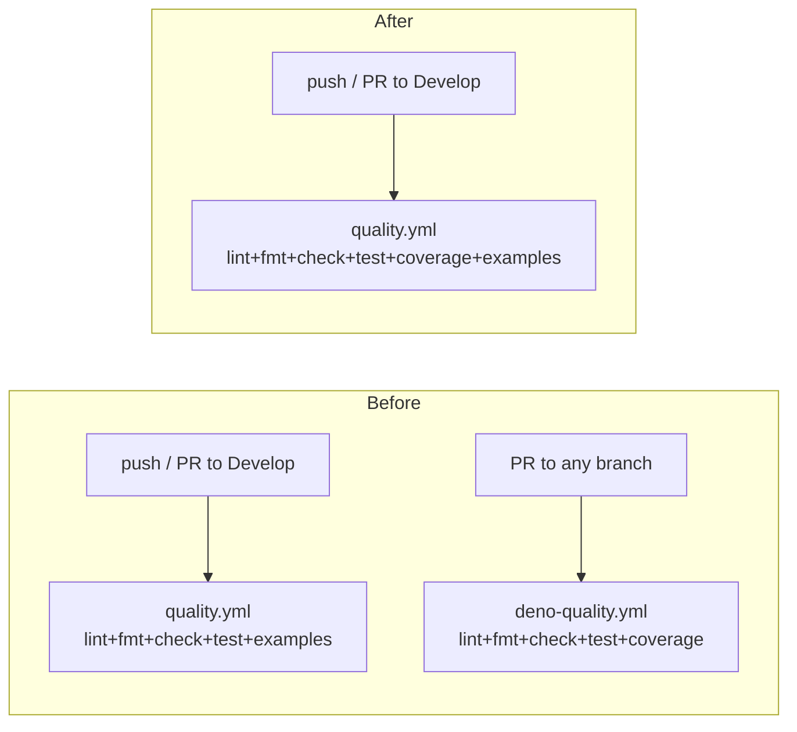

## Summary

Consolidated the duplicate `Quality Check` and `Deno Quality` GitHub Actions workflows into a single
`quality.yml` so each push and pull request runs lint / fmt / type-check / tests **once** instead of
twice. Closes #231.

The previous setup had `quality.yml` and `deno-quality.yml` running the same four Deno gates on
overlapping triggers — the only unique behaviour was the Codecov upload in `deno-quality.yml` and
the example-program runs in `quality.yml`. Both have been folded into the single workflow:

- `quality.yml` now also produces a coverage profile, generates an lcov report, and uploads it to
  Codecov (preserving issue #51's behaviour).
- All third-party actions are pinned to 40-char commit SHAs (preserving the supply-chain hardening
  that was previously enforced only on `deno-quality.yml`).
- `deno-quality.yml` and its test file `deno_quality_test.ts` are deleted.
- `workflow_permissions_test.ts` no longer references the removed workflow, and the surviving
  `quality.yml` step is renamed to `Run unit tests with
  coverage` (which is what it now is).

## Evidence

This is a CI configuration change with no UI surface. Verified by:

- `deno test .github/workflows/quality_test.ts workflow_permissions_test.ts` — 16/16 passing,
  including three new assertions on `quality.yml` that cover the merged behaviour:
  - `workflow runs deno test with coverage`
  - `workflow uploads coverage to Codecov`
  - `workflow pins actions to commit SHAs`
- Full unit test suite: `deno test ...` — 1025/1025 passing.
- `deno lint`, `deno fmt --check`, `deno check **/*.ts` all clean.

## Test Plan

- Added three new `Deno.test` cases in `.github/workflows/quality_test.ts` asserting coverage,
  Codecov upload, and SHA-pinning on the merged workflow.
- Removed `.github/workflows/deno_quality_test.ts` (its assertions are now satisfied by the new
  tests above against `quality.yml`).
- Updated `workflow_permissions_test.ts` to drop the deleted workflow and match the renamed test
  step in `quality.yml`.
- Existing assertions on lint / fmt / type-check / unit tests / example runs are unchanged and still
  pass.
