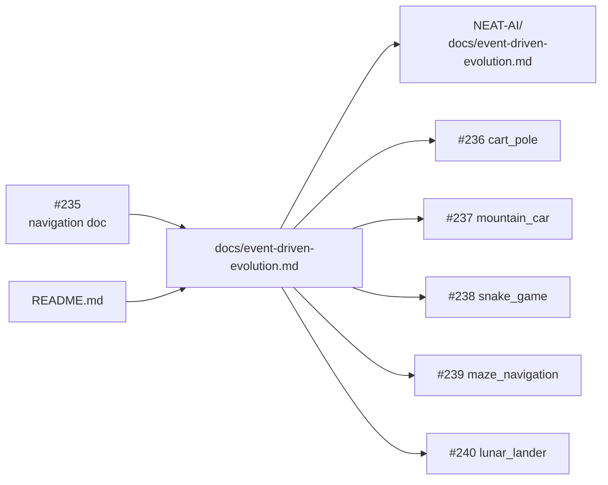

# PR Summary — Issue #235

## Summary

Adds `docs/event-driven-evolution.md` — the navigation/landing page that summarises the **supervised
batch** vs **reinforcement / event-driven** paradigm split for Examples readers, maps every existing
example to its category and to the NEAT-AI evolution API it should call, links out to the full
upstream API spec in `stSoftwareAU/NEAT-AI`, and tracks the migration status of the five
event-driven examples (`cart_pole`, `mountain_car`, `snake_game`, `maze_navigation`,
`lunar_lander`). README.md picks up a deeper-read pointer to the new doc, and a new
`event_driven_evolution_doc_test.ts` regression test fails if a reinforcement / event-driven example
is added without classifying it. Closes #235.

This PR also makes two pre-existing-failure repairs that quality.sh would otherwise fail on:

- `docs/pr-summary-270.md` was committed with line lengths that violate `deno fmt`; reformatted in
  place with no content change.
- `docs/archive_test.ts` allowlist now includes `pr-summary-270.md` (the previous PR did not add it)
  and `pr-summary-235.md` (this PR's own summary).

## Evidence

This is a documentation-only change with no UI surface. The new doc itself contains a Mermaid
diagram contrasting the two loops, and the test asserts on the doc's contents (sections, examples,
API names, sub-issue references, README link) rather than its line count — so future migrations that
tick boxes or re-word prose will still pass.



Tests verifying the change pass locally:

```text
running 10 tests from ./event_driven_evolution_doc_test.ts
docs/event-driven-evolution.md exists and is non-empty ... ok
docs/event-driven-evolution.md has the four required sections ... ok
docs/event-driven-evolution.md lists every supervised batch example ... ok
docs/event-driven-evolution.md lists every event-driven example ... ok
docs/event-driven-evolution.md names the two evolution APIs ... ok
docs/event-driven-evolution.md explains why the split matters ... ok
docs/event-driven-evolution.md links to the upstream NEAT-AI spec ... ok
docs/event-driven-evolution.md migration-status section is a checkbox list ... ok
docs/event-driven-evolution.md migration-status section references every sub-issue ... ok
README.md links to docs/event-driven-evolution.md ... ok
ok | 10 passed | 0 failed
```

## Test Plan

- New regression test `event_driven_evolution_doc_test.ts` (10 cases) — verifies the doc's presence,
  four required sections, every supervised and event-driven example name, the two API names
  (`evolveDir`, `evolveEnv`), the contrast vocabulary (forward / trajectory / rollout /
  environment), the upstream link, the checkbox list, every migration sub-issue (#236–#240), and the
  README link to the new doc.
- `deno fmt --check` and `deno lint` clean.
- Full `deno test` run: 1140 passed; 3 unrelated pre-existing failures remain
  (`crispr_injection_test.ts` floating-point determinism flake, `readme_acronym_glossary_test.ts`
  `lunar_lander` RL-acronym gap) — out of scope for this issue.

## Acceptance criteria

- [x] `docs/event-driven-evolution.md` exists with all four sections — Two paradigms, Why the split
      matters, What `evolveEnv()` provides, Migration status.
- [x] All five reinforcement / event-driven examples and the three named supervised batch examples
      appear in the table.
- [x] `README.md` links to the new doc.
- [x] `event_driven_evolution_doc_test.ts` exists and asserts on the doc's contents (not its line
      count).
