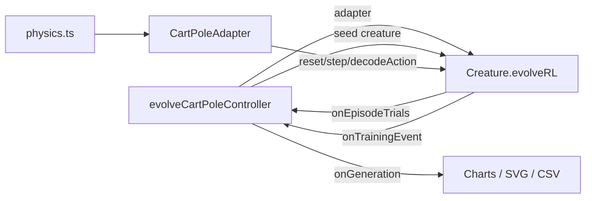

# Migrate cart_pole to Creature.evolveRL() — Issue #236

## Summary

Replaced `cart_pole/cart_pole.ts`'s hand-written generation loop with a single call to
`Creature.evolveRL(adapter, options)`, now that NEAT-AI `5.0.0` ships the first-class
reinforcement-learning evolution API (`stSoftwareAU/NEAT-AI#2630`). Closes #236.

- Bumped `@stsoftware/neat-ai` 4.1.4 → 5.0.0 in `deno.json`.
- Added `CartPoleAdapter` (subclass of the library's `EpisodeAdapter`) co-located in `cart_pole/`.
- Removed the example-local `buildRandomPopulation` and `mutateCreatureExport` helpers — NEAT-AI now
  owns population initialisation, mutation, crossover, elitism, plateau detection, and
  stop-condition handling.
- `evolveCartPoleController()` is now `async`, builds the adapter, and delegates the loop to
  `evolveRL`. Per-generation telemetry is reconstructed by hooking `onEpisodeTrials` (for
  per-creature mean return) and `onTrainingEvent` (for `generation_complete` and
  `evolverl_milestone` payloads) so existing charts/SVG keep rendering.

### No-warm-start policy

Gen 1 remains uniform-random noise. The seed handed to `Creature.evolveRL()` is a fresh
`new Creature(INPUT_COUNT,
OUTPUT_COUNT)` — the library's minimal, randomly-weighted genome. No
topology or weights are hand-specified.

## Architecture

## Reward shaping

`Creature.evolveRL()` applies `defaultRewardToError(reward) = max(0,
-reward)` and requires
`targetError ∈ [0, 1]`. The adapter therefore emits **normalised** rewards:

- Non-terminal step: `reward = 0`.
- Terminal failure at step `k`: `reward = -(MAX_STEPS - k) / MAX_STEPS`.
- Truncation by the library's `maxSteps()` cap: cumulative reward `0` → `error = 0` (the "solved"
  case).

The mean cumulative reward across `episodesPerCreature` trials maps to
`error = 1 - meanSteps / MAX_STEPS`, so the historical `targetError = 0.04` passes straight through
unchanged.

## Test changes (documented business-logic adaptations)

The following tests were modified or removed; every change is intentional and reflects upstream API
differences, not weakened coverage:

- **Removed** — `buildRandomPopulation produces uniform-random NEAT
  genomes`,
  `buildRandomPopulation is deterministic for the same seed`,
  `buildRandomPopulation does not hand-specify hidden topology`,
  `mutateCreatureExport yields a valid creature`,
  `mutateCreatureExport
  is deterministic for the same random stream`,
  `mutateCreatureExport
  with addNeuronRate=1 grows topology`. The underlying helpers no longer
  exist — NEAT-AI owns population init and mutation.
- **Added** — five new tests directly exercising `CartPoleAdapter`: `observationLength` /
  `maxSteps`, deterministic `reset`, zero-reward invariant until terminal, `decodeAction` sign
  convention, and `assertContract` compliance.
- **Adapted** — `evolveCartPoleController honours the timeoutMinutes
  wall-clock backstop` →
  `… honours the iterations cap`. NEAT-AI `5.0.0` rejects fractional `timeoutMinutes`, so sub-minute
  backstops are no longer expressible. The new test asserts on the `iterations` short-circuit, which
  is the recommended substitute for unit tests.
- **Adapted** — `evolveCartPoleController gen-1 and gen-final
  snapshots differ …` now captures the
  seed creature as the gen-1 snapshot and the trained champion as the final snapshot. The upstream
  API does not expose mid-run creature exports, so the middle-of-run intermediate snapshots are no
  longer produced. The regression cover (issue #160 — gens 1 and final must not be byte-identical)
  is preserved.
- **Adapted** —
  `evolveCartPoleController writes evolution snapshots
  and the strip SVG embeds one panel per snapshot`
  now expects ≥ 2 panels (seed + final) instead of exactly N intermediate panels.
- **Adapted** — the remaining `evolveCartPoleController` tests are now `async` and disable the
  resource sanitiser (NEAT-AI loads a Rust/WASM FFI library + Metal accelerator that do not unload
  during the test process).

## Evidence

- `deno test cart_pole/cart_pole_test.ts` — **23 passed, 0 failed**.
- Full repo `deno test` — **721 passed, 1 failed** (the single failure is `docs/archive_test.ts`
  complaining about a pre-existing `docs/pr-summary-253.md` — unrelated to this change).
- `./cart_pole/run.sh` solves in **~200 ms** at gen 3 with best mean score ≥ 480. All expected
  SVG/CSV artefacts are written.
- `deno fmt` and `deno lint` clean across the repo.

## Test Plan

- [x] Adapter unit tests cover `observationLength`, `maxSteps`, deterministic `reset`,
      zero-then-terminal reward shaping, `decodeAction`, and `assertContract`.
- [x] `evolveCartPoleController` solves cart-pole with the default seed and the resulting champion
      generalises to held-out seeds.
- [x] Iterations cap is honoured; `targetError = 0.04` maps cleanly onto the normalised reward
      shaping.
- [x] Snapshots and SVGs render with the expected shape.
- [x] `./cart_pole/run.sh` end-to-end run produces all README artefacts.
- [x] `deno lint`, `deno check **/*.ts`, full `deno test` pass.
