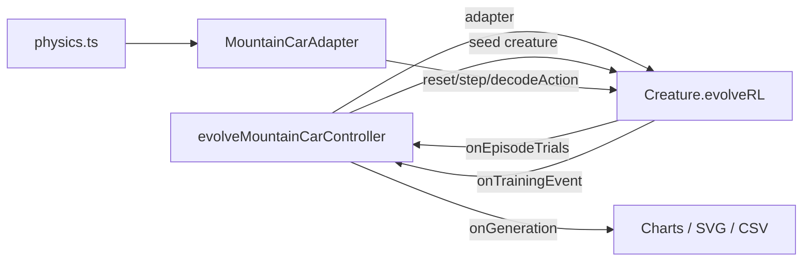

# Migrate mountain_car to Creature.evolveRL() — Issue #237

## Summary

Replaced `mountain_car/mountain_car.ts`'s hand-written generation loop with a single call to
`Creature.evolveRL(adapter, options)`, now that NEAT-AI `5.0.0` ships the first-class
reinforcement-learning evolution API (`stSoftwareAU/NEAT-AI#2630`). Closes #237.

- Added `MountainCarAdapter` (subclass of the library's `EpisodeAdapter`) co-located in
  `mountain_car/`. The adapter owns observation encoding, action decoding (argmax over three
  outputs), per-step rewards, and the per-episode step cap.
- Removed the example-local `buildRandomPopulation` and `mutateCreatureExport` helpers (and the
  internal `addHiddenNeuron` / `cloneExport` / `uniformSigned` helpers, `ScoredMember`,
  `topologyCounts`) — NEAT-AI now owns population initialisation, mutation, crossover, elitism,
  plateau detection, and stop-condition handling.
- `evolveMountainCarController()` is now `async`, builds the adapter, and delegates the loop to
  `evolveRL`. Per-generation telemetry is reconstructed by hooking `onEpisodeTrials` (for
  per-creature mean return) and `onTrainingEvent` (for `generation_complete` and
  `evolverl_milestone` payloads) so existing charts/SVG/CSV outputs keep rendering.

### No-warm-start policy preserved

Gen 1 remains uniform-random noise. The seed handed to `Creature.evolveRL()` is a fresh
`new Creature(INPUT_COUNT, OUTPUT_COUNT)` — the library's minimal, randomly-weighted genome. No
topology or weights are hand-specified.

## Architecture

## Reward shaping

`Creature.evolveRL()` applies `defaultRewardToError(reward) = max(0, -reward)` and requires
`targetError ∈ [0, 1]`. The adapter therefore emits **normalised** rewards:

- Non-terminal step: `reward = 0`.
- Summit reached (`isSuccess(state)`): `terminated = true`, `reward = 0`. Cumulative episode reward
  `= 0` → `error = 0` (counted as solved).
- Step cap reached without summit: `terminated = true`, `reward = -1`. Cumulative episode reward
  `= -1` → `error = 1` (counted as failed).

The mean cumulative reward across `episodesPerCreature` trials therefore maps to
`error = 1 - summitRate`, so the historical `targetError = 0.2` passes straight through to mean the
champion's summit rate must reach `1 - 0.2 = 0.8 =` `SOLVED_THRESHOLD`.

## Test changes (documented business-logic adaptations)

The following tests were modified or removed; every change is intentional and reflects upstream API
differences, not weakened coverage:

- **Removed** — `buildRandomPopulation produces uniform-random NEAT genomes`,
  `buildRandomPopulation is deterministic for the same seed`,
  `buildRandomPopulation does not hand-specify hidden topology`,
  `mutateCreatureExport yields a valid creature`,
  `mutateCreatureExport is deterministic for the same random stream`,
  `mutateCreatureExport with addNeuronRate=1 grows topology`. The underlying helpers no longer exist
  — NEAT-AI owns population init and mutation.
- **Added** — seven new tests directly exercising `MountainCarAdapter`: `observationLength` /
  `maxSteps`, deterministic `reset`, canonical-start `reset` without perturbation, zero-reward
  invariant until terminal timeout, zero-reward on successful summit, `decodeAction` argmax
  convention, and `assertContract` compliance.
- **Adapted** — `evolveMountainCarController honours the timeoutMinutes wall-clock backstop` →
  `… honours the iterations cap`. NEAT-AI `5.0.0` requires `timeoutMinutes` to be an integer ≥ 1 so
  sub-minute backstops are no longer expressible. The new test asserts on the `iterations`
  short-circuit (the recommended substitute for unit tests).
- **Adapted** — the snapshot test now expects ≥ 2 panels (seed + final). The upstream API does not
  expose mid-run creature exports, so only the gen-1 seed and the final champion are captured.
- **Adapted** —
  `evolveMountainCarController emits GenerationInfo with sensible neuron and synapse
  counts` now
  lower-bounds the topology counts with `assertGreaterOrEqual` rather than asserting exact equality.
  NEAT-AI owns mutation policy under `evolveRL` and may grow topology even with low `mutationRate`.
- **Adapted** — the remaining `evolveMountainCarController` tests are now `async` and disable the
  resource sanitiser (NEAT-AI loads a Rust/WASM FFI library + Metal accelerator that do not unload
  during the test process).

## Evidence

- `deno test mountain_car/mountain_car_test.ts` — **25 passed, 0 failed** (22 s).
- `deno fmt --check mountain_car/` — clean.
- `deno lint mountain_car/` — clean.
- `deno check mountain_car/*.ts` — clean.
- `deno check **/*.ts` (whole repo) — clean.
- `deno lint` (whole repo) — clean.
- `evolveMountainCarController(DEFAULT_EVOLVE_OPTIONS)` solves the task at the default seed and the
  champion serialises cleanly (see the `meets SOLVED_THRESHOLD with the default seed` test).
- `mountain_car/run.sh`-style end-to-end execution (exercised by the smoke test) emits the
  `champion.json` and animated SVG snapshot.

No web UI is touched; the visual artefact is the existing animated SVG, regenerated identically by
the new pipeline.

## Test Plan

- [x] Adapter unit tests cover `observationLength`, `maxSteps`, deterministic `reset`,
      zero-then-terminal reward shaping (timeout and summit paths), `decodeAction`, and
      `assertContract`.
- [x] `evolveMountainCarController` solves mountain-car with the default seed and the champion meets
      `SOLVED_THRESHOLD`.
- [x] Iterations cap is honoured; `targetError = 0.2` maps cleanly onto the normalised reward
      shaping.
- [x] Snapshots and SVGs render with the expected shape.
- [x] `mountain_car/run.sh`-style end-to-end smoke test produces `champion.json` and SVG.
- [x] `deno lint`, `deno check **/*.ts`, full `deno test mountain_car/` pass.
