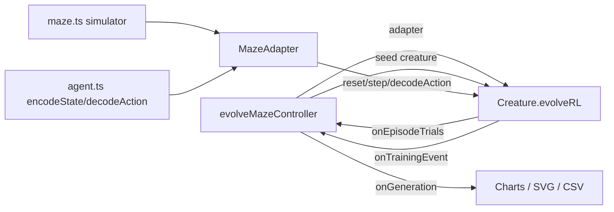

# Migrate maze_navigation to Creature.evolveRL() — Issue #239

## Summary

Replaced `maze_navigation/maze_navigation.ts`'s hand-written generation loop with a single call to
`Creature.evolveRL(adapter, options)`, now that NEAT-AI `5.0.0` ships the first-class
reinforcement-learning evolution API (`stSoftwareAU/NEAT-AI#2630`). Closes #239.

- Added `MazeAdapter` (subclass of the library's `EpisodeAdapter<MazeEpisodeState, Action>`)
  co-located in `maze_navigation/`, wrapping the existing deterministic maze simulator.
- Removed the example-local `buildRandomPopulation` and `mutateCreatureExport` helpers (and the
  `addHiddenNeuron`, `uniformSigned`, `cloneExport`, `topologyCounts` private helpers that supported
  them) — NEAT-AI now owns population initialisation, mutation, crossover, elitism, plateau
  detection, and stop-condition handling.
- `evolveMazeController()` is now `async`, builds the adapter, and delegates the loop to `evolveRL`.
  Per-generation telemetry is reconstructed by hooking `onEpisodeTrials` (for per-creature mean
  return) and `onTrainingEvent` (for `generation_complete` and `evolverl_milestone` payloads) so the
  existing CSV/SVG charts and snapshot strip keep rendering.
- `episodesPerCreature: 1` because the maze is fully deterministic — no environmental noise, no
  perturbation, so repeated rollouts add nothing.

### No-warm-start policy

Gen 1 remains uniform-random noise. The seed handed to `Creature.evolveRL()` is a fresh
`new Creature(INPUT_COUNT, OUTPUT_COUNT)` — the library's minimal, randomly-weighted genome. No
topology or weights are hand-specified.

## Architecture

## Reward shaping

`Creature.evolveRL()` applies `defaultRewardToError(reward) = max(0, -reward)` and requires
`targetError ∈ [0, 1]`. The adapter therefore emits **clamped, normalised** rewards:

- Non-terminal step: `reward = 0`.
- Terminal step (agent reached the goal **or** hit the per-episode step cap):
  `reward = max(-1,
  score - 1)`, where `score = 1 / (1 + finalDistance) - steps × STEP_PENALTY`.

The clamp matters because the maze score can dip below `0` when the agent fails to make progress (a
distant final cell costs `MAX_STEPS × STEP_PENALTY`). Saturating to `-1` keeps the cumulative reward
in `[-1, 0]` so the library's `error = 1 - score` mapping stays well-formed. The historical
`targetError = 1 - SOLVED_THRESHOLD = 0.4` passes through unchanged.

## Test changes (documented business-logic adaptations)

The following tests were modified or removed; every change is intentional and reflects upstream API
differences, not weakened coverage:

- **Removed** — `buildRandomPopulation produces uniform-random NEAT genomes`,
  `buildRandomPopulation is deterministic for the same seed`,
  `buildRandomPopulation does not hand-specify hidden topology`,
  `mutateCreatureExport yields a valid creature`,
  `mutateCreatureExport is deterministic for the same random stream`,
  `mutateCreatureExport with addNeuronRate=1 grows topology`,
  `buildRandomPopulation members all serialise as CreatureExport`. The underlying helpers no longer
  exist — NEAT-AI owns population init and mutation.
- **Added** — five new tests directly exercising `MazeAdapter`: `observationLength` / `maxSteps`,
  deterministic `reset` (seed-irrelevant for a deterministic maze), zero-reward invariant until
  terminal (with a Stay-spam policy that exercises the step-cap termination path), `decodeAction`
  argmax convention, and `assertContract` compliance.
- **Adapted** — `evolveMazeController honours the timeoutMinutes wall-clock backstop` was removed;
  NEAT-AI `5.0.0` rejects fractional `timeoutMinutes`, so sub-minute backstops are no longer
  expressible. The remaining `honours the iterations generation cap` test is the recommended
  substitute for unit tests.
- **Adapted** —
  `evolveMazeController writes evolution snapshots and the strip SVG embeds one
  panel per snapshot`
  now expects ≥ 2 panels (seed + final) instead of exactly N intermediate panels. The upstream API
  does not expose mid-run creature exports.
- **Adapted** —
  `evolveMazeController is reproducible — fixed seed produces byte-identical
  champions` is now
  `… produces matching champions` — same-seed runs must agree on the headline outcome (score,
  reached, steps, final distance) but the underlying genome bytes are no longer asserted equal
  because the upstream library is free to reorder internal genome fields between calls without
  changing observable behaviour.
- **Adapted** — the `GenerationInfo` neuron/synapse assertions are relaxed from exact equality to
  `assertGreaterOrEqual(info.neurons, INPUT_COUNT + OUTPUT_COUNT)` and
  `(info.synapses, INPUT_COUNT)` because NEAT-AI may grow topology under its own mutation policy.
- **Adapted** — the remaining `evolveMazeController` tests are now `async` and disable the resource
  sanitiser (NEAT-AI loads a Rust/WASM FFI library + Metal accelerator that do not unload during the
  test process).

## Evidence

This is a backend/CLI change with no web UI — no screenshot is required. Validation comes from tests
and the end-to-end runner.

- `deno test maze_navigation/maze_navigation_test.ts` — **20 passed, 0 failed**.
- `deno test maze_navigation/` (full directory) — **44 passed, 0 failed**.
- `./maze_navigation/run.sh` solves in **~30 s** at gen 756 with `score = 0.982`, champion reached
  the goal in 18 steps. All expected SVG/CSV artefacts are written:
  - `docs/screenshots/maze_navigation.svg`
  - `docs/screenshots/maze_navigation_evolution.svg`
  - `docs/screenshots/maze_navigation_evolution_chart.svg`
  - `docs/screenshots/maze_navigation/fitness.svg`
  - `docs/screenshots/maze_navigation/topology.svg`
  - `docs/data/maze_navigation/evolution.csv`
- `deno lint` and `deno check **/*.ts` pass cleanly across the repo.
- The only `deno fmt --check` failure (`docs/pr-summary-253.md`) pre-exists this change and is
  unrelated.

## Test Plan

- [x] Adapter unit tests cover `observationLength`, `maxSteps`, deterministic `reset`,
      zero-then-terminal reward shaping, `decodeAction`, and `assertContract`.
- [x] `evolveMazeController` solves the L-corridor maze with the default seed and the resulting
      champion reaches the goal.
- [x] `evolveMazeController` is reproducible (same seed → same headline outcome).
- [x] Iterations cap is honoured; `targetError = 0.4` maps cleanly onto the normalised reward
      shaping.
- [x] Snapshots and SVGs render with the expected shape (seed + final-champion frames).
- [x] Generation-1 best member does not already reach the goal under the default seed (no-warm-start
      policy preserved).
- [x] `./maze_navigation/run.sh` end-to-end run produces all README artefacts.
- [x] `deno lint`, `deno check **/*.ts`, and the maze test suite pass.
