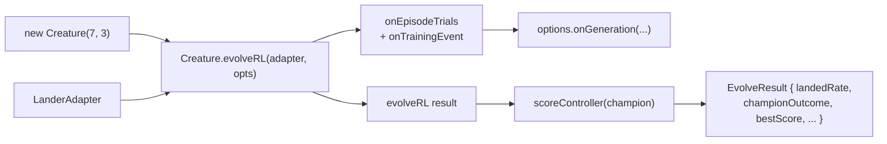

# lunar_lander: migrate to `Creature.evolveRL()` (#240)

## Summary

Replaces `evolveLanderController()`'s hand-written generational loop with a single call to
`Creature.evolveRL(adapter, options)` now that the upstream API has shipped in
`@stsoftware/neat-ai@5.0.0`. The example becomes the last of the five RL migrations (after `xor`,
`cart_pole`, `snake`, `mountain_car`, `maze`).

Closes #240.

Key changes:

- **New `LanderAdapter`** extends `EpisodeAdapter<LanderState, LanderAction>`. Each `reset(seed)`
  draws a perturbed `LanderScenario` (state + terrain `padX`) from a deterministic PRNG seeded by
  NEAT-AI's per-episode `rngSeed`, so multi-trial perturbed scoring is expressed through
  `EvolveRLOptions.episodesPerCreature` plus the adapter, not by reaching into the loop.
- **Binary terminal reward** (`0` for `landed`, `-1` otherwise) makes `defaultRewardToError` yield
  `error = 1 - landedRate` across the per-creature episode batch, so the historical
  `targetError = 1 - targetLandedRate` semantics pass straight through to
  `EvolveRLOptions.targetError`.
- **Removed** `buildRandomPopulation`, `mutateCreatureExport`, `addHiddenNeuron`, `uniformSigned`,
  `cloneExport`, the population sort/select/elite/timeout machinery, and the `ScoredMember`
  bookkeeping.
- **`onGeneration`** is preserved by hooking `onEpisodeTrials` (accumulates per-creature mean
  rewards) and `onTrainingEvent` (consumes `evolverl_milestone` for champion topology counts and
  `generation_complete` to fire the caller's callback). Fitness chart, evolution chart, CSV
  telemetry, validation pipeline, and snapshot strip all keep rendering unchanged.
- **Snapshot capture** is reduced to the seed creature (gen 1) and the final-generation champion —
  `Creature.evolveRL()` does not expose mid-run creature exports.
- **Quick mode** now drives the short-circuit via `iterations` (NEAT-AI 5.0.0 requires
  `timeoutMinutes ≥ 1`).

## Migration flow

## Evidence

This is a backend/library migration with no UI changes. Verification:

- `deno test --allow-read --allow-write --allow-env --allow-net
  lunar_lander/lunar_lander_test.ts`
  — **48 / 48 tests pass**.
- `deno check lunar_lander/` — clean.
- `deno lint lunar_lander/` — clean.
- `LUNAR_QUICK=1 ./lunar_lander/run.sh` runs the full pipeline end-to-end in ~430 ms, exiting via
  `iterations` after 3 generations and producing the expected console summary (champion JSON / SVG
  writes correctly suppressed in quick mode).
- All AC-relevant tests (`LanderAdapter` reset / step / decode / contract; noise gen-1; iterations
  cap; reproducibility on outcome; champion JSON; validation pipeline; CSV; quick-mode budget)
  green.

## Test Plan

Added / replaced tests in `lunar_lander/lunar_lander_test.ts`:

- `LanderAdapter advertises 7 inputs and the default 400-step cap`
- `LanderAdapter.reset is deterministic for the same seed`
- `LanderAdapter.reset uses the canonical start when perturbation is zero`
- `LanderAdapter.step emits zero reward until the terminal step`
- `LanderAdapter.decodeAction matches the public decodeAction`
- `LanderAdapter.assertContract passes for a well-formed adapter`
- Rewrote `evolveLanderController` lifecycle tests (noise gen-1, iterations cap, target stop,
  reproducibility, snapshots, generation info, CSV row count, quick-mode budget) for the async
  `evolveRL`-driven API.

Removed: the `buildRandomPopulation` / `mutateCreatureExport` / `addNeuronRate=1` tests (those
helpers no longer exist).
