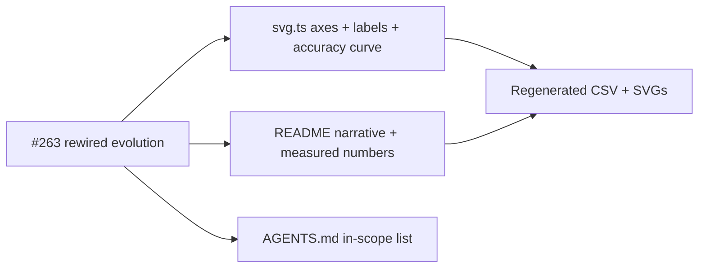

## Summary

Refresh `adaptive_mutation`'s user-facing documentation, SVG renderers, and project metadata to
match the classification rewrite from #263. The README now opens with the 4-bit even-parity
classification narrative, the headline SVG plots measured classification accuracy alongside the
topology and policy curves, the fitness chart is labelled as classification fitness, and AGENTS.md
lists `adaptive_mutation` in the in-scope (noise → competent) list rather than the exempt list.
Closes #264.

## Evidence

Headline SVG regenerated by running `./adaptive_mutation/run.sh`:

Measured numbers quoted in the README (latest local run):

- Task: 4-bit even parity (16-row truth table)
- Generations: 461 (solved — `targetError` reached)
- Wall-clock: 24.7 s
- Final training accuracy: 0.9375 (15 of 16 rows correct)
- Held-out accuracy: 0.9375
- Final best fitness: 0.9500
- Held-out score (-MSE): -0.0487
- Seed neurons / synapses: 5 / 4
- Final neurons / synapses: 30 / 70
- `targetError` 0.05, `timeoutMinutes` 5

The captured noise → competent arc is visible directly in the regenerated CSV: gen 1 accuracy 0.5625
(about chance), final-generation accuracy 0.9375, with hidden neurons growing 5 → 30 and synapses 4
→ 70 in lockstep.

## Changes

- `adaptive_mutation/svg.ts`:
  - `renderAdaptiveMutationSVG` now renders a two-panel headline chart. Upper panel keeps the
    measured size vs analytic `p(topology)` curves; lower panel plots **measured classification
    accuracy** with a fixed `[0, 1]` Y axis and a dashed reference line at 0.5 (chance). New
    `ACCURACY_CURVE_CLASS` (`classification-accuracy`) is exported and asserted by tests.
  - Caption gains a `Final accuracy: …` line; title and aria label reframed around classification.
  - `renderFitnessChartSvg` title/legend labels reframed as classification fitness rather than the
    MSE-based fitness used by the old regression version.
- `adaptive_mutation/adaptive_mutation_test.ts`: new assertions cover the accuracy curve class, the
  classification-fitness labels, the final-accuracy caption, and that NaN accuracy rows do not leak
  into the rendered SVG.
- `adaptive_mutation/README.md`: rewritten introduction describes the 4-bit even-parity
  classification task and the AI **finding** the solution from noise; new "No warm start" section
  per AGENTS.md policy; refreshed measured-numbers table; updated Mermaid flowchart `DATA` node; How
  It Works / Why NEAT-AI Adapts the Mutation Rate / Tests / NEAT-AI Features sections aligned with
  the rewritten code.
- `AGENTS.md`: `adaptive_mutation` moved from the exempt list to the in-scope (random-noise
  required) list.
- `docs/data/adaptive_mutation/evolution.csv`, `docs/screenshots/adaptive_mutation.svg`,
  `docs/screenshots/adaptive_mutation/{fitness,topology}.svg` regenerated by
  `./adaptive_mutation/run.sh` and committed.

## Test Plan

- `deno test --allow-all adaptive_mutation/` — 40 tests pass (23 in `adaptive_mutation_test.ts` + 17
  in `classification_task_test.ts`), including the new headline-SVG accuracy-curve assertions and
  classification-fitness label assertions.
- `deno fmt --check` and `deno lint` clean across the modified files.
- `deno check **/*.ts` clean.
- `./adaptive_mutation/run.sh` completes end-to-end in 24.7 s and reproduces the measured numbers
  quoted above.

## Notes

- The pre-existing top-level test `docs/archive_test.ts::No PR summary files remain in docs/ root`
  fails on Develop because several earlier PR summaries (236, 237, 239, 240, 253, 262, 263) were not
  archived to `docs/archive/`. This PR keeps the convention by writing `docs/pr-summary-264.md` to
  `docs/` root for now; archival is a separate concern.
- Top-level `README.md` references to `adaptive_mutation` still describe the old "policy
  demonstration" framing; updating them is out of scope for this sub-issue, which is scoped to
  `adaptive_mutation/`, AGENTS.md, and the regenerated artefacts.
