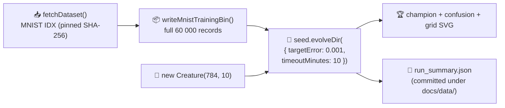

## Summary

Cuts `mnist_classification/README.md` down to a short measured-results report against the post-#270
runner: a single 10-minute `Creature.evolveDir` over the full 60 000-record MNIST training file from
a minimal `new Creature(784, 10)` seed. The README now quotes only what was measured (no "95 %
target" framing, no estimates, no extended narrative) and an honesty test cross-checks those numbers
against a JSON summary the runner writes. Closes #271.

The stripped sections (95 % framing, `MNIST_NEAT_EVOLUTION` / `MNIST_MLP_BASELINE` modes, audit
hyper-parameter table, fitness/topology/CSV per-generation telemetry, 1 024-record subset callout,
"Why argmax stays near chance" callout) are gone. Per-generation telemetry returns once upstream
NEAT-AI exposes hooks for `evolveDir` (tracked in #273), captured as a one-line note in the README.

## Evidence

The runner adds `MnistRunSummary` and writes it to two places —
`.synthetic-mnist/output/run_summary.json` (working copy) and
`docs/data/mnist_classification/run_summary.json` (committed canonical copy). The
`readme_screenshot_honesty_test.ts` audit reads the committed file and asserts the README's test
accuracy, wall-clock, seed/final synapse, and final neuron numbers match.

Measured run committed in this PR (10-minute budget, single `evolveDir` call):

| Metric                     | Value                                        |
| -------------------------- | -------------------------------------------- |
| Training records           | 60 000 (full MNIST training file)            |
| Wall-clock                 | 610 s (≈ 10 min 10 s — hit `timeoutMinutes`) |
| Seed neurons / synapses    | 794 / 7 840 (dense direct wiring)            |
| Final neurons / synapses   | 794 / 7 841 (NEAT added 1 synapse in 10 min) |
| Validation argmax accuracy | 10.90 %                                      |
| Test-set argmax accuracy   | 10.37 %                                      |
| Stop condition that fired  | `timeoutMinutes`                             |

This is a documentation/CLI change — no UI screenshots applicable. Verified via the new honesty test
and the committed `docs/data/mnist_classification/run_summary.json` artefact.

## Test Plan

- **New** `mnist_classification/readme_screenshot_honesty_test.ts` (7 tests): README links the
  prediction-grid SVG and the file is non-empty; references audit issue #268; does not contain any
  forbidden `95 %` / `MNIST_NEAT_EVOLUTION` / `MNIST_MLP_BASELINE` / `runMinimalSeedEvolution` /
  `1 024-record` / `down-sampled` strings; quotes the measured test accuracy, wall-clock, seed and
  final topology values from the committed `run_summary.json`; validates `trainingRecords ≥ 50 000`.
- **New** `mnist_classification/mnist_classification_test.ts` cases for `inferStopCondition` (covers
  both `timeoutMinutes` and `targetError` branches).
- Existing `no_warm_start_policy_test.ts`, `readme_structure_test.ts`, and
  `readme_acronym_glossary_test.ts` still pass against the rewritten README.
- Stale per-generation artefacts deleted: `docs/data/mnist_classification/evolution.csv`,
  `docs/screenshots/mnist_classification/{evolution,fitness,topology}.svg`.
- Two pre-existing test failures (`crispr_injection` flaky determinism; `lunar_lander` acronym) are
  unchanged by this PR — verified with a `git stash` baseline run.
