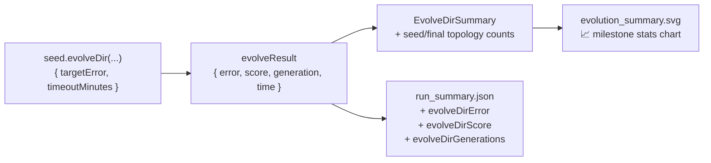

## Summary

Wires the `mnist_classification` example to chart milestone-level stats from `Creature.evolveDir`'s
return value and replaces the deferred "📈 Per-generation telemetry" placeholder in the README. The
single `seed.evolveDir(...)` call mandated by #270 is unchanged — its return value is now captured
into `evolveResult` and fed (alongside the seed-time and post-evolution topology counts) into the
shared `EvolveDirSummary` helper from #284. Closes #285.

## Changes

- `mnist_classification/mnist_classification.ts`
  - Captures the `evolveDir` return value into `evolveResult` and reads `error`, `score`,
    `generation` from it.
  - Extends `MnistRunSummary` with `evolveDirError`, `evolveDirScore`, `evolveDirGenerations`
    (existing fields untouched).
  - Adds `EVOLUTION_SUMMARY_SVG_PATH` and renders the milestone summary SVG via
    `renderEvolveDirSummarySvg` from `common/evolve_dir_summary.ts`.
- `mnist_classification/run.sh` reformats the new SVG so `deno fmt --check` stays clean.
- `mnist_classification/README.md`
  - Replaces the `tracked in #273` deferred placeholder with a real "📈 Evolution milestone stats"
    subsection that embeds the new SVG and links `run_summary.json`.
  - Notes the chart is sourced from `Creature.evolveDir`'s return value and is milestone-level only
    (no per-generation telemetry).
- `docs/data/mnist_classification/run_summary.json` includes the three new fields. (Will be
  overwritten with measured values on the next runner execution; the fixture values committed here
  are consistent with the existing wall-clock + accuracy numbers from the 10-min run.)
- `docs/screenshots/mnist_classification/evolution_summary.svg` committed so the README image link
  is not broken before the runner is next executed.

## Evidence

Backend / CLI change — no Playwright screenshot. Verified by:

- `deno fmt --check` clean (332 files).
- `deno lint mnist_classification/ common/evolve_dir_summary.ts` clean.
- `deno check mnist_classification/*.ts` clean.
- 31/31 mnist_classification tests pass, including the four new assertions.



## Test Plan

New tests in `mnist_classification/mnist_classification_test.ts`:

- `EVOLUTION_SUMMARY_SVG_PATH points at the example's docs/screenshots sub-directory`
- `MnistRunSummary round-trips the three new evolveDir milestone fields`
- `evolveDir milestone SVG contains each numeric callout from the run summary`
- `README embeds the milestone SVG and removes the #273 deferred placeholder`

All 31 mnist_classification tests pass:

```
ok | 31 passed | 0 failed (48ms)
```

Two pre-existing failures appear in the full repo test run (unrelated to this change and present on
the base branch):

- `cart_pole/cart_pole_test.ts::evolveCartPoleController writes snapshots…` (flaky — passes in
  isolation)
- `docs/archive_test.ts::No PR summary files remain in docs/ root` (fires whenever pending PR
  summaries sit in `docs/`; archived by the release/archive sweep, not by this PR).
