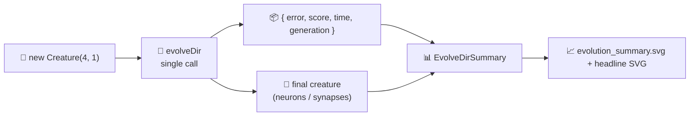

## Summary

Replaced the per-generation chunked `evolveDir` loop in `adaptive_mutation` with a single
`creature.evolveDir(...)` call charted from the returned `{ error, score, time, generation }` plus
the final creature's topology. The "adaptive mutation" narrative is preserved via the documented
analytic policy curve (`topologyProbability` / `DEFAULT_POLICY_CONFIG`) and the seed-vs-final
topology bars rendered by the shared `renderEvolveDirSummarySvg` helper from #284. Closes #286.

Removed in this PR:

- The `while (evolved < config.maxIterations)` chunking loop and `TELEMETRY_CHUNK_ITERATIONS`
  constant in `adaptive_mutation.ts`.
- The `onTrainingEvent` hook (per #272's accepted scope: per-generation telemetry hooks are not
  used).
- The `EvolutionRow` interface, `formatEvolutionCsv`, and `EVOLUTION_CSV_HEADER` exports.
- The `renderFitnessChartSvg` / `renderTopologyChartSvg` renderers and their per-generation CSS
  class exports.
- Committed per-generation artefacts: `docs/data/adaptive_mutation/evolution.csv`,
  `docs/screenshots/adaptive_mutation/fitness.svg`,
  `docs/screenshots/adaptive_mutation/topology.svg`.

Added:

- `AdaptiveMutationResult.summary: EvolveDirSummary` populated from the `evolveDir` return value +
  seed/final topology counts; `solved` derives from `summary.finalError <= targetError` and
  `generations` from `summary.generations`.
- `docs/screenshots/adaptive_mutation/evolution_summary.svg` — single summary chart rendered via
  `renderEvolveDirSummarySvg`.
- Rewritten headline `renderAdaptiveMutationSVG` that consumes the summary plus the analytic policy
  curve; the lower panel shows the seed-vs-final neuron and synapse bars.

## Evidence

CLI demo — single `evolveDir` call completes inside the 5-minute backstop and writes the headline
SVG, the new evolution summary, and the champion JSON:

```
generations    : 2003  (did not reach targetError)
neurons (final): 17
synapses (final): 50
training acc   : 0.7500
held-out score : -0.139258

🖼️  Wrote docs/screenshots/adaptive_mutation.svg
📈 Wrote evolution summary docs/screenshots/adaptive_mutation/evolution_summary.svg
💾 Saved champion to .adaptive-mutation/creatures/champion.json
```



## Test Plan

`adaptive_mutation/adaptive_mutation_test.ts` exercises the new return-value-driven flow:

- `runAdaptiveMutationDemo - summary matches champion's live topology` — asserts that
  `summary.finalNeurons` / `summary.finalSynapses` equal the returned champion's live
  `creature.neurons.length` / `creature.synapses.length`.
- `runAdaptiveMutationDemo - generations within [1, maxIterations + grace]` — asserts the summary's
  generation count lies inside the requested cap (plus a small grace factor that reflects NEAT-AI's
  observed fine-tune overshoot).
- `runAdaptiveMutationDemo - summary.finalError is finite and non-negative` — asserts the error and
  score returned from `evolveDir` are finite and the error is `>= 0`.
- `runAdaptiveMutationDemo - solved flag derives from finalError ≤ targetError` — pins the `solved`
  flag to the documented decision rule.
- `renderAdaptiveMutationSVG - well-formed SVG with policy curve and topology bars` — asserts the
  headline SVG contains the analytic policy curve class, the seed-vs-final topology bar classes, and
  the caption numbers (final error, held-out -MSE, generations).
- `renderAdaptiveMutationSVG - handles zero-growth runs without exploding` — guards against
  divide-by-zero when seed and final topology match.

Quality checks run: `deno fmt`, `deno lint`, `deno check **/*.ts`, full unit-test suite (752 tests
pass; one pre-existing unrelated archive_test failure for `pr-summary-240.md` that predates this
branch). The `./adaptive_mutation/run.sh` example was executed end-to-end and produced both SVG
artefacts plus the champion JSON.
