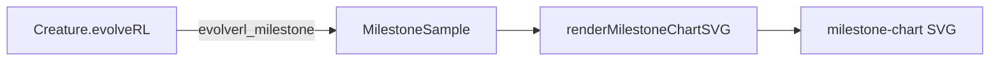

# Add milestone-statistics chart helper for evolveRL examples

## Summary

Adds a shared `common/milestone_chart.ts` helper that renders an SVG chart from `evolveRL_milestone`
statistics emitted by NEAT-AI 5.0 — the foundation that lets the five `evolveRL()` examples tell the
fitness-progression and topology-growth story without depending on per-checkpoint `CreatureExport`
snapshots (which `evolveRL()` does not expose). Closes #287.

The helper follows the same conventions as `common/evolution_chart.ts` and
`common/fitness_chart.ts`: pure string emission, no DOM, no extra dependencies, byte-deterministic
output for identical input, and throws on empty input.

### Series and axes

- **Left Y axis**: `bestScore` (blue) and `meanEpisodeSteps` (orange) on a shared linear scale.
- **Right Y axis**: `bestNeurons` (green) and `bestSynapses` (red) on a shared linear scale clamped
  to zero.
- **X axis**: milestone generation, with optional `logX` toggle for the canonical 1, 2, 5, 10, 20,
  50, 100, 200, 500, 1000, … power-of-ten spacing.
- **Caption** (optional): final score, final topology size, and total wall-clock ms (sum of
  `generationWallClockMs`).

### Data flow

## Evidence

Backend/library change with no UI to screenshot. Verified via the co-located unit tests in
`common/milestone_chart_test.ts` (8 tests, all passing) plus `deno fmt`, `deno lint`, and
`deno check` on the new files.

## Test Plan

Added `common/milestone_chart_test.ts` covering:

- Happy-path multi-sample render emits all four series, both axes, a legend, and no
  `NaN`/`Infinity`.
- Empty input throws `"at least one sample"`.
- Single-sample render produces a clean SVG.
- Identical input produces byte-identical output (determinism).
- `logX: true` produces a different layout from the linear default and is self-deterministic.
- `caption: true` emits a caption listing the final score, neurons, synapses, and total wall-clock
  ms; `caption` defaults to off.
- Linear-X mode plots exactly one point per sample at its actual generation.

No example runner consumes the helper yet — that lands in the dependent sub-issues #236, #237, #238,
#239, #240.
