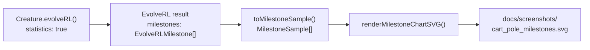

## Summary

Replace cart-pole's degraded seed+final snapshot strip and the legacy per-generation fitness /
evolution / topology charts with the milestone-statistics chart introduced in #287, aligning the
example with the decision in #298 that NEAT-AI surfaces only `evolverl_milestone` telemetry. The
example no longer registers any `onTrainingEvent` handler — milestone payloads are read straight
from the `EvolveRLMilestone[]` array `Creature.evolveRL()` returns when `statistics: true` is set,
and rendered via `renderMilestoneChartSVG`. Closes #288.

## Changes

- `cart_pole/cart_pole.ts`
  - Dropped imports from `common/evolution_snapshot.ts`, `common/evolution_progress_svg.ts`,
    `common/evolution_chart.ts`, and `common/fitness_chart.ts`.
  - Added imports for `MilestoneSample` / `renderMilestoneChartSVG` from `common/milestone_chart.ts`
    and `EvolveRLMilestone` from `@stsoftware/neat-ai`.
  - Removed `EVOLUTION_CHECKPOINTS`, `SNAPSHOTS_DIR`, `EVOLUTION_PROGRESS_SVG_PATH`,
    `EVOLUTION_CHART_PATH`, `EVOLUTION_CSV_PATH`, `EVOLUTION_CSV_HEADER`, `FITNESS_SVG_PATH`,
    `TOPOLOGY_SVG_PATH`, `EvolutionRow`, `formatEvolutionCsv`, `renderTopologyChartSvg`, and
    `GenerationInfo`.
  - Removed the `snapshotConfig`, `onGeneration` fields from `EvolveOptions` and the
    `onEpisodeTrials` / `onTrainingEvent` handlers from the `EvolveRLOptions` passed to `evolveRL` —
    none are needed once milestones are read from the run summary.
  - Added `MILESTONE_SVG_PATH = "docs/screenshots/cart_pole_milestones.svg"` and a
    `milestones: MilestoneSample[]` field on `EvolveResult`.
- `cart_pole/cart_pole_test.ts`
  - Removed the snapshot-strip, snapshot-differ, `formatEvolutionCsv`, and `renderTopologyChartSvg`
    tests covering removed APIs.
  - Rewrote the "gen-1 sits below the threshold" test to read `result.milestones[0]` instead of an
    `onGeneration` callback.
  - Added a new test asserting milestone samples are collected from `evolveRL` and the SVG written
    by `renderMilestoneChartSVG` is well-formed (contains all four series classes).
- `cart_pole/run.sh` — fmt only the SVGs the runner now emits (`cart_pole.svg`,
  `cart_pole_milestones.svg`).
- `cart_pole/README.md` — replaced the snapshot-strip / per-generation charts section with a
  milestone-chart section that references the milestone-only telemetry policy from #298.
- Removed the now-stale artefacts: `docs/screenshots/cart_pole_evolution.svg`,
  `docs/screenshots/cart_pole_evolution_chart.svg`, `docs/screenshots/cart_pole/fitness.svg`,
  `docs/screenshots/cart_pole/topology.svg`, `docs/data/cart_pole/evolution.csv`.
- Added `docs/screenshots/cart_pole_milestones.svg` produced by `./cart_pole/run.sh`.

## Evidence

`./cart_pole/run.sh` finishes in ~11 s with the default seed and emits both the run-replay SVG and
the new milestone chart:

```text
✅ Solved after 1050 generations (best=492.3, threshold=480, stop=target, wallclock=10.8s).
💾 Saved champion to .synthetic-cart-pole/creatures/champion.json
🖼️  Wrote screenshot docs/screenshots/cart_pole.svg (255 frames captured)
📈 Wrote milestone chart docs/screenshots/cart_pole_milestones.svg (10 milestones)
```




`deno fmt --check`, `deno lint`, and `deno check cart_pole/cart_pole.ts cart_pole/cart_pole_test.ts`
all pass. The full `cart_pole/cart_pole_test.ts` suite (19 tests) passes locally:

```text
ok | 19 passed | 0 failed (5m2s)
```

## Test Plan

- Existing cart-pole adapter / scoring / replay tests continue to pass.
- New test `evolveCartPoleController collects milestone samples and the chart SVG round-trips`
  asserts that `evolveRL` returns at least one milestone with `iterations=1`, that each sample
  carries sensible topology and timing counters, and that `renderMilestoneChartSVG` renders to a
  well-formed SVG containing all four series.
- Rewritten test `evolveCartPoleController gen-1 milestone sits well below the threshold` verifies
  the noise → competent narrative directly from the gen-1 milestone payload (no `onGeneration`
  handler required).
- `MILESTONE_SVG_PATH points at the documented milestone chart` pins the README-referenced path.
- `./cart_pole/run.sh` manual run confirmed both `docs/screenshots/cart_pole.svg` and
  `docs/screenshots/cart_pole_milestones.svg` are emitted and well-formed.
