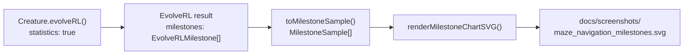

## Summary

Replace maze_navigation's degraded seed+final snapshot strip and the legacy per-generation fitness /
evolution / topology charts with the milestone-statistics chart introduced in #287, aligning the
example with the decision in #298 that NEAT-AI surfaces only `evolverl_milestone` telemetry. The
example no longer registers any `onTrainingEvent` handler — milestone payloads are read straight
from the `EvolveRLMilestone[]` array `Creature.evolveRL()` returns when `statistics: true` is set,
and rendered via `renderMilestoneChartSVG`. Mirrors the cart_pole cleanup (#288). Closes #289.

## Changes

- `maze_navigation/maze_navigation.ts`
  - Dropped imports from `common/evolution_snapshot.ts`, `common/evolution_progress_svg.ts`,
    `common/evolution_chart.ts`, and `common/fitness_chart.ts`.
  - Added imports for `MilestoneSample` / `renderMilestoneChartSVG` from `common/milestone_chart.ts`
    and `EvolveRLMilestone` from `@stsoftware/neat-ai`.
  - Removed `EVOLUTION_CHECKPOINTS`, `SNAPSHOTS_DIR`, `EVOLUTION_PROGRESS_SVG_PATH`,
    `EVOLUTION_CHART_PATH`, `EVOLUTION_CSV_PATH`, `EVOLUTION_CSV_HEADER`, `FITNESS_SVG_PATH`,
    `TOPOLOGY_SVG_PATH`, `EvolutionRow`, `formatEvolutionCsv`, `renderTopologyChartSvg`, and
    `GenerationInfo`.
  - Removed the `snapshotConfig` and `onGeneration` fields from `EvolveOptions` and the
    `onEpisodeTrials` / `onTrainingEvent` handlers from the `EvolveRLOptions` passed to `evolveRL` —
    none are needed once milestones are read from the run summary.
  - Added `MILESTONE_SVG_PATH = "docs/screenshots/maze_navigation_milestones.svg"` and a
    `milestones: MilestoneSample[]` field on `EvolveResult`.
- `maze_navigation/maze_navigation_test.ts`
  - Removed the snapshot-strip, `GenerationInfo`, `formatEvolutionCsv`, and `renderTopologyChartSvg`
    tests covering removed APIs.
  - Rewrote the "gen-1 sits below the threshold" test to read `result.milestones[0]` instead of an
    `onGeneration` callback.
  - Added a new test asserting milestone samples are collected from `evolveRL` and the SVG written
    by `renderMilestoneChartSVG` is well-formed (contains all four series classes).
- `maze_navigation/run.sh` — fmt only the SVGs the runner now emits (`maze_navigation.svg`,
  `maze_navigation_milestones.svg`).
- `maze_navigation/README.md` — replaced the snapshot-strip / per-generation charts section with a
  milestone-chart section that references the milestone-only telemetry policy from #298.
- Removed the now-stale artefacts: `docs/screenshots/maze_navigation_evolution.svg`,
  `docs/screenshots/maze_navigation_evolution_chart.svg`,
  `docs/screenshots/maze_navigation/fitness.svg`, `docs/screenshots/maze_navigation/topology.svg`,
  `docs/data/maze_navigation/evolution.csv`.
- Added `docs/screenshots/maze_navigation_milestones.svg` produced by `./maze_navigation/run.sh`.

## Evidence

`./maze_navigation/run.sh` finishes in ~2 s with the default seed and emits both the run-replay SVG
and the new milestone chart:

```text
✅ Champion reached the goal in 18 steps (final distance 0, score=0.982, generations=125, threshold=0.6, stop=target, wallclock=2.2s).
💾 Saved champion to .synthetic-maze/creatures/champion.json
📜 Saved trajectory log to .synthetic-maze/output/trajectory.json
🖼️  Wrote screenshot docs/screenshots/maze_navigation.svg (19 frames captured)
📈 Wrote milestone chart docs/screenshots/maze_navigation_milestones.svg (7 milestones)
```




`deno fmt --check maze_navigation/`, `deno lint maze_navigation/`, and
`deno check maze_navigation/**/*.ts` all pass. The full `maze_navigation/maze_navigation_test.ts`
suite (17 tests) passes locally:

```text
ok | 17 passed | 0 failed (16s)
```

🌱 **Generation 1 still starts from uniform-random noise** — the seed handed to
`Creature.evolveRL()` remains a fresh `new Creature(INPUT_COUNT, OUTPUT_COUNT)` with no hand-crafted
topology and no tuned weights. The
`evolveMazeController gen-1 milestone sits well below the
threshold` test asserts this directly from
the milestone payload.

## Test Plan

- Existing maze adapter / scoring / replay / SVG tests continue to pass.
- New test `evolveMazeController collects milestone samples and the chart SVG round-trips` asserts
  that `evolveRL` returns at least one milestone with `iterations=1`, that each sample carries
  sensible topology and timing counters, and that `renderMilestoneChartSVG` renders to a well-formed
  SVG containing all four series classes (`best-score-line`, `mean-steps-line`, `neurons-line`,
  `synapses-line`).
- Rewritten test `evolveMazeController gen-1 milestone sits well below the threshold` verifies the
  noise → competent narrative directly from the gen-1 milestone payload (no `onGeneration` handler
  required).
- `MILESTONE_SVG_PATH points at the documented milestone chart` pins the README-referenced path.
- `./maze_navigation/run.sh` manual run confirmed both `docs/screenshots/maze_navigation.svg` and
  `docs/screenshots/maze_navigation_milestones.svg` are emitted and well-formed.
