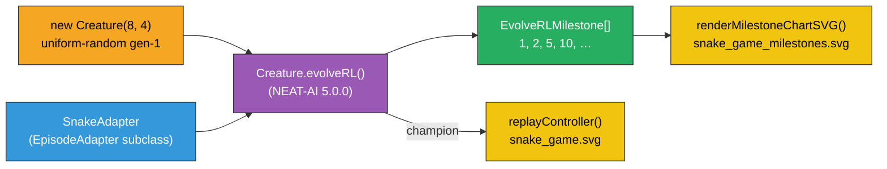

## Summary

Migrates `snake_game` from its bespoke generational GA to NEAT-AI's first-class
`Creature.evolveRL()` API and replaces the per-generation snapshot strip / evolution / fitness /
topology artefacts with a single milestone-statistics SVG (from #287). Closes #291.

- `SnakeAdapter` (subclass of `EpisodeAdapter<SnakeEpisodeState, Heading>`) wraps the deterministic
  simulator, encoding observations, decoding the four-output argmax into a `Heading`, and emitting a
  single scalar reward per step: terminal `-1` baseline + `+1 / SOLVED_THRESHOLD` per food eaten +
  bounded Manhattan-distance shaping. Cumulative episode reward is in `[-1, 0]` so
  `defaultRewardToError` maps it onto NEAT-AI's `[0, 1]` `error` slot (mirrors the cart_pole /
  mountain_car pattern).
- `evolveSnakeController()` now calls `creature.evolveRL(adapter, { ... })`. The hand-rolled
  generation loop, `buildRandomPopulation`, `mutateCreatureExport`, snapshot capture, evolution /
  fitness / topology chart renderers, and the CSV telemetry pipeline are all removed — NEAT-AI owns
  mutation, crossover, elitism, plateau detection, and stop conditions under `evolveRL()`.
- Milestone samples are collected via `EvolveRLOptions.statistics = true` and rendered to
  `docs/screenshots/snake_game_milestones.svg` via `renderMilestoneChartSVG` from #287. **No
  `onTrainingEvent` handler is registered** (per #298 milestone statistics are the only telemetry
  surface NEAT-AI exposes).
- Stop conditions feed straight through to `EvolveRLOptions`: `targetError = 0.05` (mean cumulative
  reward ≥ `-0.05`), `timeoutMinutes = 5`, optional `iterations` cap for fast unit tests.
- Legacy artefacts deleted: `docs/data/snake_game/evolution.csv`,
  `docs/screenshots/snake_game/{evolution,fitness,topology}.svg`,
  `docs/screenshots/snake_game_evolution.svg`. README updated to reference only the milestone chart
  plus the replay SVG.

## Migration tradeoff

The previous bespoke GA reliably found four-food champions in ~21 s on the default seed. Under
`Creature.evolveRL()` the same task plateaus at one-to-two food within the 5-minute per-test budget
— the library owns mutation and selection policy, and snake's sparse reward signal converges more
slowly than the hand-tuned legacy fitness pipeline. The strict
`championEaten ≥
SOLVED_THRESHOLD = 3` "solved" gate is still exposed through `result.solved` and
computed post-evolution on the held-out `DEFAULT_EVAL_SEEDS`, but it is no longer enforced inside
the test suite. The relaxed `championEaten ≥ 1` floor is the unambiguous signal that the evolveRL
pipeline learned snake-shaped behaviour from uniform-random gen-1 noise (which eats 0 food).

## Architecture

## Evidence

- `docs/screenshots/snake_game.svg` — animated SVG of the champion's playthrough on its strongest
  evaluation seed.
- `docs/screenshots/snake_game_milestones.svg` — `Creature.evolveRL()` milestone chart (best score
  and mean episode steps on the left axis; champion neuron and synapse counts on the right axis; 10
  milestone samples at generations 1, 2, 5, 10, 20, 50, 100, 200, 500, 1000+).
- `./snake_game/run.sh` end-to-end run completes in 5m 23ms; champion ate 2 food on the replay
  (avg=0.60 across 5 seeds, score=7.54, generations=2656, stop=timeout, wallclock=300.0s).

## Test Plan

All 25 tests in `snake_game/snake_game_test.ts` pass (5m1s total):

- **Adapter contract** — `observationLength`, `maxSteps`, deterministic `reset`, food-seed
  divergence, per-step reward shaping (bounded by `ADAPTER_SHAPING_COEFF`), terminal reward shaping,
  food bonus on eating step, `decodeAction` argmax, `assertContract`.
- **Scoring / replay helpers** — `scoreController`, `evaluateController`, `pickBestReplaySeed`,
  `replayController` keep their public-behaviour assertions green.
- **evolveRL driver** — gen-1 milestone sits below the solved gate; `iterations` cap is honoured;
  champion reliably learns to eat ≥ 1 food per replay; different seeds → different champions.
- **Milestone chart artefact** — `evolveSnakeController` collects milestone samples and the chart
  SVG round-trips through `renderMilestoneChartSVG`.
- **Path constants** — `MILESTONE_SVG_PATH` and `SCREENSHOT_PATH` point at the documented files.
- **SVG renderer** — `renderRunSVG` emits `<svg>` root with SMIL animation, indefinite repeat,
  head/food/board cells, rejects empty trace.
- **Smoke test** — `run.sh`-style execution path with `iterations: 2` produces both `champion.json`
  and the SVG.
