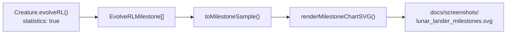

## Summary

Migrates `lunar_lander` to the milestone-only telemetry contract decided in
[#298](https://github.com/stSoftwareAU/NEAT-AI-Examples/issues/298): drops the per-generation
telemetry handler, snapshot capture pipeline, evolution-progress strip, fitness chart, evolution
chart, and per-generation CSV; replaces them with the dual-axis milestone-statistics chart from
[#287](https://github.com/stSoftwareAU/NEAT-AI-Examples/issues/287). `Creature.evolveRL()` already
owned the generation loop after #240; this PR completes the migration by deleting every artefact
sourced from telemetry NEAT-AI no longer exposes. Closes #292.

## What Changed

- `lunar_lander/lunar_lander.ts`
  - Dropped the `onTrainingEvent` handler entirely (per #298 NEAT-AI surfaces only
    `evolverl_milestone` events via `result.milestones`).
  - Dropped `GenerationInfo`, `onGeneration`, `snapshotConfig`, `EvolutionRow`,
    `formatEvolutionCsv`, `EVOLUTION_*` / `FITNESS_*` / `SNAPSHOTS_DIR` constants.
  - Added `milestones: MilestoneSample[]` to `EvolveResult`, populated via
    `toMilestoneSample(m: EvolveRLMilestone)`.
  - Added `MILESTONE_SVG_PATH = "docs/screenshots/lunar_lander_milestones.svg"` and wired the
    `import.meta.main` runner to render the dual-axis chart via `renderMilestoneChartSVG`.
- `lunar_lander/lunar_lander_test.ts`
  - Removed tests covering snapshot config, the per-generation `onGeneration` callback,
    `formatEvolutionCsv`, and `EVOLUTION_CSV_HEADER`.
  - Added milestone-chart round-trip test and updated the gen-1 noise test to read
    `result.milestones[0]`.
- `lunar_lander/README.md`
  - Updated the training-pipeline mermaid diagram to drop `CSV`/`FITN` nodes and add `MILES`.
  - Replaced the "Evolution Progress" prose so it describes the milestone chart instead of the
    snapshot strip + fitness/evolution charts.
- `lunar_lander/run.sh` — replaced legacy SVG/CSV `deno fmt` invocations with the new
  `lunar_lander_milestones.svg` artefact.
- Deleted legacy artefacts that are no longer produced:
  `docs/screenshots/lunar_lander_evolution.svg`, `docs/screenshots/lunar_lander/evolution.svg`,
  `docs/screenshots/lunar_lander/fitness.svg`, `docs/data/lunar_lander/evolution.csv`.

## Evidence

CLI/backend change — verified end-to-end via the unit-test suite plus a full-budget runner pass:

- `deno test lunar_lander/` → **81 passed, 0 failed**.
- Full-budget run: `./lunar_lander/run.sh --target-error=0.99 --timeout-minutes=1` → wrote
  `docs/screenshots/lunar_lander_milestones.svg` (10 milestones),
  `docs/screenshots/lunar_lander.svg` (validation-replay descent),
  `docs/screenshots/lunar_lander/validation.svg`, plus the champion JSON and the validation results
  JSON.
- Quick mode (`LUNAR_QUICK=1 ./lunar_lander/run.sh`) finishes in ~0.2 s, exits via the iterations
  backstop, and never overwrites canonical artefacts.
- `deno fmt`, `deno lint`, and `deno check **/*.ts` all clean.

## Test Plan

- New test: `evolveLanderController collects milestone samples and the chart SVG round-trips` —
  drives `evolveRL` for a single iteration, asserts the milestone payload is well-formed, then
  renders via `renderMilestoneChartSVG` and asserts every documented series appears in the SVG.
- New test: `MILESTONE_SVG_PATH points at the documented milestone chart` — guards the documented
  artefact path.
- Updated test: `evolveLanderController gen-1 milestone sits well below the solved threshold` —
  preserves the gen-1-is-noise assertion via `result.milestones[0]` (no `onGeneration` callback).
- Preserved tests covering: `LanderAdapter` contract, deterministic `reset`/`step`, action decoding
  (incl. issue #253 mutual exclusion), `scoreController` determinism + multi-trial perturbation,
  `freeFallBaselineScore`, `evolveLanderController` iterations cap / target stop / determinism,
  champion JSON export, validation hold-out pipeline (`validateChampion`, `pickValidationSvgIndex`),
  descent SVG renderer, and quick-mode regression tests.

## Acceptance Criteria

- [x] `evolveLanderController()` calls `Creature.evolveRL()` — no hand-written generation loop.
- [x] `buildRandomPopulation` / `mutateCreatureExport` are not present.
- [x] `LanderAdapter` extends `EpisodeAdapter<LanderState, LanderAction>`.
- [x] No `onTrainingEvent` handler is registered.
- [x] Milestone samples are collected from `evolverl_milestone` (via `result.milestones`) and
      rendered via `renderMilestoneChartSVG`.
- [x] Per-generation fitness chart and evolution chart artefacts replaced by the milestone chart.
- [x] Gen-1 starts from uniform-random noise — fresh `new Creature(INPUT_COUNT, OUTPUT_COUNT)`.
- [x] Multi-trial perturbed scoring is expressed via `episodesPerCreature` + adapter perturbation.
- [x] All existing tests pass; new tests cover the milestone chart.
- [x] `./run.sh` produces the milestone chart plus the run-replay SVG.
- [x] `./quality.sh` quality gates (fmt/lint/type-check/tests) pass.
