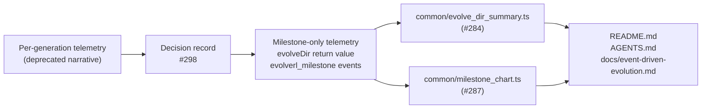

## Summary

Refresh the three top-level documentation pages (`README.md`, `AGENTS.md`,
`docs/event-driven-evolution.md`) so they describe NEAT-AI's evolution loop in terms of
**milestone-only** telemetry — the milestone summary returned by `evolveDir` and the
`evolverl_milestone` events emitted by `evolveRL` / `evolveEnv`. The captured-snapshot /
per-generation-hook narrative has been retired in line with the decision recorded in
[#298](https://github.com/stSoftwareAU/NEAT-AI-Examples/issues/298).

Closes #300.

### Changes

- `README.md`
  - Rewrote the "🌱 Random noise → competent network" intro callout to reference milestone stats
    (final score, milestone generations) instead of "captured checkpoint snapshots".
  - Updated the "🧬 Examples at a Glance" rows for XOR, Cart-Pole, Lunar Lander, Discovery at Scale,
    and Evolution Showcase to describe the milestone-stats chart instead of the multi-panel
    evolution-progression strip / per-generation telemetry CSV.
  - Added a back-reference to #298 from the intro callout.
- `AGENTS.md`
  - Dropped `common/evolution_chart.ts`, `common/evolution_snapshot.ts`, and
    `common/evolution_progress_svg.ts` from the Shared Utilities table and the Project Structure
    tree (these will be deleted by the terminal sub-issue of #298).
  - Added the milestone-era helpers `common/evolve_dir_summary.ts` (#284) and
    `common/milestone_chart.ts` (#287) to the Shared Utilities table.
  - Replaced the `common/evolution_snapshot.ts` and `common/evolution_progress_svg.ts` detailed
    subsections with a single "Milestone telemetry helpers" paragraph that points at the milestone
    helpers and states explicitly that NEAT-AI does not expose every-generation telemetry.
  - Reworded the "no warm starts" narrative so "captured milestones" replaces "captured checkpoint
    snapshots" — milestones are the supported surface.
  - Added a back-reference to #298.
- `docs/event-driven-evolution.md`
  - Audited "🚀 What `evolveEnv()` provides" so it describes milestone telemetry only (no
    per-generation hook).
  - Updated the migration-status table so each row reflects the milestone-only target.
  - Added a back-reference to #298.

### Acceptance criteria check

- [x] `README.md`, `AGENTS.md`, and `docs/event-driven-evolution.md` contain zero occurrences of
      `per-generation telemetry`, `onTrainingEvent`, `generation_complete`, `captureSnapshot`,
      `loadSnapshots`, or `renderEvolutionProgressSvg`.
- [x] The Shared Utilities table in `AGENTS.md` lists only milestone-era helpers
      (`evolve_dir_summary.ts` from #284, `milestone_chart.ts` from #287, plus the remaining
      non-telemetry helpers).
- [x] The "noise → competent" narrative still reads coherently — milestones, not snapshots, carry
      the story.
- [x] Each rewritten page contains a back-reference to #298.
- [x] `deno fmt --check` and `deno lint` both pass.

## Evidence

This is a documentation-only change — no UI to screenshot, no benchmark to run. Validation:

- `deno fmt --check` — pass (341 files checked).
- `deno lint` — pass (107 files checked).
- Grepped each of the three rewritten pages for the forbidden strings listed in the acceptance
  criteria — no matches.

## Test Plan

- [x] `deno fmt --check` passes.
- [x] `deno lint` passes.
- [x] Manual grep confirms the forbidden strings (`per-generation telemetry`, `onTrainingEvent`,
      `generation_complete`, `captureSnapshot`, `loadSnapshots`, `renderEvolutionProgressSvg`) no
      longer appear in `README.md`, `AGENTS.md`, or `docs/event-driven-evolution.md`.
- [x] Manual review confirms each rewritten page links back to #298.
