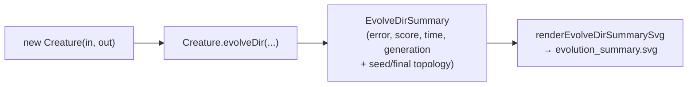
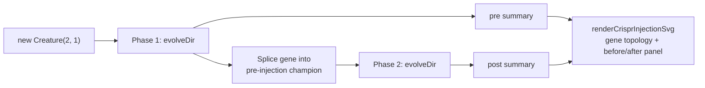

## Summary

Drops per-generation `onTrainingEvent` telemetry from `crispr_injection`, `crossover`, and
`intelligent_design`. Each example now uses NEAT-AI's supported milestone-only telemetry surface —
`Creature.evolveDir`'s return value — and renders a single milestone summary SVG via the shared
`renderEvolveDirSummarySvg` helper from #284. Closes #302.

- `crossover_example.ts` and `improve_squash_example.ts` each make a **single**
  `Creature.evolveDir(...)` call and write one milestone SVG at
  `docs/screenshots/<example>/evolution_summary.svg`.
- `crispr_injection.ts` is the special case — its narrative is the fitness lift at gene injection.
  It now runs **two** `evolveDir` calls (pre-injection minimal seed; post-injection with the gene
  spliced into the pre-injection champion) and renders a combined SVG with the gene topology on top
  and a before-vs-after milestone panel below, sourced from the two `EvolveDirSummary` records. The
  lift narrative is driven by the post-vs-pre `finalScore` delta, not per-generation rows.
- Removed all `onTrainingEvent` blocks, `EvolutionRow` helpers, chunked `evolveDir` loops,
  `formatEvolutionCsv`, `renderEvolutionChartSVG`, `renderFitnessChartSVG`, and the associated path
  constants (`EVOLUTION_CSV_PATH`, `FITNESS_SVG_PATH`, `TOPOLOGY_SVG_PATH`, `EVOLUTION_CSV_HEADER`).
- Deleted deprecated per-generation artefacts under `docs/data/<example>/` and
  `docs/screenshots/<example>/fitness.svg|topology.svg`.

## Evidence

Generated milestone SVGs from real `./<example>/run.sh` invocations:

- `docs/screenshots/crispr_injection.svg` — gene topology + before/after milestone panel (pre
  `score=0.9961`, post `score=0.9986`, lift `+0.0024`, topology `14/33 → 21/54`).
- `docs/screenshots/crossover/evolution_summary.svg` — minimal-seed evolved champion score
  `0.982393` after 259 generations / 8.7s.
- `docs/screenshots/intelligent_design/evolution_summary.svg` — evolved champion score `0.9999`
  (target error reached) after 703 generations / 7.7s.

CRISPR variant — two phases, one combined SVG:

## Test Plan

Tests updated to exercise the new return-value path. All 62 tests across the three affected examples
pass:

- `crossover_example_test.ts` — `runMinimalSeedEvolution returns a
  milestone summary` and
  `renderEvolveDirSummarySvg renders a summary
  derived from runMinimalSeedEvolution` verify the
  new contract (finite summary fields, topology matches the live champion, summary SVG includes the
  four numeric callouts and topology counts). Dropped
  `EvolutionRow`/`formatEvolutionCsv`/`rowsToFitnessSamples`/ `rowsToEvolutionSamples` tests (those
  helpers were removed).
- `improve_squash_example_test.ts` — same milestone-summary contract; dropped the per-generation
  telemetry tests.
- `crispr_injection_test.ts` — new
  `runCrisprInjectionEvolution returns pre- and post-injection
  milestone summaries` asserts the
  post-injection seed has more neurons than the pre-injection seed, the topology counts in each
  summary match the live champion, and the post-injection `finalScore` is at least as good as the
  pre-injection `finalScore` (within a small epsilon — both phases may converge to ≈ 1 when the
  budget is large enough). The `renderCrisprInjectionSvg` tests verify the SVG includes the gene
  topology group, the milestone panel group, both summaries' numeric callouts, and a signed lift
  delta callout. Legacy gene-splicing tests (`createGene`, `injectGene`, `runCrisprExperiment`,
  `mutateMember`) are retained verbatim.

Stress-tested the `runCrisprInjectionEvolution` test five times to verify the assertion is no longer
flaky after the eps-relaxation.
