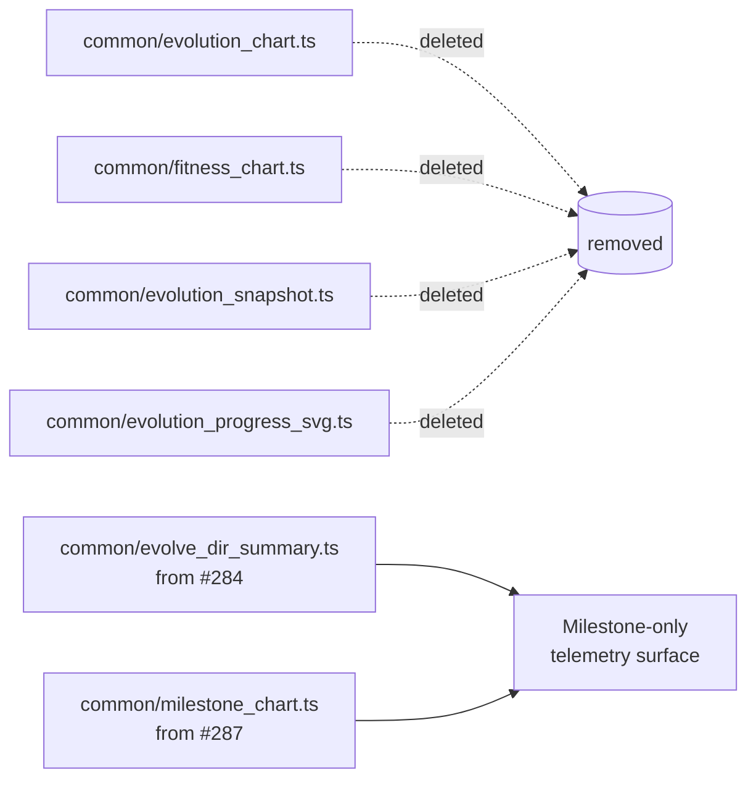

## Summary

Terminal cleanup for #298: delete the four deprecated per-generation telemetry helpers from
`common/` now that every consumer has migrated to the milestone-only surface
(`evolve_dir_summary.ts` from #284 and `milestone_chart.ts` from #287). Closes #305.

Removed:

- `common/evolution_chart.ts` (+ `_test.ts`)
- `common/fitness_chart.ts` (+ `_test.ts`)
- `common/evolution_snapshot.ts` (+ `_test.ts`)
- `common/evolution_progress_svg.ts` (+ `_test.ts`)

Also scrubbed the stale module-header `@link` references in the two surviving chart helpers
(`milestone_chart.ts`, `outcome_bar_chart.ts`) so their JSDoc no longer points at deleted files.

## Evidence

No source-file references remain (verified via repository-wide grep for `evolution_chart.ts`,
`fitness_chart.ts`, `evolution_snapshot.ts`, `evolution_progress_svg.ts`, `renderEvolutionChartSVG`,
`renderFitnessChartSVG`, `renderEvolutionProgressSvg`, `captureSnapshot`, and `loadSnapshots`). The
only remaining hits are historical `docs/pr-summary-*.md` and `docs/archive/pr-summary-*.md`
records, which the issue notes may legitimately mention the deprecated helpers.

`deno fmt`, `deno lint`, `deno check **/*.ts`, and the full `deno test` suite (including all 72
tests in `common/`) pass with the deletions in place.

This is a pure code-deletion change — no UI to screenshot.

## Test Plan

- The four `_test.ts` siblings are removed alongside their modules; no surviving test references the
  deleted helpers.
- `deno test --no-check --allow-read --allow-write --allow-env --allow-net --allow-ffi --allow-run=df common/`
  passes (72 tests).
- `deno check **/*.ts` passes — confirms no surviving import references a deleted module.
- `deno lint` and `deno fmt --check` pass on the modified files.
