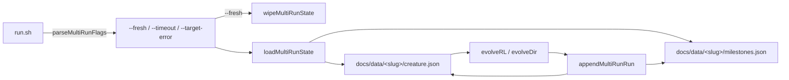

# PR Summary — Issue #318

## Summary

Adds `common/multi_run_state.ts`, a shared persistence helper that lets every NEAT-AI example resume
evolution across multiple runs. It exports four functions plus a `MultiRunMilestone` interface, all
backed by atomic JSON writes via `safeWriteJson`. The helper is the foundation every multi-run
example will build on (charts, run.sh wrappers, `--fresh` wipes). Closes #318.

## What was added

- `loadMultiRunState(slug, baseDir?)` — reads `docs/data/<slug>/creature.json` and
  `docs/data/<slug>/milestones.json` if present. Returns documented defaults when files are missing;
  throws on malformed JSON.
- `appendMultiRunRun(slug, args, baseDir?)` — stamps each new sample with `runIndex` and
  `cumulativeGen = baseCumulativeGen + runGen`, then overwrites `creature.json` and rewrites
  `milestones.json` (atomic temp + rename via `safeWriteJson`).
- `wipeMultiRunState(slug, baseDir?)` — removes the two JSON files and both chart SVGs
  (`docs/screenshots/<slug>/milestones.svg`, `complexity.svg`). Missing files are not an error.
- `parseMultiRunFlags(args)` — extracts `--fresh`, `--timeout=<minutes>`, `--target-error=<value>`.
  Unknown flags pass through unchanged. Invalid numeric values yield `undefined`.
- `MultiRunMilestone` interface — per-sample schema with `runIndex`, `runGen`, `cumulativeGen`,
  `error`, `bestScore`, `neurons`, `synapses`, optional `meanEpisodeSteps`, and
  `generationWallClockMs`.

The base directory is configurable via the optional second argument or the `NEAT_MULTI_RUN_BASE_DIR`
environment variable, so tests isolate state under `Deno.makeTempDirSync` without polluting the
working tree.

## Evidence

This is a backend / shared-helper change with no UI. The behaviour is verified by 15 unit tests in
`common/multi_run_state_test.ts`, all passing under the same permissions as `./quality.sh`:

```text
ok | 15 passed | 0 failed (16ms)
```

### Data flow



## Test Plan

Tests added in `common/multi_run_state_test.ts`:

- `loadMultiRunState` returns documented defaults when no files exist.
- `appendMultiRunRun` → `loadMultiRunState` round trip preserves the champion and milestones.
- `runIndex` increments and `cumulativeGen` is monotonic across two simulated runs.
- `wipeMultiRunState` removes all four canonical artefact paths.
- `wipeMultiRunState` tolerates missing files.
- `loadMultiRunState` throws on malformed `milestones.json` and malformed `creature.json`.
- `parseMultiRunFlags`: each flag parsed correctly; combinations work; absent flags yield `false` /
  `undefined`; invalid numeric values yield `undefined`; unknown flags pass through.
- Round trip after two `appendMultiRunRun` calls produces the expected merged length.

## Notes for reviewers

- The helper is dependency-free aside from `@stsoftware/neat-ai` (`safeWriteJson`, `CreatureExport`)
  and `@std/fs` / `@std/path`.
- No existing examples have been wired up yet — that work is tracked under the #311 sub-issue tree.
- All new code uses Australian English (e.g. "behaviour", "artefact").
