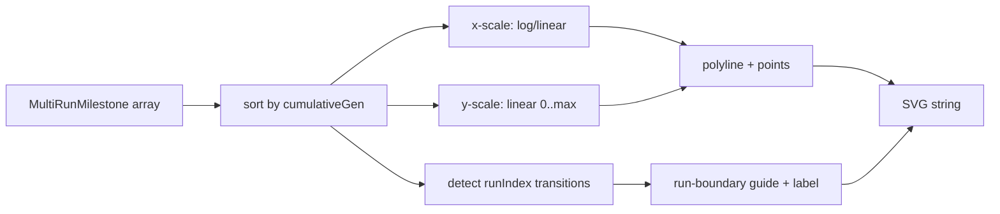

## Summary

Add `common/multi_run_error_chart.ts` — a pure-string SVG renderer that plots error vs cumulative
generation as a single continuous polyline across every run, with faint vertical guide lines at each
`runIndex` transition. Closes #319.

Builds on the multi-run persistence helper from #318 by consuming its `MultiRunMilestone` shape, so
an example can resume across runs and chart the unified noise → competent arc that the parent issue
(#311) calls out.

Key behaviours:

- Single continuous polyline across all samples sorted by `cumulativeGen` — not split per run.
- Faint vertical guide line (`stroke="#cccccc" stroke-width="0.5"`) at every `runIndex` transition,
  labelled with the new run number above the plot.
- Default log-X mapping (configurable) to suit the 1, 10, 100, … milestone cadence.
- Linear Y axis clamped to `[0, max(0.05, observed max)]` so low-error runs remain legible.
- Optional caption summarising final error, total runs, total cumulative generations and total
  wall-clock (sum of `generationWallClockMs`).
- Throws on empty input — callers skip rendering until at least one milestone exists.
- No `NaN` / `Infinity` leakage even when input contains zero or near-zero error.
- Byte-deterministic output for identical inputs.

## Evidence

CLI-only addition — no UI surface to screenshot. Behaviour is verified by 11 "what" tests in
`common/multi_run_error_chart_test.ts`, all passing:

```
ok | 11 passed | 0 failed (3ms)
```

And the full common suite stays green:

```
ok | 98 passed | 0 failed (1s)
```



## Test Plan

Added `common/multi_run_error_chart_test.ts`:

- Happy path: valid SVG containing `<svg>`, the error polyline class, and axis labels.
- Run-boundary markers count matches `distinctRunIndices − 1` (covered by one-run, two-run,
  three-run cases).
- Empty input throws with a clear "at least one sample" error.
- Deterministic output — repeated calls with identical input produce byte-identical strings.
- Zero / near-zero error values produce no `NaN` or `Infinity` in the output.
- Caption block appears only when `options.caption: true`.
- `logX` layout differs from linear for power-of-ten spaced generations.
- Unsorted input is sorted defensively by `cumulativeGen`.
