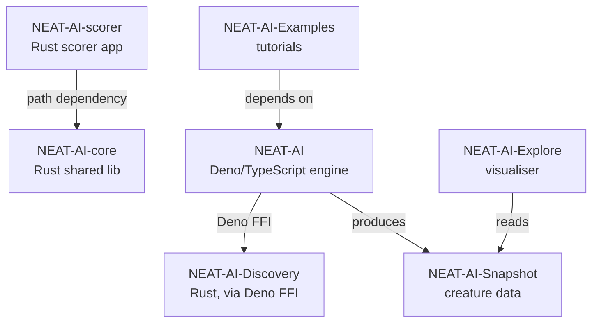

## Summary

Added a `## Related Repositories` section to `README.md` directly after the existing Examples
Overview Mermaid diagram, reusing the canonical block defined in stSoftwareAU/NEAT-AI-core#18
verbatim. The section lists every public NEAT-AI-* repository with a one-line description, links,
and a Mermaid dependency graph showing how the seven repos compose. Closes #32.

## Evidence

This is a documentation-only change. Verified by:

- `./quality.sh` — passes cleanly (lint, fmt, all unit tests, all example runners).
- New unit tests in `related_repositories_test.ts` assert that the section exists, mentions every
  required repo, links to each GitHub URL, and contains the canonical Mermaid dependency diagram.

The inserted dependency diagram (rendered on GitHub):

## Test Plan

- Added `related_repositories_test.ts` with four "what" tests:
  - `README.md contains a 'Related Repositories' section`
  - `Related Repositories section lists all 7 NEAT-AI-* repos`
  - `Related Repositories section links to the GitHub repos`
  - `Related Repositories section contains a Mermaid dependency diagram`
- Existing `mermaid_diagrams_test.ts` continues to pass — the new diagram is well-formed and uses a
  valid `graph TD` declaration.
