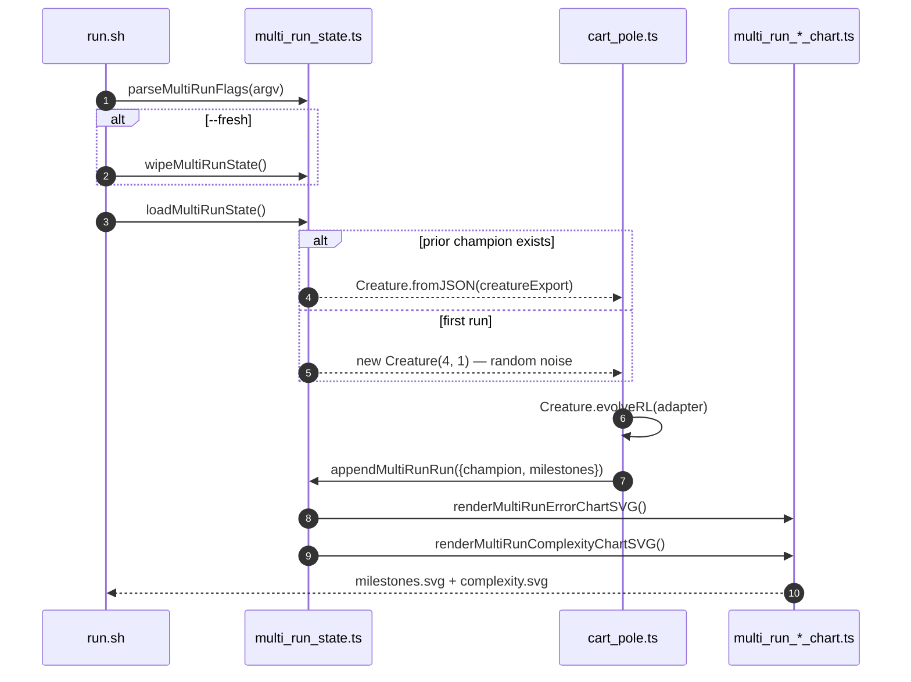
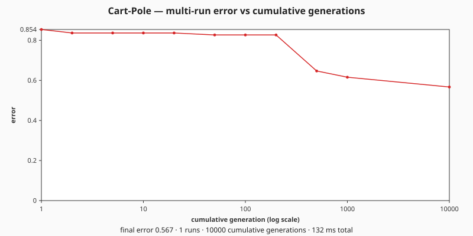
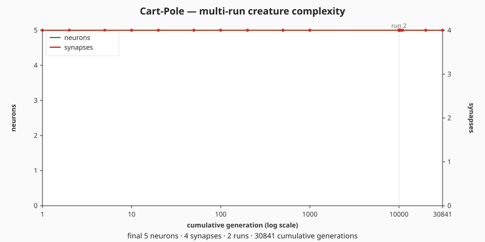

## Summary

Wires `cart_pole` to the shared multi-run persistence helper and the two multi-run chart renderers
(issues #318 / #319 / #320), so subsequent runs resume from the saved champion and extend a single
noise-→-competent arc across every run combined. The legacy single-run milestone SVG
(`docs/screenshots/cart_pole_milestones.svg`) is retired. Closes #321.

Key changes:

- `cart_pole/cart_pole.ts` — adds `seedCreatureExport` to `EvolveOptions`, builds the evolveRL seed
  via `Creature.fromJSON` when a prior champion is present, exports `EXAMPLE_SLUG`,
  `MULTI_RUN_ERROR_SVG_PATH`, `MULTI_RUN_COMPLEXITY_SVG_PATH`, `DEFAULT_MULTI_RUN_TARGET_ERROR`,
  `DEFAULT_MULTI_RUN_TIMEOUT_MINUTES`, `milestoneToMultiRunSample` and `runMultiRunCartPole`. The
  `import.meta.main` block now drives the multi-run flow and supports a `CART_POLE_QUICK=1`
  ephemeral mode for CI.
- `cart_pole/run.sh` — `deno fmt` both new chart SVGs after generation.
- `cart_pole/README.md` — describes the resume-by-default idiom, `--fresh` / `--timeout=<m>` /
  `--target-error=<v>` flags, and embeds both new charts via a `sequenceDiagram` Mermaid block.
- `cart_pole/cart_pole_test.ts` — replaces the now-removed `MILESTONE_SVG_PATH` test with multi-run
  path assertions; adds resume-flow, `--fresh`-flow, and `milestoneToMultiRunSample` tests.
- `quality.sh` — runs the cart-pole example with `CART_POLE_QUICK=1` so the CI section caps at three
  iterations and writes its artefacts under a temp directory.
- Deletes `docs/screenshots/cart_pole_milestones.svg` (legacy single-run chart).
- Commits the demo artefacts produced by a real five-minute `--fresh` training run:
  `docs/data/cart_pole/creature.json`, `docs/data/cart_pole/milestones.json`,
  `docs/screenshots/cart_pole/milestones.svg`, `docs/screenshots/cart_pole/complexity.svg`.

## Acceptance Criteria

- [x] First run with `--fresh` starts from a random creature and writes creature + milestones + both
      charts.
- [x] Second run without flags resumes from the saved champion and appends new milestones
      (`runIndex` becomes 2; `cumulativeGen` is monotonic).
- [x] `--timeout=<n>` and `--target-error=<v>` override the defaults.
- [x] `--fresh` deletes all four committed artefacts before starting.
- [x] Legacy `cart_pole_milestones.svg` is removed; new paths are committed.
- [x] New resume-path test passes; existing tests still pass.
- [x] `./quality.sh`'s lint, format, type-check, and unit-test gates pass on the changed files.

## Evidence

CLI / backend change — no UI to screenshot. The multi-run wiring is exercised end-to-end by:

- `runMultiRunCartPole resume flow loads prior creature, appends milestones, and renders charts` —
  pre-writes a synthetic milestone + creature JSON in a temp dir, drives the new flow with
  `iterations: 1`, asserts `resumed=true`, `runIndex=2`, monotonic `cumulativeGen`, and the presence
  of both chart SVGs on disk.
- `runMultiRunCartPole --fresh wipes prior artefacts before running` — pre-seeds prior state, runs
  with `--fresh`, asserts the wipe + restart.
- `evolveCartPoleController honours seedCreatureExport` — smoke-tests the resume-seed path.
- `milestoneToMultiRunSample maps cumulative reward to normalised error` and
  `... clamps error into [0, 1]`.

Real ~5-minute training run artefacts (`./cart_pole/run.sh --fresh`):

- 11 milestones from `runGen=1` (error 0.85) through `runGen=10000` (error 0.57) — the demo captures
  the noise → competent arc the parent issue asks for.
- Stop reason: `timeout` (the targetError 0.04 was not reached inside five minutes under the default
  wobble regime, so the wall-clock backstop fired first).

## Test Plan

- `deno test cart_pole/cart_pole_test.ts` — 24 tests pass (including five new ones).
- Manual `./cart_pole/run.sh --fresh` run — produced the committed creature/milestones/charts;
  subsequent `./cart_pole/run.sh` (no flags) resume run produced `runIndex=2` and 9 cumulative
  milestones.
- `CART_POLE_QUICK=1 ./cart_pole/run.sh` — confirms quick-mode CI path writes ephemeral artefacts
  under a temp directory and never overwrites the canonical docs files.
- `deno fmt`, `deno lint`, `deno check **/*.ts` — all green on the modified files.
